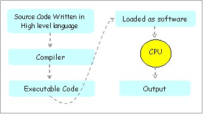
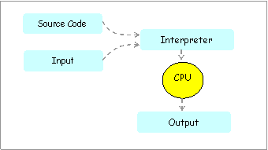
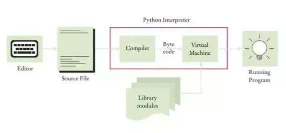

# Introduzione a Python

[Python](https://www.python.org/) è un linguaggio di programmazione moderno, con una sintassi volutamente semplice e facile da imparare,
utilizzabile in vari contesti anche molto diversi fra loro:

-   sviluppo di applicazioni desktop,
-   generazione siti e applicazioni Web,
-   scripting per l'amministrazione di sistema,
-   calcolo scientifico e numerico,
-   gestione database,
-   giochi,
-   grafica 3D,
-   etc\...

Se controllate sul sito di riferimento potrete trovare una sezione **quotes** (<https://www.python.org/about/quotes/>) con le citazioni
famose su Python da parte di personaggi famosi delle aziende più in vista e una sezione **Success Stories**
(<https://www.python.org/success-stories/>) che appunto elenca le maggiori storie di successo ove Python ha contribuito in maniera
determinante.

Python è un linguaggio ideato da **Guido van Rossum** all'inizio degli anni novanta. Il nome fu scelto (tenetevi alla sedia) per via della sua
passione per i [Monty Python](https://it.wikipedia.org/wiki/Monty_Python), un gruppo comico britannico attivo negli anni settanta. 
Per rendervi conto della *incredibile comicità* del gruppo... ecco uno dei primi video su YouTube ottenuto cercando *Monty Python ita*. 
Dura 84 minuti. Io non ho superato il minuto 4...

<iframe width="640" height="360" src="https://www.youtube.com/embed/S04V_mW5v0I" title="YouTube video player" frameborder="0" allow="accelerometer; autoplay; clipboard-write; encrypted-media; gyroscope; picture-in-picture" allowfullscreen></iframe>

## Breve Storia

Come già citato, Python nasce negli anni novanta, grazie al suo [Benevolent Dictator For Life](https://en.wikipedia.org/wiki/Benevolent_dictator_for_life) 
*Guido van Rossum*. 
La storia racconta che durante le vacanze di Natale del 1989, Guido progettò questo nuovo linguaggio, cercando di mettere in esso tutte le caratteristiche positive 
che aveva trovato negli altri linguaggi di programmazione, provando ad evitare forzature o strutture non lineari.

Subito Python diventa uno strumento imprescindibile per l'azienda in cui Guido lavora. Questo fatto e la licenza opensource con cui van Rossum
distribuisce la sua creatura determinano la sua fortuna: Python diventa brevemente uno dei linguaggi più utilizzati e seguiti da una comunità
*attiva* di sviluppatori.

Python ha avuto il suo momento di massima espansione con la versione 2.x del linguaggio, rilasciata nel 2000, momento in cui è passato 
**da *"linguaggio di programmazione settoriale"* a *"linguaggio tra i più utilizzati e conosciuti"*.**

Pochi anni dopo, ci si rende conto che per fare un passo definitivo, il linguaggio deve essere *sistemato* per funzionare bene in tutte le
lingue (e in tutti i set di caratteri), avere una sintassi consistente e *facile da dedurre e indovinare* ed essere *facile* da potenziare
tramite librerie di supporto.

Nel 2008 nasce Python 3.0.

Il tempo ha fatto il resto... la versione 2.x di Python ha fatto la storia, ma ormai deve anche rimanerci... Python 3.x è attualmente il presente di uno 
dei migliori linguaggi di programmazione della seppur breve storia dell'Informatica.

## Linguaggi compilati vs interpretati

Prima di passare all'installare vera e propria dell'interprete e dell'ambiente di sviluppo Python, concediamoci una breve introduzione generica e generale sui linguaggi di programmazione.

> Sentitevi liberi di leggere velocemente questa parte, ma ricordatevi di riguardare queste righe almeno una
> volta all'anno, per meglio apprezzare il livello di comprensione del linguaggio raggiunto

I linguaggi di programmazione si dividono in:

-   linguaggi compilati
-   linguaggi interpretati

Vi dico subito che **Python è un linguaggio interpretato**. Nelle prossime righe cercheremo di capire cosa questo significhi e quale
differenza faccia con i linguaggi compilati.

**Nei linguaggi compilati** si scrive il codice sorgente, un file di testo semplice, nel linguaggio proprio (ad esempio nel linguaggio C, che è un
linguaggio compilato). Quando si è pronti con il codice si passa alla compilazione. 
Banalmente ogni linguaggio compilato è fornito di un compilatore, che è in grado di tradurre il codice dal linguaggio di
partenza al linguaggio macchina, creando un file eseguibile ovvero un file contenente una sequenza di istruzioni direttamente eseguibili dalla
macchina (in linguaggio macchina appunto).

Creato l'eseguibile, il compilatore non serve più. Possiamo eseguire il nostro programma semplicemente invocando l'eseguibile.

**Nei linguaggi interpretati** si scrive il codice sorgente, sempre un file di testo semplice, nel linguaggio proprio (ad esempio nel linguaggio
Python). Quando si è pronti con il codice, la preparazione del programma è terminata. Quando si vuole eseguire il programma si invoca
l'interprete, che legge il codice del programma e sa esattamente eseguire ogni istruzione scritta, in modo tale da *interpretare il
programma da eseguire*.

Ogni volta che si vuole rieseguire il programma, riparte l'interpretazione del codice.

Questa importante caratteristica porta inevitabilmente importanti differenze insite nei linguaggi. Ne elenco alcune:

-   in fase di esecuzione, i programmi generati da linguaggi compilati
    sono generalmente più veloci. Infatti eseguono direttamente codice
    nativo (pronto per essere eseguito dal compilatore) invece di
    doverlo interpretare al volo;
-   in fase di produzione, i programmi interpretati sono subito pronti
    per l'interpretazione e il testing, senza dover ad ogni minima
    modifica ricompilare.
-   in fase di esecuzione, i programmi generati da linguaggi compilati
    utilizzano meno memoria. Infatti per eseguire un programma generato
    da compilazione serve solo il programma stesso, mentre per eseguire
    un programma interpretato serve il programma e l'interprete;
-   in fase di esecuzione, i programmi interpretati gestiscono la
    memoria in maniera più semplice e (spesso) efficiente perché
    l'interprete si occupa di *filtrare* le (sciocchezze) richieste del
    programma.
-   per ogni sistema operativo supportato è necessario procedere ad una
    ricompilazione del codice sorgente. Infatti gli eseguibili generati
    dalla compilazione dipendono dal sistema operativo ove essi sono
    compilati;
-   il codice di un programma interpretato va bene così com'è per ogni
    sistema operativo per cui esiste un interprete del linguaggio;
-   i programmi compilati vengono eseguiti direttamente dal dispositivo
    ospite e quindi possono fare *grandi danni*
-   i programmi interpretati vengono eseguiti tramite l'interprete del
    linguaggio che può *controllare* che essi non facciano danni
    all'hardware o alla memoria del dispositivo.

Insomma, come si vede, ci sono luci e ombre in entrambi gli approcci. Di certo l'approccio dei linguaggi interpretati è quello più semplice e
sicuro.

Python, per massimizzare i punti a favore e ottenere il miglior comportamento possibile, può utilizzare un approccio *misto*,
sbilanciato dalla parte dell'interpretazione:

!!! note

    L'interprete Python, alla prima esecuzione del codice, fa una sorta di
    *compilazione*, generando un programma (bytecode, estensione .pyc) non
    direttamente eseguibile dal dispositivo, ma direttamente eseguibile
    dalla parte dell'interprete preposta allo scopo: la macchina virtuale.

    In questo modo, dalla seconda esecuzione in poi, la velocità della
    stessa sarà paragonabile (in molti casi identica) a quella dei linguaggi
    compilati.

Tutto il processo descritto è completamente automatico: il programmatore
non deve far altro che scrivere codice e testarne l'esecuzione
nell'ambiente adatto.

