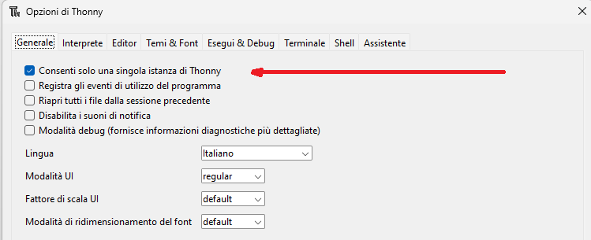
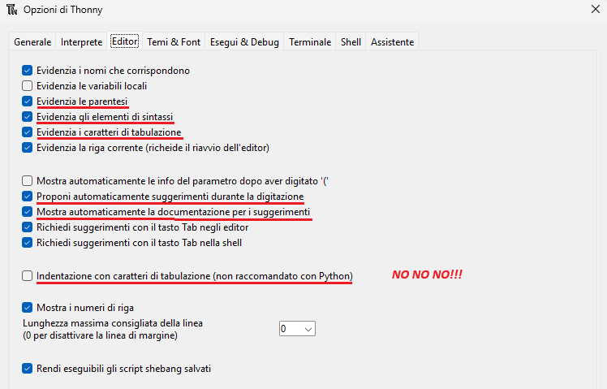
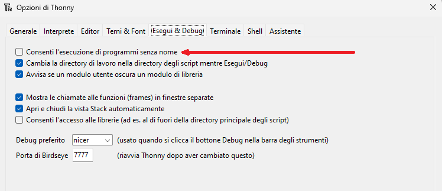
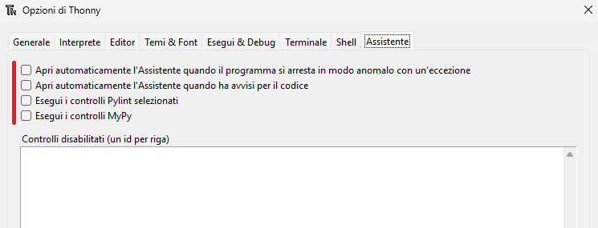

# Installazione

Per lavorare con Python basta avere l'interprete Python con tutte le
sue librerie più importanti installato nel proprio sistema, utilizzare
il blocco note (o un altro editor di testo semplice) per scrivere il
codice e infine richiederne l'esecuzione all'interprete Python tramite
riga di comando.

Capite che questa modalità di lavoro, benché funzionante e sufficiente,
risulti complicata e inadatta a chi deve concentrarsi sull'imparare il
linguaggio piuttosto che far funzionare tutto il sistema solo per
eseguire la prova di un semplice programma.

Per risolvere questo problema e favorire lo sviluppo semplice e veloce delle applicazioni 
(**RAD**: [Rapid Application Development](https://it.wikipedia.org/wiki/Rapid_application_development))
si è addirittura inventata una nuova categoria di software, denominata
**IDE** ([Integrated Development Environment](https://it.wikipedia.org/wiki/Integrated_development_environment)).

Gli IDE sono software che contengono più o meno tutto quanto necessario
per sviluppare una applicazione in uno o più linguaggi di
programmazione: un editor di testo per la scrittura del codice, il
compilatore e/o l'interprete del linguaggio (o dei linguaggi, se l'IDE ne supporta più di uno), 
gli strumenti per il debug, ovvero per la correzione degli errori del software, 
e... tutto quello che serve!

Gli IDE più utilizzati per sviluppare in Python sono:

-   [PyCharm](https://en.wikipedia.org/wiki/PyCharm)
    (multipiattaforma e multilinguaggio), molto completo, ma anche molto pesante;
    sviluppato specificatamente per lo sviluppo in Python.
-   [Visual Studio Code](https://it.wikipedia.org/wiki/Visual_Studio_Code)
    (multipiattaforma e multilinguaggio), sviluppato da Microsoft per sviluppare su tutti i
    linguaggi che essa supporta e utilizza (tra cui, ovviamente, Python!)
-   [XCode](https://it.wikipedia.ia.org/wiki/Eclipse_(informatica))
    (Specifico per MacOS, multilinguaggio) l'IDE di casa Apple, può essere configurato per lavorare
    con Python. 
-   [IDLE](https://en.wikipedia.org/wiki/IDLE), il più semplice IDE per
    Python, scritto in Python, multipiattaforma, disponibile
    nell'installer ufficiale di Python.
-   [Thonny](https://thonny.org/), (multipiattaforma, specifico per Python), un IDE
    progettato specificatamente per imparare a programmare in Python. Semplice, leggero,
    con supporto per MicroPython (Python per piccoli dispositivi).
    
Non la facciamo lunga: **noi utilizzeremo Thonny!** E lo faremo per i seguenti motivi:

-   Thonny è scritto in Python e disponibile per Windows, MacOS, Linux,
    Raspberry. Tutti sistemi operativi che potenzialmente useremo.
-   Thonny è scritto non da una azienda o da una comunità, ma
    direttamente dal dipartimento di informatica dell'università di
    Tartu (Estonia)
-   Thonny è stato scritto specificatamente per la didattica con Python.
-   Thonny installa una copia di Python, rendendo semplicissima
    l'installazione dell'ambiente completo per tutti gli utenti.
-   Thonny fornisce una interfaccia semplice anche per l'interazione
    con pip, il gestore di pacchetti Python (ne parleremo in seguito)

Insomma, un IDE a misura degli studenti! 

Le istruzioni che seguono spiegano come installare [Thonny](https://en.wikipedia.org/wiki/Thonny)
sui vari sistemi operativi (in rigoroso ordine alfabetico)!


<!-- ############################################################################################ -->
## Installare Thonny su Linux

Installare software su Linux è affare allo stesso momento semplicissimo
e complicatissimo. Semplicissimo perché con il comando giusto, i sistemi
operativi basati su Linux eseguono download, installazione e prima
configurazione del software in pochissimo tempo. Complicatissimo perché
scegliere il comando giusto richiede una minima conoscenza del sistema
che non sempre tutti gli utenti hanno e che varia da sistema a sistema.

In generale, ho schematizzato i comandi da terminale per tutte le
distribuzioni più famose. Se pensate di non rientrare in nessuna di
queste, contattatemi e vedremo insieme cosa fare:

``` bash
# Debian, Rasbian, Ubuntu, Mint e altre
$ sudo apt install python3 thonny

# Fedora, Red Hat, Mandriva, OpenSuse e altre
$ sudo dnf install python3 thonny

# Arch Linux, Manjaro, Chakra, Parabola e altre
$ sudo pacman -S python3 thonny
```

Questo installerà l'ultima versione di Python 3.x e Thonny sul vostro
sistema, rendendolo pronto all'uso! Tutto qui! Passate a testare
l'installazione con l'Hello World Test in fondo!


<!-- ############################################################################################ -->
## Installare Thonny su MacOS

Per installare Thonny su Mac, andate sul sito di Thonny
(<https://thonny.org/>), scaricate il pacchetto di installazione per Mac
e installatelo sul vostro sistema. Se avete già installato sul vostro
Mac un pacchetto .pkg non avrete alcuna difficoltà!


Terminata l'installazione verificate che tutto funzioni con gli Hello World Test 
del prossimo capitolo.


<!-- ############################################################################################ -->
## Installare Thonny su Windows

Per installare Thonny su Windows, andate sul sito di Thonny
(<https://thonny.org/>), scaricate il pacchetto di installazione per
Windows e installatelo sul vostro sistema.


C'è qualcuno che pensa evidentemente che gli utenti di Windows siano
tutti tonti: non avete idea di quanti tutorial si trovano su YouTube per
installare Thonny. Nel dubbio ne aggiungo qui uno...


<br>

<div id="ytv1"></div>
<br>

<script>
function play1() { 
    var frameB = document.getElementById("ytb1");
    frameB.style.display="None";
    var frameV = document.getElementById("ytv1");
    frameV.innerHTML += '<iframe width="640" height="360" src="https://www.youtube.com/embed/TlvQOWhlfpo" frameborder="0" allowfullscreen></iframe>';
    }
</script>


Spero tutto questo sia sufficiente. Altrimenti contattatemi per avere
aiuto. Appena avete finito procedete gli Hello World Test 
del prossimo capitolo.


<!-- ############################################################################################ -->
## Thonny, impostazioni di base


Per accedere al menù delle impostazioni di Thonny, selezionate la voce STRUMENTI ---> OPZIONI.


Nella scheda **GENERALE** vi invio a selezionare la voce evidenziata. Le altre sono a vostro piacimento:




Nella scheda **EDITOR** ci sono le opzioni più importanti per lavorare bene durante la scrittura del software. 
Nel laboratorio sono impostate così. Quelle sottolineate sono quelle assolutamente necessarie!!!




Nella scheda **RUN && DEBUG** c'è solo una opzione interessante per noi: forza il salvataggio automatico dei programmi
da eseguire!




Nella scheda **ASSISTANT** abbiamo disabilitato tutto! Durante l'esecuzione andremo a leggere i suggerimenti direttamente dall'interprete nella shell!




<br>
<br>
<br>

