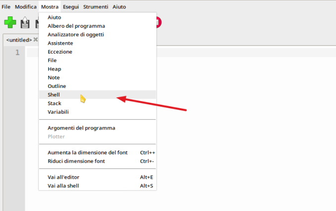
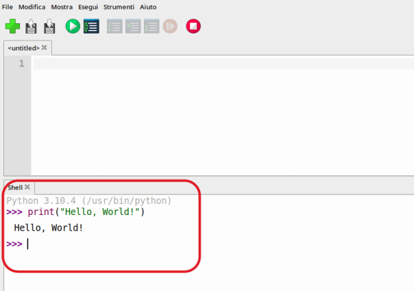
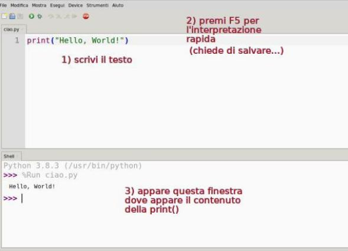

# Prime cose

In questo primo capitolo cercheremo di fare semplicemente i primi passi con il linguaggio di programmazione Python
e le prime esperienze con l'IDE Thonny. la cosa più semplice (e intelligente) per capire è provare a fare insieme!

Quando si comincia a studiare un nuovo linguaggio, il primo programma che si scrive di solito è il cosiddetto "Hello, World!". 
È un semplice programma che scrive semplicemente "Hello, World!", ma in realtà serve per fare un numero incredibile di cose:

- familiarizzare con l'IDE, il nuovo ambiente di programmazione
- provare a scrivere un primo programma
- riuscire nella fase di compilazione/interpretazione/esecuzione del codice
- conoscere l'istruzione principale di output
- superare psicologicamente...

!!! tip "Hello World Programs"

    Gli *Hello World* sono programmi che scrivono (o mostrano) semplicemente
    la scritta "Hello, World!".

    Tutti i linguaggi di programmazione hanno il loro HelloWorld... sembra una cavolata, ma cominciare con il semplice **senza sottovalutarlo**
    e assicurandosi di avere tutto chiaro (fino a lì) è sicuramente un'ottima strategia di apprendimento.


Noi proveremo a scrivere addirittura **due** HelloWorld!!! Infatti, essendo Python un linguaggio interpretato, è possibile
accedere direttamente all'interprete Python ed eseguire codice riga per riga, oppure *creare un modulo*, ovvero un file di testo 
in cui si scrive codice Python e lo si salva con estensione ***.py***.

Cominciamo con l'interprete.

<!-- ############################################################################################################### -->
## L'interprete Python

Per accedere all'interprete Python, basta aprire Thonny e guardare in basso! Se l'interprete non è aperto, attivarlo dal menù
come da immagine.



L'interprete si mostra con il suo tipico `prompt` fatto con i 3 maggiori `>>>`. Quando vedete il prompt significa che l'interprete è pronto a ricevere
ed eseguire i vostri comandi. A questo punto basta digitare l'istruzione `print("Hello, World!")` come nell'immagine seguente:



Tutto qui! Primo livello superato :)

Potete usare il prompt per eseguire una o più righe di codice e vedere che cosa succede, potete usarlo come calcolatrice, potete... farci tutto quello che Python è
in grado di fare (tanta roba) in maniera... un pò scomoda (ma adatta a fare prove, a valutare comandi, etc...).
Ecco alcuni esempi di utilizzo dell'interprete. Le spiegazioni arriveranno (tutte!!!) successivamente. Per adesso... imparate provando!

``` python
>>> print("Ciao")
Ciao

>>> 3 + 5
8

>>> 5 / 5
1.0

>>> type(1.0)
<class 'float'>

>>> type(1)
<class 'int'>

>>> numero = 5 * 2
>>> numero
10

>>> numero = numero / 4
>>> print(numero)
2.5
```


<!-- ############################################################################################################### -->
## Moduli Python (file .py)


Praticamente la cosa più difficile che abbiamo visto finora è che Python chiama i suoi file di codice (in programmazione si dicono *file sorgente*) con il nome di *moduli*.
Per creare un modulo, ovvero un file con estensione .py, basta aprire Thonny, scrivere nell'editor un pò di codice e premere SALVA!

Noi molto semplicemente proveremo di nuovo con un HelloWorld! Scrivete ancora il seguente codice:

``` python
print("Hello, World!")
```

Poi premete `F5` per avviare l'esecuzione. Thonny prima di eseguire un modulo, salva su file le modifiche che avete fatto! Se non avete ancora salvato nulla, parte la procedura
di salva con nome:



Tutto qui!<br>


<!-- ############################################################################################################### -->
## Comandi di base

La prima istruzione che abbiamo incontrato è la classica `print()`.
Serve per visualizzare i suoi argomenti!

``` python
>>> print("Ciao")
Ciao

>>> print("Ciao","a tutti")
Ciao a tutti

>>> print("Ciao", 'ciao', "ne")
Ciao ciao ne
```

Non mi sembra molto complicato... 
- Potete scrivere quante robe volete
- Ogni cosa va tra apici (singoli o doppi... basta che ci sia coerenza
- Per scrivere più cose basta separarle nella print con una virgola e poi queste verranno scritte con uno spazio di separazione

Se abbiamo paura di dimenticarci qualcosa... oppure vogliamo spiegare una o più righe di codice, possiamo
utilizzare i **commenti**!

``` python
# Questo è un commento
# serve a spiegare in italiano alcune cose...
# ad esempio:
# l’istruzione print() visualizza sullo schermo il suo contenuto
print("Hello, World!")
```

Come vedete, ogni commento inizia con un `#` e fino a fine riga potete scrivere ciò che volete.

I commenti semplificano il lavoro di rilettura del codice, soprattutto
quando le righe di codice si avvicinano pericolosamente alle centinaia.
Inoltre, cosa ancora più importante, piacciono al vostro prof! Quindi
scriveteceli! Sempre! Spiegate in ogni porzione di codice l'idea che vi
frulla in mente e quello che volete fare per realizzarla!

Il secondo programma da provare prevede l'introduzione della funzione
complementare alla print(), ovvero quella che permette all'utente di
inserire un valore: **la funzione input()**. Vediamo un esempio:

``` python
# la funzione input permette a chi utilizza il programma di inserire informazioni
nome = input("Come ti chiami? ")
print("Ciao", nome)
```

Quando si esegue questo codice vedremo qualcosa tipo:

    Come ti chiami? Andrea
    Ciao Andrea

Ecco fatto! 
Qui abbiamo anticipato un concetto facile da intuire ma di cui si parlerà nel prossimo capitolo: **le variabili**!!! 
Ne parleremo nel prossimo capitolo... adesso voglio farvi solo vedere un esempio scritto nell'interprete e lasciare il resto a voi...

``` python
>>> nome = "Andrea"

>>> print(nome)
Andrea

>>> print("nome")
nome
```


<!-- ############################################################################################ -->
## Esercizi

Per ognuno dei seguenti quesiti, creare un modulo (un file .py) per eseguire la richiesta dell'esercizio. Tipicamente i file degli esercizi si chiamano `esNUMERO.py`, ad esempio `es1.py` oppure `es001.py`
e nelle prime righe si trova (come commento) il nome di chi lo ha svolto e una descrizione dell'esercizio. Una cosa tipo:


``` 
# Andrea Diamantini
# Esercizio 1

(...codice...)
```


**Esercizio 1**

Visualizzare sullo schermo la scritta seguente:

``` 
Ciao, mi chiamo Pinco Pallino
```

----------------------------------------------------------------------------

**Esercizio 2**

Chiedere all'utente il suo nome, poi chiedere all'utente il suo cognome e alla fine visualizzare sullo schermo la scritta seguente:

``` 
Ciao, mi chiamo Andrea Diamantini
```

Sostituendo al mio il nome (e cognome) scritti dall'utente

----------------------------------------------------------------------------


**Esercizio 3**

Visualizzare sullo schermo la scritta seguente (andando a capo quando
necessario):

``` 
Ciao, 
mi chiamo 
Pinco Pallino
```

----------------------------------------------------------------------------

**Esercizio 4**

Chiedere all'utente il suo nome, poi chiedere all'utente il suo cognome e alla fine visualizzare sullo schermo la scritta seguente
(andando a capo quando necessario):

``` 
Ciao,
mi chiamo 
Andrea Diamantini
```

Sostituendo al mio il nome (e cognome) scritti dall'utente

----------------------------------------------------------------------------

**Esercizio 5**

Visualizzare sullo schermo il seguente disegno:

``` 
+ + + +
+     +
+     +
+ + + +
```

<br>
<br>
<br>

