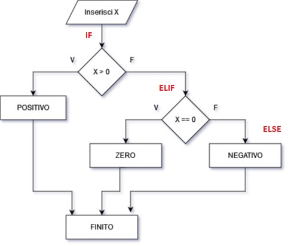

# Strutture di alternanza


Il lavoro di creazione e organizzazione dell'algoritmo risolutivo di un
certo problema si può descrivere, in buona approssimazione, con la
stesura di una serie di operazioni da compiere per ottenere il risultato
prefissato. Durante questo lavoro, vanno tenute in considerazioni anche
variabili come il linguaggio implementativo scelto, il sistema che
ospiterà il programma finale e ogni variabile contingente. È ovvio
dunque che la stesura dell'algoritmo un'operazione preliminare alla
stesura del codice e andrebbero sempre ben distinte.

La schematizzazione sistematica delle operazioni da svolgere per le
risoluzione del problema è il procedimento che viene definito
programmazione strutturata. Obiettivo di questa tecnica di
programmazione è quello di organizzare in strutture più semplici ogni
algoritmo risolutivo. In un algoritmo le istruzioni possono essere
organizzate in:

1. **sequenza**, in cui le istruzioni sono eseguite una dopo l'altra
2. **alternanza**, in cui alcune istruzioni sono eseguite alternativamente (o un gruppo o un altro)
3. **ripetizione**, in cui alcune istruzioni sono ripetute un numero finito di volte.

Accanto a queste semplici strutture possono esserne inserite altre più
generali o più particolari, per schematizzare ogni algoritmo secondo i
criteri che più si adattano ai propri gusti. Queste tre sono state
scelte perché vale il seguente:


> ***Teorema di Jacopini-Bohm (1966)***
>
> "Qualsiasi algoritmo può essere riscritto in maniera equivalente
> utilizzando solo le strutture di sequenza, alternanza, ripetizione."

Questo algoritmo cioè sostanzialmente afferma che le tre strutture
indicate sono i mattoni fondamentali per riprodurre qualsiasi algoritmo
formulabile dall'uomo. In altre parole, tutti i problemi che sono
risolvibile, hanno anche una soluzione costruita semplicemente con
istruzioni in sequenza, alternanza e ripetizione.


<!-- ###################################################################################################### -->

## Istruzione if


if è la più semplice istruzione per realizzare la struttura di
alternanza. Si pone una condizione e a seconda che essa risulti vera
oppure no si eseguono alternativamente due blocchi di istruzione.

Vediamo la definizione di codice:

    if condizione:
        # blocco di codice da eseguire se condizione è vera
        # indentato di 4 caratteri
    [elif condizione2:
        # blocco di codice da eseguire se condizione2 è vera
        # indentato di 4 caratteri]
    [elif condizione3:
        # blocco di codice da eseguire se condizione3 è vera
        # indentato di 4 caratteri]
    [else:
        # blocco di codice da eseguire se condizione è falsa
        # indentato di 4 caratteri]


Le parentesi quadre sopra indicano parti opzionali della struttura di
alternanza. Spero si capisca meglio con qualche esempio:


``` python
x = int (input("Inserisci un numero intero: "))

if x > 0 :
    print("POSITIVO")
elif x == 0:
    print("ZERO")
else:
    print("NEGATIVO")
    
print("FINITO")
```

    Inserisci un numero intero: 7
    POSITIVO
    FINITO


Dal punto di vista funzionale, il codice scorre le istruzioni sopra scritte come nel diagramma seguente:



Le parti con le istruzioni `elif` ed `else` sono opzionali,
ovvero si può costruire un `if-else` semplice, come questo:


``` python
y = int (input("Inserisci un altro numero intero: "))

if y % 2 == 0 :
    print("Hai inserito un numero pari")
else:
    print("Hai inserito un numero dispari")
```


    Inserisci un altro numero intero: 8
    Hai inserito un numero pari


oppure lasciare proprio l'istruzione `if` da sola:


``` python
z = int (input("Inserisci un ultimo numero intero: "))
if z != 9 :
    print("Pensavo inserissi 9 :(")
```

    Inserisci un ultimo numero intero: -5
    Pensavo inserissi 9 :(


Capito??<br>
Provate tutti questi codici e poi giù con gli esercizi...


<!-- ###################################################################################################### -->

## Indentazione in Python


!!! note "Indentazione"

    ***Indentare*** significa inserire una certa quantità di spazi vuoti
    all'inizio di una o più righe per incolonnare opportunamente il codice
    sorgente. 

I linguaggi più famosi, come C o Java, utilizzano le parentesi
graffe per indicare un blocco di codice e opzionalmente suggeriscono di
indentare il codice per rendere i blocchi più evidenti:


***Esempio di codice in linguaggio C, INDENTATO***

``` c
if (numero > 0)
{
    // fai qualcosa se numero è maggiore di ZERO
}
else
{
    // fai qualcosa se numero NON è maggiore di ZERO
}
```


Come si vede, lo spostamento a destra di alcune righe del codice le
rende più evidenti. Come dicevamo comunque, per C o Java l'indentazione
è assolutamente opzionale e il seguente pezzo di codice è assolutamente
equivalente al precedente.


***Esempio di codice in linguaggio C, NON INDENTATO***

``` c
if (numero > 0) { // fai qualcosa se numero è maggiore di ZERO
} else { // fai qualcosa se numero NON è maggiore di ZERO
}
```


Io penso che sia alquanto evidente come il primo esempio sia molto più
facile da leggere, da comprendere e imparare rispetto al secondo, anche
se per il linguaggio C essi rappresentano lo stesso identico concetto.

Altri linguaggi, come il PASCAL, non utilizzano le parentesi ma parole
chiave del linguaggio. Anche qui l'indentazione è opzionale.


**Esempio di codice in linguaggio PASCAL, NON INDENTATO**

``` pascal
if (numero > 0) then ( fai qualcosa se numero è maggiore di ZERO )
else
( fai qualcosa se numero NON è maggiore di ZERO } ;
```


Anche qui, pur avendo le parole chiave `if ... then ... else ... ` che racchiudono
i due blocchi, a mio parere senza indentazione la leggibilità e la
chiarezza del codice vengono molto meno.


> Python obbliga i suoi utilizzatori ad usare l'**indentazione** 
> come unica forma di organizzazione del codice in blocchi! 


In questo modo le parole del linguaggio da imparare sono pochissime e la struttura del linguaggio
è molto facile da leggere.

A questo aggiungiamo che lo stile predefinito di Python per
l'indentazione è di inserire 4 spazi ogni volta si voglia identificare
un blocco di codice. In questo modo tutti i programmi Python sono per
definizione

- i più semplici da leggere
- con una struttura logica identica alla indentazione delle righe di codice che la implementano
- con una organizzazione uniforme in TUTTI i programmi Python.


Vediamo il solito esempio scritto in Python:


**Esempio di codice in linguaggio Python (indentato per forza)**


``` python
if numero > 0 :
    # i blocchi Python iniziano con 4 spazi
    # Qui si fa qualcosa se numero è maggiore di ZERO
else:
    # altro blocco di codice
    # qui si fa qualcosa se numero NON è maggiore di ZERO

print("qui i blocchi sono finiti")
```


Tutto qua! D'ora in avanti quando incontreremo strutture con blocchi di
codice li evidenzieremo tramite indentazione di 4 spazi. Come vedremo
alcuni editor di testo ci aiutano molto per questa operazione :)

Volendo fare i *precisoni*, Python 3.x che noi studieremo utilizza una
specifica chiamata [PEP8](https://www.python.org/dev/peps/pep-0008/) che
descrive per filo e per segno ***come*** scrivere qualunque struttura di
codice Python. Questo con l'obiettivo dichiarato di uniformare lo stile
di qualsiasi pezzo di codice Python scritto da chiunque.

In particolare vorrei sottolineare come questa specifica sia
assolutamente allergica al carattere di tabulazione TAB, presente in
alto a destra in ogni tastiera. **Il carattere di tabulazione NON deve
essere usato negli script Python**.


!!! tip "Suggerimento"

    Se state utilizzando *Thonny* (come dovreste) potete utilizzare tranquillamente
    il tasto TAB della tastiera perché esso ***trasforma automaticamente ogni TAB in una
    sequenza di 4 caratteri*** evitando fastidi durante l'esecuzione del codice e
    semplificando il lavoro del programmatore che non deve digitare a mano 4, 8, 12,,, spazi!!


Per forzare gli utenti ad usare queste buone regole di uniformità,
l'interprete Python segnala un errore ogni volta che trova un carattere
di tabulazione nel codice. E il prof mette una insufficienza. Fate
voi...


<!-- ###################################################################################################### -->

## Esercizi


**Esercizio 201**

Scrivere un programma che richiede un numero intero all'utente e
visualizza la scritta "PARI" oppure "DISPARI" a seconda del valore
inserito.


-----------------------------------------------------------------------------------------


**Esercizio 202**

Scrivere un programma che richiede un numero intero all'utente e
visualizza la scritta "DIVISIBILE PER 5" oppure "NON DIVISIBILE PER
5" a seconda del valore inserito.


-----------------------------------------------------------------------------------------


**Esercizio 203**

Dati due numeri interi da parte dell'utente, memorizzati nelle variabili
n1, n2; verificare se il primo è un multiplo del secondo, visualizzando
il risultato.


-----------------------------------------------------------------------------------------


**Esercizio 204**

Dato un numero intero, inserito dall'utente, restituire la scritta
CORRETTO se il numero è pari e compreso fra 100 e 200 (estremi esclusi),
NON CORRETTO altrimenti.


-----------------------------------------------------------------------------------------


**Esercizio 205**

Dato un numero intero, inserito dall'utente, restituire la scritta
CORRETTO se il numero è dispari e compreso fra -5 e 5 (estremi inclusi),
NON CORRETTO altrimenti.


-----------------------------------------------------------------------------------------


**Esercizio 206: confronti**

Dati due numeri reali da parte dell'utente, visualizzarli in ordine
crescente (prima il più piccolo, poi il più grande).


-----------------------------------------------------------------------------------------


**Esercizio 207**

Dati due numeri reali da parte dell'utente, memorizzati nelle variabili
n1 e n2, inserire il valore più piccolo nella variabile "piccolo" e il
più grande nella variabile "grande", infine visualizzarli.


-----------------------------------------------------------------------------------------


**Esercizio 208**

Dati tre numeri reali da parte dell'utente, visualizzarli in ordine
crescente (prima il più piccolo, poi il medio, poi il più grande).


-----------------------------------------------------------------------------------------


**Esercizio 209**

Dati tre numeri reali da parte dell'utente, memorizzati nelle variabili
n1, n2, n3; inserire il valore più piccolo nella variabile "v1", il
medio nella variabile "v2" e il più grande nella variabile "v3".


-----------------------------------------------------------------------------------------


**Esercizio 210**

Dati quattro numeri reali da parte dell'utente, memorizzati nelle
variabili n1, n2, n3, n4; visualizzare il valore più grande fra i 4.


-----------------------------------------------------------------------------------------


**Esercizio 211**

Dati quattro numeri reali da parte dell'utente, memorizzati nelle
variabili n1, n2, n3, n4; visualizzare il valore più piccolo fra i 4.


-----------------------------------------------------------------------------------------


**Esercizio 212: metà e doppio di un intero**

Programma che, dato un numero intero, ne visualizza la metà se il numero
è pari o ne visualizza il doppio se il numero è dispari.


-----------------------------------------------------------------------------------------


**Esercizio 213: radice quadrata**

Programma che dato un numero intero, dice se questo è positivo oppure
no. Se il numero è positivo, ne calcola la radice quadrata. Se il numero
è negativo ne calcola l'opposto.


-----------------------------------------------------------------------------------------


**Esercizio 214: validità di una data (giorno/mese)**

Richiedere l'inserimento di due numeri interi, che rappresentano
rispettivamente il giorno e il mese di una data. Alla fine comunicare
all'utente se la data inserita risulta valida oppure no.

Ad esempio, la sequenza 15 16 non rappresenta una data valida (non
esiste il mese '16'). La sequenza 29 2 non è valida (non sapendo che
anno è... facciamo che non è bisestile).


-----------------------------------------------------------------------------------------


**Esercizio 215: anno bisestile**

Dato un numero intero da parte dell'utente, visualizzare se questo
rappresenta un anno bisestile oppure no. Un anno è bisestile se è
divisibile per 4, ma non per 100 oppure se è divisibile per 400.

Ad esempio il 1900 **non** è stato un anno bisestile, perché 1900 è
divisibile per 4 ma anche per 100. L'anno 2000 è stato bisestile perché
2000 è divisibile per 400.


-----------------------------------------------------------------------------------------


**Esercizio 216**

Un negozio applica degli sconti diversi a seconda del prezzo dei
prodotti. Sul prezzo di un prodotto viene praticato lo sconto del 3% se
costa fino a 100 euro e del 5% se costa di più. Inserito da tastiera il
prezzo P, calcolare il prezzo da pagare secondo la regola sopra
descritta.


-----------------------------------------------------------------------------------------


**Esercizio 217: biglietto del treno**

Sul prezzo di un biglietto di un treno viene applicato un supplemento
del 7% se il treno è di tipo 'A', del 12% se è di tipo 'B' e del 18%
se è di tipo 'C'. Per gli altri treni non c'è supplemento.

Chiedere all'utente di inserire un numero reale che rappresenta il
costo del biglietto e un carattere che rappresenta il tipo di treno,
quindi calcolare il prezzo reale del biglietto, applicando l'eventuale
sovrapprezzo secondo le indicazioni precedenti.

Infine visualizzare il prezzo iniziale (inserito dall'utente) il tipo
di treno indicato e il prezzo finale.


-----------------------------------------------------------------------------------------


**Esercizio 218: temperature**

Si permetta all'utente di inserire un numero reale che rappresenterà una
temperatura in gradi Celsius. Il programma visualizzerà la temperatura
inserita e poi la convertirà in gradi Fahrenheit e in gradi Kelvin.
Prima della conversione, il programma verificherà se la temperatura
inserita è minore allo zero assoluto (ZERO gradi Kelvin) e in quel caso
visualizzerà un errore senza visualizzare le conversioni.

!!! tip "Suggerimento"

    Per convertire le temperature, usa le seguenti formule:
    
    ```
    Fahrenheit = (9/5) * Celsius + 32
    Kelvin = Celsius + 273.15
    ```


-----------------------------------------------------------------------------------------


**Esercizio 220: triangolo o no**

Dati 3 numeri A, B, C da parte dell'utente, che rappresentano le
lunghezze di 3 lati, valutare se essi possono rappresentare un
triangolo. In caso affermativo dire quale tipo di triangolo (equilatero,
isoscele, rettangolo, scaleno) e calcolare l'angolo compreso fra i lati
AB.


-----------------------------------------------------------------------------------------


**Esercizio 221: cifre1**

Chiedere all'utente di inserire un numero intero. Visualizzare poi il
numero stesso e la cifra delle centinaia. Ad esempio se il numero
inserito è 243, la cifra da visualizzare è 2. Se il numero inserito è
85, la cifra da visualizzare è 0. Se il numero inserito è 1357, la cifra
da visualizzare è 3.

!!! tip "Suggerimento"
    se sapete verificare se un numero è multiplo di un altro,
    sapete trovare le cifre di un numero, verificando se è multiplo di 10,
    100, 1000...)


-----------------------------------------------------------------------------------------


**Esercizio 222: cifre2**

Chiedere all'utente di inserire un numero intero. Visualizzare poi il
numero stesso e la cifra delle decine. 

Ad esempio se il numero inserito è 243, la cifra da visualizzare è 4. 

Se il numero inserito è 85, la cifra da visualizzare è 8. 

Se il numero inserito è 1357, la cifra da visualizzare è 5.


-----------------------------------------------------------------------------------------


**Esercizio 223: data valida**

Chiedere all'utente di inserire 2 numeri interi GG, MM e si determini se
questi possono rappresentare i giorni e i mesi di una data. In
particolare, se questo è vero si riporti la scritta DATA VALIDA,
altrimenti la scritta DATA NON VALIDA.

Ad esempio,

- dati i valori G = 25, M = 7 si ritorna DATA VALIDA.
- dati i valori G = 5, M = 17 si ritorna DATA NON VALIDA.
- dati i valori G = 31, M = 3 si ritorna DATA VALIDA.
- dati i valori G = 31, M = 4 si ritorna DATA NON VALIDA.

Il 29 febbraio non è una data valida, non essendo presente il controllo
sull'anno.

PS: Trenta dì conta Novembre, con April, Giugno e Settembre...


-----------------------------------------------------------------------------------------


**Esercizio 224: orario**

Chiedere all'utente di inserire due numeri interi per le ore e i minuti
di un orario e visualizzare la scritta ORARIO ERRATO se esso è una
combinazione impossibile (ad esempio se i valori sono negativi, oppure
se le ore superano 23, etc...).

Se l'orario è corretto, visualizzare una scritta secondo il seguente
schema:

- Dalle 8.00 alle 8.59: visualizzare PRIMA ORA
- Dalle 9.00 alle 9.59: visualizzare SECONDA ORA
- Dalle 10.00 alle 10.54: visualizzare TERZA ORA
- Dalle 10.55 alle 11.04: visualizzare INTERVALLO
- Dalle 11.05 alle 11.59: visualizzare QUARTA ORA
- Dalle 12.00 alle 13.00: visualizzare QUINTA ORA

In tutti gli altri casi, visualizzare la scritta TEMPO LIBERO.

<br>
<br>
<br>

