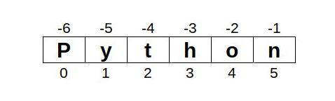
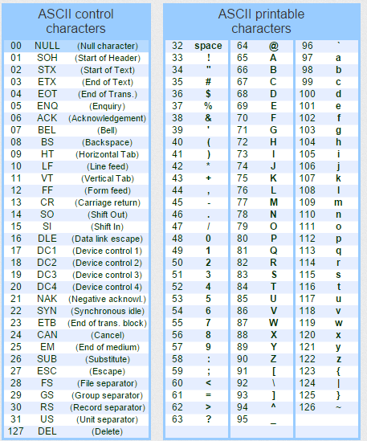

# Sequenze


Una sequenza è intuitivamente una collezione di elementi messi "in
fila". Pur potendo considerare, in siffatte strutture, tipologie di
oggetti anche molto diversi (anche fra loro, all'interno della stessa
sequenza) ci sono una serie di operazioni che funzionano comunque in
questo contesto: ad esempio *contare* gli elementi presenti nella
sequenza o verificare se un certo elemento è presente all'interno della
stessa.

Le operazioni che adesso andiamo ad elencare sono comuni a tutte le
sequenze: in questa tabella sono state ordinate secondo la priorità
(crescente) di esecuzione. Negli esempi che descrivono le operazioni, x,
y, z sono elementi possibilmente presenti in una sequenza, s e t sono
sequenze di esempio, i, k, n sono numeri interi.

| Comando o Funzione | Descrizione                                                                                                         |
|--------------------|---------------------------------------------------------------------------------------------------------------------|
| x in s             | True se un elemento di s è uguale a x, altrimenti False                                                             |
| x not in s         | False se un elemento di s è uguale a x, altrimenti True                                                             |
| s + t              | La sequenza prodotta dalla concatenazione di s e t                                                                  |
| s * n oppure n * s | La sequenza prodotta dalla concatenazione di s con se stessa per n volte                                            |
| s [ i ]            | L'elemento della sequenza s al posto i, considerando che il primo elemento della sequenza si trova al posto ZERO.   |
| len (s)            | Numero di elementi di s, lunghezza di s                                                                             |
| min (s)            | Elemento più piccolo di s                                                                                           |
| max (s)            | Elemento più grande di s                                                                                            |
| s.count (x)        | Numero di volte in cui x compare nella sequenza s                                                                   |
| s.index (x)        | La prima posizione della sequenza s ove si trova l'elemento x. Ritorna errore se l'elemento non è presente.         |

Ora... queste operazioni sembrano molto generiche come il concetto
stesso di "sequenza". Allora, per partire con un esempio semplice
pensiamo così: **una stringa non è altro che una sequenza di
caratteri!!**

Più precisamente... ***le stringhe sono definite in Python come delle
sequenze immutabili di caratteri***. Lasciamo a dopo il significato di
"immutabile" e concentriamoci sul fatto che sono sequenze: supportano
tutte le operazioni che abbiamo appena elencato.

Facciamo degli esempi per illustrare il concetto:

**Operatori *in*, *not in***

```python
if "n" in "Python":
    print("Presente")
else:
    print("Assente")

# scrive "Presente"
```

Altro esempio: 

```python
if "s" not in "Python":
    print("Assente")

# scrive "Assente"
```

** Operatori +, * **

```python
nome = "Capo" + "Stazione"
print(nome)

# scrive "CapoStazione"
```

Altro esempio:

```python
parola = "Acqua" * 3
print(parola)

# scrive "AcquaAcquaAcqua"
```

Per quanto riguarda l'operatore **sequenza[intero]** che ci permette
di visualizzare l'elemento al posto richiesto, vanno precisate alcune
cose:

- il primo elemento è l'elemento al posto ZERO
- Andando avanti ogni elemento si trova (ovviamente) al posto successivo

Vediamo un esempio:

```python
nome = "Leonardo"
print("Al posto 0 troviamo: ", nome[0])
print("Al posto 4 troviamo: ", nome[4])
print("Al posto 8 troviamo: ", nome[8])

# Scrive:
# Al posto 0 troviamo L
# Al posto 4 troviamo a
# Al posto 8 troviamo ERRORE!!!
```

Va inoltre specificato che la numerazione degli elementi di una sequenza
funziona anche con i numeri negativi, dove:

- l'ultimo elemento è quello al posto -1
- il penultimo è quello al posto -2
- .. e così via fino al primo elemento

Ancora un esempio:

```python
cognome = "Da Vinci"
print("All'ultimo posto: ", cognome[-1])
print("Al penultimo posto: ", cognome[-2])
print(". . ." , cognome[-9])

# Scrive:
# All'ultimo posto: i
# Al penultimo posto: c
# . . . ERRORE!!!
```

Riassumendo il concetto con un disegno, inizializzata una stringa, le
posizioni degli elementi si contano come in figura:

```python
linguaggio = "Python"
```



La funzione **len(sequenza)** ci dice il numero di elementi della stessa.

```python
print(linguaggio , "contiene" , len(linguaggio) , "caratteri")

# scrive "Python contiene 6 caratteri"
```

La funzione **sequenza.count(elemento)** ci dice quante volte un
elemento compare in una sequenza.

```python
prova = "Buonasera"
print("Quante 'a' in " , prova , ":" , prova.count('a') )
print("Quante 't' in " , prova , ":" , prova.count('t') )

# scrive:
# Quante a in Buonasera: 2
# Quante t in Buonasera: 0
```


!!! warning "Attenzione"

    Attenzione alla differenza fra maiuscole e minuscole!!!


La funzione **sequenza.index(elemento)** ritorna *la prima posizione* in cui si trova un elemento ed errore se l'elemento non è
presente, quindi ATTENZIONE!!!

```python
prova = "Buonasera"
print( prova.index('a') )

# scrive 4
```

Mentre...

```python
print( prova.index('t') )

# ERRORE!
```

Per assicurarci che la funzione index() non dia errore bisogna controllare la presenza o meno della variabile nella parola:


```python
if 't' in prova:
    print( prova.index('t') )
```


Le funzioni **min(sequenza)** e **max(sequenza)** ci ritornano rispettivamente l'elemento minore e maggiore della sequenza.

```python
nome = "Gianmarco"
print( min(nome) ) 
# scrive 'G'
print( max(nome) ) 
# scrive 'r'
```

{style="float:right; margin-left:10px; margin-top:5px;"}

Se, come spero, grazie agli esempi sopra le funzioni tipiche delle sequenze saranno molto più chiare, rimane ancora un
mistero da svelare, ovvero per quale assurdo motivo la lettera più piccola (min) della parola "Gianmarco" sia la "G" invece 
della 'a'? Non funziona l'ordine alfabetico?

Questo funzionamento dipende dal fatto che i caratteri sono memorizzati all'interno dei nostri dispositivi come sequenze numeriche e la
corrispondenza numero-lettera è data dal cosiddetto [codice ASCII](https://it.wikipedia.org/wiki/ASCII).

Guardate l'immagine sul codice ASCII che riporta i caratteri stampabili in una tabella: come si desume osservandola, le lettere maiuscole, ordinate
secondo l'alfabeto tradizionale, vengono tutte prima delle minuscole e secondo il confronto numerico sono da considerarsi "più piccole".


<!-- ############################################################################################ -->
### Lavorare con le sequenze


Quando vogliamo controllare se un valore si trova in una sequenza,
abbiamo capito di poter ricorrere all'operatore in all'interno di una
istruzione condizionale, un **if-else**:


```python
parola = input("Inserisci una parola")
if "a" in parola:
    print("la parola che hai scritto contiene la 'a'")
else:
    print("la parola che hai scritto NON contiene la 'a'")
```


A seconda della parola che l'utente inserisce ci aspettiamo una
risposta diversa. Questo perché l'istruzione ***elemento in sequenza***
ritorna un valore boolean che può essere True o False esattamente come
serve al comando if.

Questo controllo funziona con qualunque stringa: ad esempio funziona
benissimo anche per la ricerca delle sottostringhe:


```python
if "gn" in parola:
    print("la parola che hai scritto contiene la 'gn'")
else:
    print("la parola che hai scritto NON contiene la 'gn'")
```


C'è però un altro metodo di applicare l'operatore IN alle sequenze che è quello del comando **FOR...IN**:

```python
parola = "oggi"
for car in parola:
    print(car)
```

Scrive:

    o
    g
    g
    i


Come si desume osservando l'esempio, il comando ***FOR elemento IN sequenza*** scorre tutta la sequenza, assegnando ogni volta alla
variabile ausiliaria ***elemento*** il valore di uno degli elementi della sequenza.

Se invece vogliamo scorrere le posizioni dobbiamo muoverci con un ciclo ***FOR...IN RANGE***. Infatti una sequenza è lunga LEN(sequenza)
elementi e i suoi elementi sono numerati da 0 a LEN(sequenza) - 1, esattamente come si comporta la funziona range(len(sequenza)).

```python
    parola = "oggi"
    for pos in range(len(parola)):
        print("posizione" , pos , ":" , parola[pos])
```

Scrive:

    posizione 0: o
    posizione 1: g
    posizione 2: g
    posizione 3: i

Facile e comodo. Tutto chiaro?


<!-- ############################################################################################ -->

### Esercizi sulle stringhe

Negli esercizi che seguono dobbiamo ricordare che le stringhe in Python
non sono altro che un tipo particolare di sequenza (di caratteri).
Aggiungo inoltre che per ogni necessità ulteriore ci sono sempre le
funzioni ***dir()*** e ***help()***.


**Esercizio 401**

Chiedere all'utente di inserire una stringa e visualizzarla. Poi
visualizzare i caratteri che compongono la stringa uno per riga.

------------------------------------------------------------------------------------------------

**Esercizio 402**

Chiedere all'utente di inserire una stringa e visualizzarla. Poi
visualizzare il numero di caratteri presenti nella stringa inserita.

------------------------------------------------------------------------------------------------

**Esercizio 403**

Chiedere all'utente di inserire una stringa e visualizzarla.

Chiedere successivamente di inserire un carattere (verificare che sia un
solo carattere!) e verificare se esso è presente nella stringa inserita.

Infine verificare se il carattere è presente nell'altro caso (ad esempio
se l'utente inserisce il carattere "a" ma nella stringa è presente il
carattere "A").

(suggerimento: guarda `dir(str)` e `help(str.upper)` oppure `help(str.lower)`).

------------------------------------------------------------------------------------------------

**Esercizio 404**

Chiedere all'utente di inserire il proprio nome, da salvare in una
variabile e successivamente il proprio cognome, da salvare in un'altra
variabile. Creare la variabile nominativo che contiene il nome inserito,
uno spazio e il cognome inserito. Visualizzare la variabile nominativo
così creata.

------------------------------------------------------------------------------------------------

**Esercizio 405**

Chiedere all'utente di inserire una frase e un numero intero. Poi
visualizzare la frase inserita per quel numero di volte.

------------------------------------------------------------------------------------------------

**Esercizio 406**

Chiedere all'utente di inserire una frase e un numero intero. Poi
creare una stringa che contiene la frase , uno spazio, la frase, uno
spazio, la frase, uno spazio... per il numero di volte inserito
dall'utente. L'ultimo spazio non va inserito!!!

Ad esempio, dato "cane" e 3, la stringa da creare sarà "cane cane
cane". Non basta visualizzarla: il valore va assegnato ad una
variabile.

Visualizzare la stringa così creata.

------------------------------------------------------------------------------------------------

**Esercizio 407**

Chiedere all'utente di inserire una stringa e visualizzarla tutta
scritta in caratteri maiuscoli. 

(suggerimento: guarda `dir(str)` e `help(str.upper)`)

------------------------------------------------------------------------------------------------

**Esercizio 408**

Chiedere all'utente di inserire una stringa e visualizzarla tutta
scritta in minuscolo con iniziali maiuscole per ogni parola.

(suggerimento: guarda `dir(str)` e `help(str.title)`)

------------------------------------------------------------------------------------------------

**Esercizio 409**

Chiedere all'utente di inserire una stringa e visualizzarla. Chiedere
successivamente di inserire un carattere e contare quante volte il
carattere è presente nella stringa inserita.

Ripetere lo stesso calcolo ignorando il caso, ovvero contando le lettere
minuscole e/o maiuscole presenti.

------------------------------------------------------------------------------------------------

**Esercizio 410**

Chiedere all'utente di inserire una stringa e visualizzarla. Contare le
vocali (maiuscole e minuscole) presenti nella stringa. (Come si fa??)

------------------------------------------------------------------------------------------------

**Esercizio 411**

Chiedere all'utente di inserire una stringa e visualizzarla.
Successivamente verificare se la stringa inizia oppure no con una
vocale.

------------------------------------------------------------------------------------------------

**Esercizio 412**

Chiedere all'utente di inserire una frase e visualizzarla in modo tale
che ogni volta che si incontra uno spazio si vada a capo.

(suggerimento: `help(print)` )

> Questo esercizio va fatto modificando il comportamento della funzione print.
>
> Chiedetemi se l'help non vi risulta troppo chiaro!

------------------------------------------------------------------------------------------------

**Esercizio 413**

Chiedere all'utente di inserire il proprio nome. Se esso termina per
'o' visualizzare la frase "Sei un maschio?". Se esso termina per
"a" visualizzare la frase "Sei una femmina?". In tutti gli altri
casi visualizzare la frase "Sei un maschio o una femmina?".

------------------------------------------------------------------------------------------------

**Esercizio 414**

Chiedere all'utente di inserire una stringa e visualizzarla.
Successivamente chiedere all'utente di inserire un carattere e
verificare se esso è presente nella stringa. Se è presente, chiedere un
secondo carattere e rimpiazzare nella stringa tutte le occorrenze del
primo carattere con il secondo.

(Suggerimento: `help(str.replace)` )

------------------------------------------------------------------------------------------------

**Esercizio 415**

Chiedere all'utente di inserire una stringa e visualizzarla.
Successivamente visualizzare il carattere più volte presente nella
stringa.

------------------------------------------------------------------------------------------------

**Esercizio 416**

Chiedere all'utente di inserire un numero intero N e calcolare il
valore decimale di 1/N. Le sue cifre decimali contengono la cifra 9? In
quale posizione?

(Suggerimento: calcolare 1/N come float, poi convertirlo in stringa
e...)

------------------------------------------------------------------------------------------------

**Esercizio 417**

Dichiarare la stringa alfabeto, contenente tutte le lettere
dell'alfabeto, la stringa numeri, contenente tutte le cifre da 0 a 9 e
la stringa alfanumerici, contenenti tutti i caratteri di punteggiatura
diversi che riuscite ad inserire in una stringa.

Chiedere all'utente di inserire una stringa e dire se essa contiene
lettere, cifre, caratteri alfanumerici o spazi.

------------------------------------------------------------------------------------------------

**Esercizio 418**

Chiedere all'utente di inserire una stringa e visualizzarla.
Visualizzare le vocali presenti nella stringa. Visualizzare la posizione
delle vocali presenti nella stringa.

------------------------------------------------------------------------------------------------

**Esercizio 419**

Chiedere all'utente di inserire una frase qualsiasi, lunga a piacere.
Visualizzare la stringa inserita.

Chiedere poi all'utente di inserire un carattere a piacere, verificando
che sia una lettera e che sia solo uno. Ad esempio "f" va bene
(lettera singola), "?" non va bene (no lettera), "fa" non va bene (2
lettere). Contare quante volte il carattere è presente nella frase
(minuscolo e maiuscolo).

Permettere all'utente di inserire un nuovo carattere singolo e
sostituire le occorrenze del carattere precedente con il nuovo,
visualizzando la stringa risultante

Ad esempio, inserita la stringa "buonasera" e indicato prima il
carattere "a" e successivamente il carattere "g" dovrà essere
visualizzata la stringa "buongserg".


<!-- ############################################################################################ -->
## Tuple

Python fornisce un tipo predefinito, chiamato ***tupla***, per indicare
una ***sequenza immutabile*** di oggetti, di solito diversi fra loro
anche per tipo.

> In Python, un tipo di dato si dice **immutabile** se, una volta
> definito il suo valore, esso non può essere modificato.
>
> Viceversa un tipo di dato si dice **mutabile** se il suo valore può
> essere modificato anche dopo essere stato definito.

Essendo la tupla un tipo sequenza, essa supporta tutte le operazioni
definite per le sequenze e visionate poco fa per le stringhe.

Una tupla si definisce elencando dentro le parentesi tonde una serie di
valori separati da virgola:


```python
tabellina7 = ( 7 , 14 , 21 , 28 , 35 , 42 , 49 , 56 , 63 , 70 )
```


Come dicevamo, per le tuple valgono tutte le operazioni tipiche delle
sequenze:

```python
len(tabellina7) # vale 10
min(tabellina7) # vale 7
```


Possiamo controllare la presenza di un valore con IN:

```python
num = int(input("Inserisci un numero: "))
if num in tabellina7:
    print(num,"fa parte della tabellina del 7")
```

Oppure visualizzare i valori con un ciclo:


```python
for num in tabellina7:
    print(num)
```

Scrive:
    
    7
    14
    21
    28
    35
    42
    49
    56
    63
    70


Facciamo un altro esempio con valori eterogenei:

```python
tupla = ("ciao" , 12 , 23.45 , 1000000 , 12, "come??")
print(tupla)
```

scrive: 

    ( "ciao" , 12 , *23.45 *, 1000000 , 12, "come??" )


```python
tupla.count(12) # vale 2
tupla.index(12) # vale 1 (la posizione della prima istanza di 12)
```


Ricordo che i valori presenti in una sequenza sono numerati dal primo
all'ultimo a partire da zero, quindi:


```python
    tupla[0] # vale "ciao"
    tupla[3] # vale 1000000
    tupla[1] = "prova" ERRORE!!!
```


!!! error "Errore!!!"

        tupla[1] = "prova" ERRORE!!!

    Le tuple sono immutabili! Ricordate???

A occhio sembrano abbastanza facili! Attenti però...

In Python la definizione di una tupla non richiede espressamente le
parentesi tonde, basta elencare i valori con la virgola. Ecco allora che
lo studente sprovveduto potrebbe scrivere:

```python
pigreco = 3,14
print(pigreco)
```

scrive:

    ( 3 , 14 )

mentre:

```python
pi = 3.14
print(pi)
```

scrive:

    3.14


!!! warning "ATTENZIONE!!!"

    pigreco è una tupla NON un valore reale!

    ```python
    type (pigreco) scrive <class 'tuple'>
    type (pi)      scrive <class 'float'>
    ```


> In Python il separatore decimale è il punto NON la virgola!!!

Quando si usano le tuple è sempre meglio utilizzare sempre le parentesi
tonde per evitare spiacevoli equivoci!!!

```python
# scrivi le tuple con le parentesi tonde!
tupla = (3,14)
```
    
La caratteristica delle tuple di essere immutabili non limita comunque
la possibilità di inserirvi dati via codice: basta semplicemente usare
qualche accortezza!


**Esempio: definire la tupla "datiPersonali" con nome e cognome inseriti dall'utente**

```python
nome = input("Inserisci nome: ")
cognome = input("Inserisci cognome: ")
datiPersonali = ( nome , cognome )
```


**Esempio: definire la tupla tabellina del numero scelto dall'utente**

```python
num = int ( input("Inserisci numero: ") )
tabellina = (num,num*2,num*3,num*4,num*5,num*6,num*7,num*8,num*9,num*10)
```


**Esempio: definire una tupla con un solo valore**

```python
es1 = (1,)
es2 = (1)
print("es1:",es1, type(es1)
print("es2:",es2, type(es2)
```
    
scrive:
    
    es1: (1,) <class 'tuple'>
    es2: 1 <class 'int'>
    
In realtà, con un po' di furbizia e la sintassi giusta, è possibile
anche "modificare" una tupla:

```python
tupla = ()
for i in range(10):
    # questo codice OGNI volta crea una nuova tupla aggiungendo (i) in fondo al valore della precedente
    # es: (1,2) + (3,) diventa la tupla (1,2,3) 
    tupla += (i,)

print(tupla)
```


    ( 0 , 1 , 2 , 3 , 4 , 5 , 6 , 7 , 8 , 9 )


Spero sia tutto sufficientemente chiaro!

Per schiarirsi definitivamente le idee... ci sono gli esercizi :)


<!-- ############################################################################################ -->
### Esercizi sulle Tuple


**Esercizio 421**

Dichiarare una tupla con i nomi dei giorni della settimana. Visualizzare
la tupla con una print, poi visualizzare la stessa con un ciclo,
visualizzando i giorni uno per riga.

Alla fine visualizzare il numero degli elementi della tupla con la
funzione len.

------------------------------------------------------------------------------------------------

**Esercizio 422**

Dichiarare una tupla con i nomi di alcuni dei propri parenti. Chiedere
all'utente di inserire un nome e verificare se la persona ha lo stesso
nome di un proprio parente. Visualizzare il risultato, confermando la
ricerca visualizzando anche l'elenco dei propri parenti con un elenco
intervallato da virgole.

Ad esempio se la tupla contiene ("gino", "pino") e l'utente
inserisce il nome "dino", visualizzare una frase tipo: "dino" non
può essere mio parente, infatti i miei parenti si chiamano: "gino",
"pino".

------------------------------------------------------------------------------------------------

**Esercizio 423**

Dichiarare una tupla con i nomi dei mesi.

Chiedere all'utente di inserire una data digitando i numeri per giorno,
mese, anno (ad esempio: 16 , 10 , 2020). Utilizzare la tupla con i
nomi dei mesi per visualizzare la data nella forma "16 ottobre 2020".

------------------------------------------------------------------------------------------------

**Esercizio 424**

Dichiarare una tupla con i nomi dei nani, senza visualizzarla! Chiedere
all'utente di inserire i nomi dei nani e verificare se li sa tutti
oppure si sbaglia.

------------------------------------------------------------------------------------------------

**Esercizio 425**

Dichiarare una tupla che contiene la tabellina del 5 e poi scrivere un
ciclo per visualizzarla nella forma:

    5 x 1 = 5
    5 x 2 = 10
    5 x 3 = 15
    . . .

------------------------------------------------------------------------------------------------

**Esercizio 426**

Chiedere all'utente di inserire un numero intero fra 2 e 15 (da
verificare) e dichiarare la tupla che contiene la tabellina del numero
inserito.

Visualizzare la tupla così creata.

------------------------------------------------------------------------------------------------

**Esercizio 427**

Chiedere all'utente di inserire i propri dati personali relativi a:
nome, cognome, sesso, luogo di nascita. Poi dichiarare una tupla
contenente queste 4 informazioni. Ripetere l'operazione per 3 persone.
Alla fine devono rimanere nelle variabili **tutti** i dati inseriti!

(sfida: provate a farlo con un ciclo, in modo da non dover ripetere le
operazioni...)

------------------------------------------------------------------------------------------------

**Esercizio 428**

Chiedere all'utente di inserire un numero reale in una variabile
chiamata "real" e dichiarare la tupla così definita:

    tupla = ( real * -1 , 0 , real , real * 3 , real * 0.5 )

Visualizzare la tupla così ottenuta e visualizzare il valore più piccolo
e più grande di essa.

------------------------------------------------------------------------------------------------

**Esercizio 429**

Chiedere all'utente di inserire 5 numeri reali e al termine
dell'inserimento visualizzare la tupla composta dai numeri inseriti
dall'utente.

Chiedere all'utente di inserire un altro numero e verificare se esso
sia presente nella tupla. In caso positivo visualizzare la prima
posizione ove esso è presente.

------------------------------------------------------------------------------------------------

**Esercizio 430**

Chiedere all'utente di inserire una stringa e un numero intero positivo
(verificare). Creare la tupla contentente la stringa per numero volte.

Ad esempio, inserito "ciao" e 4 va creata la tupla  ("ciao","ciao","ciao","ciao").

Chiedere all'utente di inserire due stringhe e un numero intero positivo
(verificare). Creare la tupla contentente le due stringhe per numero
volte. 

Ad esempio, inseriti "pippo" , "ciccio" e 3 va creata la tupla ("pippo", "ciccio", "pippo", "ciccio", "pippo", "ciccio").

------------------------------------------------------------------------------------------------

**Esercizio 431**

Chiedere all'utente di inserire 5 numeri interi e creare una tupla
contenente questi 5 numeri. Visualizzare la tupla con una semplice
print. Chiedere all'utente di inserire un numero qualsiasi e
visualizzare la frase: "il numero inserito è presente nella tupla per
TOT volte". Ovviamente TOT va calcolato...


<!-- ########################################################################################################################################## -->


## Liste


Python fornisce un tipo predefinito, chiamato **lista**, per indicare una ***sequenza mutabile*** di oggetti, 
solitamente omogenei fra loro per tipo.

Le liste vengono definite in fase di dichiarazione utilizzando le
parentesi quadre per racchiudere l'elenco degli argomenti. Ancora una
volta ricordo che ***le liste sono un altro tipo sequenza*** e che
quindi supportano tutte le proprietà definite per esse.


```python
lista = [ 13, 8, 6, 11, 13, 22 ]
print(lista) # scrive [ 13, 8, 6, 11, 13, 22 ]
lista[1] # vale 8
max(lista) # vale 22
```


Le liste sono oggetti ***mutabili***, ovvero tali per cui è possibile
cambiarne il valore. Ad esempio:


```python
quadrati = [0, 1, 4, 10, 16, 25] # oops...
quadrati[3] = 9
print(quadrati) # scrive [0, 1, 4, 9, 16, 25]
```


Questa caratteristica di essere sequenze mutabili fornisce alle liste
alcune funzionalità aggiuntive per la manipolazione semplice degli
elementi delle stesse.

Le funzioni che seguono sono caratteristiche solo delle liste e si
aggiungono a tutte le funzionalità che derivano dal loro essere delle
sequenze.


| Funzione                    | Descrizione                                                                  |
|-----------------------------|------------------------------------------------------------------------------|
| list.append( elem )         | Aggiunge elem in fondo alla lista.                                           |
| list.insert( index , elem ) | Inserisce elem al posto index della lista, spostando in avanti i successivi  |
| list.pop()                  | Rimuove e restituisce l'ultimo elemento della lista.                         |
| list.remove( elem )         | Trova e rimuove (la prima istanza di) elem dalla lista.                      |
| list.sort()                 | Ordina la lista (se possibile) in senso crescente                            |
| list.reverse()              | Inverte l'ordine degli elementi della lista                                  |
| list.copy()                 | Crea e restituisce una copia della lista                                     |
| list.clear()                | Rimuove tutti gli elementi dalla  lista                                      |

Vediamo ancora alcuni esempi per chiarire il funzionamento dei metodi
descritti:


**Esempio: metodo append()**

```python
lettere = [ 'c' , 'a' , 's' , 'o' ]
lettere.append('!')
print(lettere)
```
    
    [ 'c' , 'a' , 's' , 'o' , '!' ]


**Esempio: metodo insert()**

```python
# lettere vale [ 'c' , 'a' , 's' , 'o' , '!' ]
lettere.insert(3,'c')
print(lettere)
```
    
    [ 'c' , 'a' , 's' , 'c' , 'o' , '!' ]


**Esempio: metodo pop()**

```python
# lettere vale [ 'c' , 'a' , 's' , 'c' , 'o' , '!' ]
print(lellere.pop()) # estrae e ritorna l'ultima lettera ('!')
print(lettere)
```

    !
    [ 'c' , 'a' , 's' , 'c' , 'o' ]


**Esempio: metodo remove()**

```python
# lettere vale [ 'c' , 'a' , 's' , 'c' , 'o' ]
lettere.remove('c')
# print(lettere)
```

    [ 'a' , 's' , 'c' , 'o' ]


!!! note "Nota!"

    `remove()` elimina solo la prima occorrenza dell'elemento


**Esempio: metodo sort()**

```python
# lettere vale [ 'a' , 's' , 'c' , 'o' ]
lettere.sort()
print(lettere)
# scrive le lettere ordinate secondo l'ordine alfabetico
```
    
    [ 'a' , 'c' , 'o' , 's' ]


**Esempio: metodo reverse()**

```python
# lettere vale [ 'a' , 'c' , 'o' , 's' ]
lettere.reverse()
print(lettere)
```

    [ 's' , 'o' , 'c' , 'a' ]


**Esempio: metodo clear()**

```python
# lettere vale [ 's' , 'o' , 'c' , 'a' ]
lettere.clear()
print(lettere)
```

    []


Ho lasciato per ultimo 2 esempi per far capire la necessità del metodo
**copy()** che restituisce una copia della lista pronta per essere
assegnata ad una nuova variabile.


**Esempio 1: senza copy le 2 variabili si riferiscono alla stessa lista**

```python
list1 = [1 , 2 , 3]
list2 = list1
list2[0] = 5
print(list1)
```

    [ 5 , 2 , 3 ]


**Esempio 2: usando il metodo copy() la seconda variabile vale *solo* inizialmente uguale alla prima.**

```python
list1 = [1 , 2 , 3]
list2 = list1.copy()
list2[0] = 5
print(list1)
```

    [ 1 , 2 , 3 ]


Spero sia chiaro! Capisco che queste cose non siano esattamente
banali... ma fortunatamente è possibile verificare chiarametne su uno ha davvero capito!

Basta provare il codice degli esempi e provare a fare gli esercizi!


<!-- ############################################################################################ -->

### Esercizi sulle liste

**Esercizio 441**

Dichiarare una lista vuota e procedere ad inserire al suo interno
tramite un ciclo i primi 30 numeri interi. Visualizzare la lista così
ottenuta.

Calcolare la somma dei numeri della lista e visualizzarla.

------------------------------------------------------------------------------------------------

**Esercizio 442**

Dichiarare una lista vuota e procedere ad inserire al suo interno
tramite codice la tabellina del 3. Visualizzare la lista così ottenuta,
in modo da enunciare la tabellina come alle elementari:

    3 per 1 = 3
    3 per 2 = 6
    . . .

------------------------------------------------------------------------------------------------

**Esercizio 443**

Dichiarare una lista vuota e chiedere all'utente di inserire un numero
intero. Riempire la lista con la tabellina di quel numero. Visualizzare
la lista così ottenuta.

------------------------------------------------------------------------------------------------

**Esercizio 444**

Dichiarare una lista vuota e riempirla con i primi 20 numeri dispari.
Visualizzare la lista così ottenuta. Successivamente procedere ad
eliminare dalla lista tutti i numeri multipli di 3. Visualizzare gli
elementi eliminati dalla lista e alla fine della procedura la lista
rimanente dei dispari che non sono multipli di 3.

------------------------------------------------------------------------------------------------

**Esercizio 445**

Dichiarare una lista vuota e permettere all'utente di digitare 7 numeri
(interi o reali) da inserire nella lista. Alla fine dell'inserimento
visualizzare la lista così ottenuta. Visualizzare successivamente il
valore più piccolo e il valore più grande inseriti nella lista.

------------------------------------------------------------------------------------------------

**Esercizio 446**

Permettere all'utente di inserire numeri interi finché non digita ZERO.
Inserire man mano i numeri in una lista (lo zero non va inserito). Alla
fine dell'inserimento visualizzare la lista così ottenuta. Visualizzare
inoltre il numero di elementi presenti nella lista e la somma dei numeri
della stessa.

------------------------------------------------------------------------------------------------

**Esercizio 447**

Dichiarare una lista di numeri interi e visualizzare un istogramma
orizzontale di asterischi della lista stessa. Ad esempio, data la lista
[ 3 , 7 , 5 ] visualizzare:

    ***
    *******
    *****

------------------------------------------------------------------------------------------------

**Esercizio 448**

Dichiarare le due liste vuote "listaParole" e
"listaLunghezzaParole". Permettere all'utente di inserire 10 parole,
da memorizzare nella prima lista e calcolare successivamente la
lunghezza di ogni parola per riempire la seconda lista. Infine
visualizzare entrambe le liste, meglio se con una serie di frasi tipo:

    la parola `listaParole[num]` è lunga `listaLunghezzaParole[num]` caratteri.

------------------------------------------------------------------------------------------------

**Esercizio 449**

Dichiarare una lista vuota e fare inserire all'utente un intero
positivo (da verificare) che rappresenterà il numero di elementi da
inserire nella lista. Permettere successivamente all'utente di inserire
quella quantità di numeri interi. Visualizzare la lista così ottenuta.
Procedere infine a visualizzare le posizioni della lista in cui si
trovano dei numeri pari.

------------------------------------------------------------------------------------------------

**Esercizio 450**

Data una lista di 20 interi, da riempire a piacere tramite codice:

- visualizzare la lista completa
- visualizzare la somma di tutti gli elementi che sono multipli di 3
- visualizzare la somma di tutti gli elementi che sono contemporaneamente multipli di 2 e di 3.
- contare gli elementi pari.
- visualizzare gli elementi in posizione pari.
- dato un numero intero a, visualizzare tutti gli elementi nelle posizioni multiple del numero.
- calcolare la somma e la media dei valori contenuti nella lista

------------------------------------------------------------------------------------------------

**Esercizio 451**

Dichiarare una lista vuota e permettere all'utente di inserirvi 5
numeri reali. Visualizzare la lista così ottenuta. Successivamente
ordinare la lista in senso crescente e visualizzarla ordinata.

Rovesciare la lista e visualizzarla così ordinata in senso decrescente.

------------------------------------------------------------------------------------------------

**Esercizio 452**

Dichiarare una lista vuota e permettere all'utente di inserirvi 5
numeri reali. Visualizzare la lista così ottenuta. Procedere ad una
copia della lista in una nuova lista chiamata listaOrdinata e procedere
al suo ordinamento in senso crescente.

Procedere ad una copia della lista originale in una terza lista chiamata
listaDecrescente e procedere al suo ordinamento in senso decrescente.

Visualizzare le 3 liste così ottenute.

------------------------------------------------------------------------------------------------

**Esercizio 453**

Scrivere un programma Python che inizializza una lista con i primi 100
numeri primi.


<!-- ############################################################################################ -->

## Esercizi sulle sequenze

Gli esercizi qui presenti coinvolgono in maniera più o meno casuale
tutti i tipi sequenza e concludono idealmente lo studio delle stesse:
riuscire in questi significa essere pronti per la verifica su questi
argomenti (molti di questi esercizi sono tratti dalle verifiche degli
scorsi anni).

Buon lavoro!

------------------------------------------------------------------------------------------------

**Esercizio 481**

Creare una lista vuota e riempirla con 100 interi casuali compresi fra 1
e 50. Visualizzare la lista con 100 elementi. Procedere poi a rimuovere
tutti i valori duplicati dalla lista.

Visualizzare la lista con tutti valori unici (ovvero senza elementi duplicati).

------------------------------------------------------------------------------------------------

**Esercizio 482**

Chiedere all'utente un numero intero compreso fra 1 e 100 (da
verificare) e procedere alla sua visualizzazione in lettere.

Ad esempio, dato 132 si fa ripetere l'inserimento per un numero fra 1 e 100. 
Dato 75, si visualizzi la scritta "settantacinque".

------------------------------------------------------------------------------------------------

**Esercizio 483**

Dichiarare una tupla con i nomi delle dita delle mani e una con i nomi
delle dita dei piedi (li sai??). Poi visualizzare entrambe in parallelo.
Una cosa tipo:

| DITO    | MANO    | PIEDE  |
|---------|---------|--------|
| Primo   | pollice | alluce |
| Secondo | indice  | illice |
| ...     | ...     | ...    |


------------------------------------------------------------------------------------------------

**Esercizio 484**

Dichiarare una lista vuota e riempirla con 20 numeri casuali (libreria
random) compresi fra 1 e 100. Visualizzare la lista così ottenuta,
ordinarla in senso crescente poi visualizzarla. Ordinarla in senso
decrescente poi visualizzarla. Contare il numero di elementi pari
presenti nella lista e visualizzarlo.

------------------------------------------------------------------------------------------------

**Esercizio 485**

Partendo da un numero intero N, compreso fra 1 e 10, a scelta
dell'utente, riempire una lista di 100 interi tali che:

- il primo numero della lista sia N stesso
- se il numero precedente è pari, il successivo sia uguale al doppio del precedente + 1
- se il numero precedente è dispari, il successivo sia uguale a 3 meno il precedente.

Ad esempio, dato N = 6, si comincia con

    6 , 13 , -10 , -19 , 22 ...

Visualizzare la lista ottenuta.

Dalla lista precedente, creare 2 liste contenenti rispettivamente i
numeri pari e i numeri dispari della stessa.

Nella lista dei numeri dispari:

- Rendere tutti i numeri positivi, cambiandoli di segno se necessario.
- Ordinare la lista dei dispari positivi in senso decrescente.

Nella lista dei numeri pari:

- Rendere tutti i numeri negativi, cambiandoli di segno se necessario.
- Ordinare la lista dei pari negativi in senso decrescente.

------------------------------------------------------------------------------------------------

**Esercizio 487**

Dato un carattere da parte dell'utente, visualizzare se esso è una
lettera, una cifra o uno spazio (help: isspace, isdigit, isalpha).

------------------------------------------------------------------------------------------------

**Esercizio 488**

Chiedere all'utente di inserire una stringa lunga a piacere.
Visualizzare la stringa e il numero di caratteri che la compone.

Ad esempio, data la stringa "cane", visualizzerà una frase tipo:

    "la stringa cane è lunga 4 caratteri".

Definire la lista vocali, inizialmente vuota. Riempire la lista con tutte le vocali presenti nella stringa. Ad
esempio, con la stringa "cane", la lista diventerà

    vocali = ["a","e"]

------------------------------------------------------------------------------------------------

**Esercizio 489**

Chiedere all'utente di inserire una stringa qualsiasi, visualizzarla e
poi contare il numero di consonanti presenti nella stringa.

Successivamente visualizzare la stringa in "farfallese", ovvero ogni
volta che si incontra una vocale si aggiunge una f e si ripete la
vocale:

"ciao" diventa "cifiafaofo"

------------------------------------------------------------------------------------------------

**Esercizio 490**

Chiedere all'utente di inserire una stringa di esattamente 6 caratteri (da verificare).

Visualizzare la stringa di 6 caratteri.

Successivamente inserire ogni carattere della stringa come elemento di una tupla di 6 caratteri. 
Visualizzare la tupla così generata, con gli elementi mostrati uno per riga.

------------------------------------------------------------------------------------------------

**Esercizio 491**

Chiedere all'utente di inserire 2 caratteri minuscoli (verificare ogni
volta che sia un unico carattere minuscolo) e un numero intero N
compreso fra 0 e 9 (verificare).

Dichiarare una lista inizialmente vuota e procedere ad inserire in essa
tutte le coppie create dall'unione dei due caratteri alternati e dei
numeri fino ad N.

Ad esempio, siano i caratteri inseriti 'a' e 'g' ed N = 3. Allora la
lista sarà così determinata:

    lista = ["a0", "g0", "a1", "g1", "a2", "g2", "a3", g3"]

Visualizzare la lista ottenuta e verificare che len (lista) == 2 * (N + 1).

------------------------------------------------------------------------------------------------

**Esercizio 492 (password checker)**

Chiedere all'utente di inserire una stringa che rispetti i requisiti di sicurezza minimi per una password:

- lunga almeno 8 caratteri
- contenente una lettera maiuscola
- contenente una lettera minuscola
- contenente un numero

Richiedere all'utente di inserire una stringa finché essa non rispetta tutti i requisiti richiesti.

------------------------------------------------------------------------------------------------

**Esercizio 493 (password generator)**

Scrivere un programma che genera automaticamente una password casuale
che rispetta però le seguenti condizioni:

- lunga almeno 8 caratteri
- contenente una lettera maiuscola
- contenente una lettera minuscola
- contenente un numero

Visualizzare la password generata automaticamente.

------------------------------------------------------------------------------------------------

**Esercizio 494 (da lista a stringa)**

Generare una lista di caratteri minuscoli casuali. Il numero di
caratteri da generare deve essere anch'esso casuale ma compreso fra 4 e 12. Visualizzare la lista così generata.

Provvedere a formare una stringa composta dai caratteri della lista di caratteri e visualizzarla.

Ad esempio, generata la lista di 4 caratteri `[ "f", "t", "h" ,"o" ]` generare la stringa "ftho".

------------------------------------------------------------------------------------------------

**Esercizio 495 (da stringa a lista)**

Chiedere all'utente di inserire una stringa qualsiasi. Con questa
generare la lista dei caratteri della stringa inserita e visualizzarla.

Ad esempio inserita la stringa "cane", va generata la lista `["c", "a", "n", "e"]`.

------------------------------------------------------------------------------------------------

**Esercizio 496**

Chiedere all'utente di inserire una frase qualsiasi, lunga a piacere.
Visualizzare la stringa inserita. Successivamente procedere a riempire
una lista, inizialmente vuota, con le iniziali di ognuna delle parole
della frase. Ad esempio, inserita la seguente stringa:

    stringa = "Rosso di sera bel tempo si spera"

la lista diventa:

    lista = ["R", "d", "s", "b", "t", "s", "s"]

<br>
<br>
<br>

