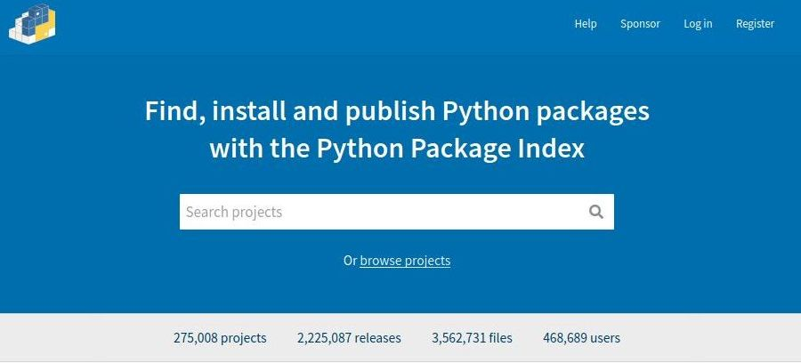
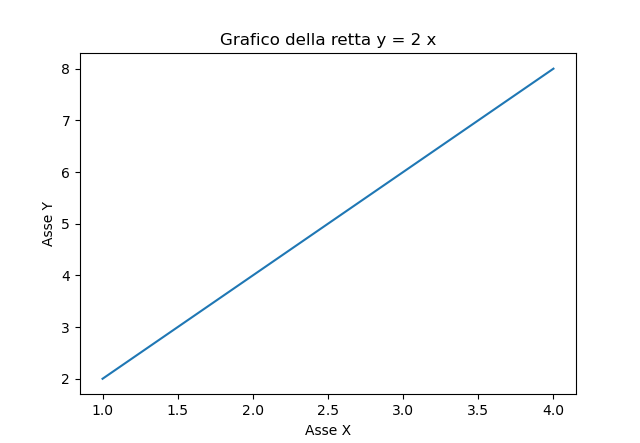
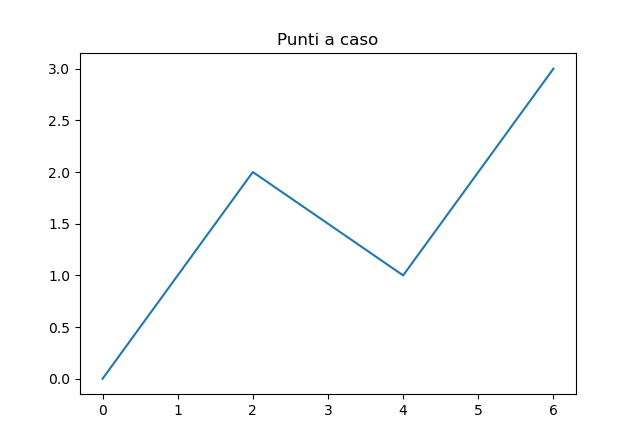
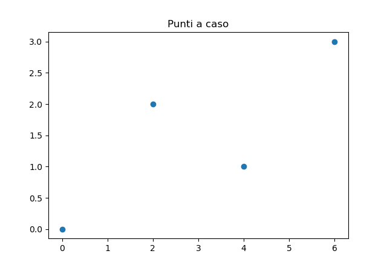
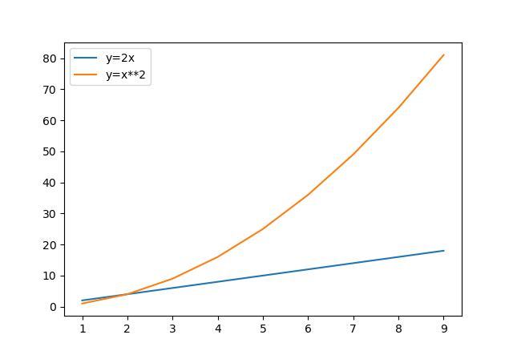

# Moduli Python

Il capitolo sui moduli Python è uno dei più impegnativi del corso. Non tanto per la difficoltà degli argomenti in sè, ma perché i moduli sono un concetto ***centrale***
della programmazione in Python: è impossibile pensare al linguaggio Python senza abbinarlo all'utilizzo dei suoi moduli!

Il capitolo è organizzato per gradi, per fare uno step alla volta:

1. Nel primo sottocapitolo, [Lavorare con i moduli](#lavorare-con-i-moduli), viene illustrata la creazione di un modulo contenente alcune funzioni da parte del programmatore e il suo utilizzo in vari ambiti.

2. Riusciti in questo primo step, nel sottocapitolo [Moduli Standard](#moduli-standard) si passa all'utilizzo dei moduli Python predefiniti, quelli in dotazione con la Python Standard Library: 
    in questo caso il focus si sposta sull'utilizzo di moduli prodotti da altri, sulla consultazione della documentazione, sull'utilizzo dei moduli Python di base
    
3. Il terzo livello, nel sottocapitolo [Moduli PyPi](#moduli-pypi), si occupa del reperimento, l'installazione e l'utilizzo di moduli terzi, ovvero attualmente non disponibili 
    nel nostro sistema, che implementano una funzionalità per noi interessante e/o utile per il software che vogliamo sviluppare.
    
Al lavoro!

<!-- ############################################################################################ -->

## Lavorare con i moduli

Come accennato, in questo capitolo ci occuperemo di implementare un modulo scrivendo tutto il codice, investigando i concetti di base e procedendo ai test semplici delle
funzionalità implementate.

<!-- ############################################################################################ -->

### Istruzione import

In Python la clausola import si utilizza per rendere disponibile il codice in un modulo in un altro. 
Questo concetto rende semplice l'organizzazione del codice in senso logico, sia dal punto di vista dei file che dal punto di vista dell'organizzazione globale del codice.

Dal punto di vista dei file, ogni modulo è ben organizzato perché contiene codice coerente: un ipotetico modulo `numeri` conterrà funzioni che lavorano coi numeri, un modulo `statistiche` contiene funzioni per il calcolo statistico, etc..

Dal punto di vista dell'organizzazione globale del codice, l'importazione di un modulo genererà un `namespace` che manterrà semplice la gestione del codice.

Capisco che il secondo punto di vista necessita di un ulteriore chiarimento: dal punto di vista intuitivo, noi abbiamo già usato il modulo `random` per le nostre liste numeriche. Allora
scriviamo:

```python
import random

# per accedere alle funzioni del modulo random, dobbiamo scrivere modulo.funzione
intero = random.randint(1,100)
```

Questa organizzazione imposta dall'import (ovvero `modulo.funzione`) permette di capire chiaramente che la funzione randint deriva dal modulo random e non è stata definita all'interno
di questo modulo. Quando le importazioni saranno di più e i moduli scritti da noi più lunghi, questa cosa inizierà ad essere molto utile.

Inoltre il `namespace` indotto preserva le funzioni importate da un altro importante problema: se molte persone diverse scrivono codice potrebbe tranquillamente capitare che due funzioni
scritte da persone diverse, su moduli diversi, abbiano lo stesso nome. Il `namespace` impedisce confusione in questo caso.


<!-- ############################################################################################ -->

### Nomi dei moduli 


Tutte le persone hanno un nome che le identifica (ad esempio il mio nome è Andrea), ma quando le persone parlano di se stesse usano la parola `io` (*io* mi chiamo Andrea).
E fin qui mi sembra tutto semplice.

Abbiamo detto finora (e nel dubbio, lo ripeto con chiarezza) che anche i moduli, ovvero i file Python con estensione `.py`, hanno un nome, che dipende dal nome del file stesso:
ad esempio, il file `pippo.py` definisce il modulo di nome `pippo`. Ogni volta che definite un modulo, Python inizializza alcune variabili speciali, fra cui la variabile `__name__`
che contiene il nome del modulo (fra un attimo faccio un esempio).

Così come le persone, parlando di se stesse, dicono *io*, i moduli, al loro interno non utilizzano il loro nome, ma utilizzano la parola `__main__`.

Cerchiamo di chiarire subito questo primo concetto, il resto verrà naturalmente di conseguenza:

**Esempio 1: un unico file**

```python
# file pippo.py

# la variabile __name__ si riferisce al nome del modulo pippo
# essendo al suo interno, conterrà la parola "__main__"
print(__name__)
```

**Esempio 2: un altro file**
```python
# file ciccio.py

# importo il modulo pippo, dell'esempio 1
# importando il modulo, andrò ad eseguirlo. la print sopra (eseguita all'esterno del modulo pippo)
# scriverà il suo nome: "pippo".
import pippo

# la variabile __name__ qui sotto si riferisce al nome del modulo ciccio
# essendo al suo interno, conterrà la parola "__main__"
print(__name__)

# la variabile __name__ qui sotto si riferisce al nome del modulo pippo
# NON essendo dentro al modulo pippo, conterrà il suo nome proprio, ovvero "pippo"
print(pippo.__name__)
```

Tutto qui :)


<!-- ############################################################################################ -->

### Testing


Dalle considerazioni fatte nei precedenti capitoli, vorrei farvi capire una tecnica molto utilizzata in ambito Python per l'esecuzione dei moduli e i test delle funzioni
in essi contenute.

La strategia è questa:

1. scrivo il modulo con la definizione delle funzioni che mi interessano
2. faccio delle prove per assicurarmi che tutto... funzioni! (faccio i **test**!!!) in fondo al file, dentro un `if __name__ == "__main__"`
3. Se eseguo direttamente il modulo con le funzioni, l'if mi permette di svolgere i test (e verificare che tutto funzioni correttamente)
4. Se importo il modulo in un altro contesto, il suo nome NON sarà "__main__" e i test non saranno svolti, permettendo di importare solo le funzioni!

Da questa spiegazione, deriva questa modalità di scrittura dei moduli con funzioni:

```python
# file prova.py

def molt(fatt1:float,fatt2:float) -> float:
    """
    prende i valori nei parametri fatt1,fatt2 e ritorna il prodotto fatt1 * fatt2 

    Ad esempio: molt(4,5) ritorna 20

    Parametri
    ---------
    fatt1
        un numero reale, il primo fattore della moltiplicazione
    fatt2
        un numero reale, il secondo fattore della moltiplicazione
    """
    return fatt1 * fatt2
    
# questa parte NON sarà eseguita all'esterno del modulo "prova"
if __name__ == "__main__":
    x = 5
    y = 4
    print("x:",x)
    print("y:",y)
    print( f"molt({x},{y}):{molt(x,y)}" )
    # ... e così via...
```

Da ora in poi scriveremo così i nostri moduli e in questo modo faremo tutti gli esercizi che seguono. Questo ci permetterà di definire un *modus operandi* logico e professionale, che ci
tornerà enormemente utile quando le cose diventeranno inevitabilmente più complicate.

Adesso, sotto con gli esercizi!

<!-- ############################################################################################ -->

### Esercizi sui moduli

!!! note "Nota"

    Ognuno dei seguenti esercizi deve essere implementato in un unico file, nominato con il nome
    indicato nell'intestazione dell'esercizio, completo di documentazione e di (almeno) **3 casi di test
    per ognuna delle funzioni implementate**!!!
    

**Esercizio 521: modulo "SequenzeNumeriche"**

`minoriDiUnElemento`<br>
Creare una funzione che, data una sequenza numerica (tupla o lista) e un
numero qualsiasi, conta quanti numeri nella sequenza sono minori del
numero.

`sommaElementi`<br>
Creare una funzione che, data una sequenza numerica (tupla o lista),
restituisce la somma dei numeri della sequenza.

`mediaElementi`<br>
Creare una funzione che, data una sequenza numerica (tupla o lista),
restituisce la media aritmetica dei numeri della sequenza.

------------------------------------------------------------------------------------------------

**Esercizio 522: modulo "ManipolazioneStringhe"**

`lunghezzaStringa`<br>
La funzione prende una stringa come parametro e ritorna il numero di
caratteri di cui è composta (la sua lunghezza)

`contaLettera`<br>
La funzione prende una stringa e una lettera come parametro e ritorna il
numero di volte in cui la lettera è presente all'interno della stringa

`tutteMaiuscole`<br>
La funzione prende una stringa come parametro e ritorna la stringa
trasformata in maiuscolo

`tutteMinuscole`<br>
La funzione prende una stringa come parametro e ritorna la stringa
trasformata in minuscolo

`invertiMaiuscoleMinuscole`<br>
La funzione prende una stringa come parametro e ritorna la stringa con
maiuscole e minuscole invertite.

`inizialiMaiuscole`<br>
La funzione prende una stringa come parametro e ritorna la stringa
trasformata in minuscolo con le iniziali di ogni parola maiuscole

------------------------------------------------------------------------------------------------

**Esercizio 523: modulo "PianoCartesiano"**

`quadrante`<br>
La funzione prende due numeri x, y che rappresentano le coordinate del
punto P nel piano cartesiano e restituisce un numero corrispondente al
quadrante nel quale esso si trova, ovvero un numero fra 1 e 4.
Restituisce 0 nel caso che il punto sia su uno degli assi cartesiani.

`distanzaOrigine`<br>
La funzione prende due numeri x, y che rappresentano le coordinate del
punto P nel piano cartesiano e restituisce la distanza del punto P
dall'origine degli assi, ovvero dal punto O di coordinate (0,0).

`distanzaFraDuePunti`<br>
La funzione prende quattro numeri xP, yP, xQ, yQ che rappresentano le
coordinate dei punto P e Q nel piano cartesiano e restituisce la
distanza fra loro.


------------------------------------------------------------------------------------------------

**Esercizio 524: modulo "CifreNumeriche"**

`unità`<br>
La funzione prende un numero come parametro e restituisce la cifra delle
unità. Ad esempio unita(23) restituisce 3, unita(8174.56) restituisce 4.

`decine`<br>
La funzione prende un numero come parametro e restituisce la cifra delle
decine. Ad esempio decine(23) restituisce 2, decine(8174.56) restituisce 7.

`centinaia`<br>
La funzione prende un numero come parametro e restituisce la cifra delle
centinaia. Ad esempio centinaia(23) restituisce 0, centinaia(8174.56)
restituisce 1.

`migliaia`<br>
La funzione prende un numero come parametro e restituisce la cifra delle
migliaia. Ad esempio migliaia(23) restituisce 0, migliaia(8174.56)
restituisce 8.

`decimi`<br>
La funzione prende un numero come parametro e restituisce la cifra dei
decimi. Ad esempio decimi(23) restituisce 0, decimi(8174.56) restituisce
5.

`centesimi`<br>
La funzione prende un numero come parametro e restituisce la cifra dei
centesimi. Ad esempio centesimi(23) restituisce 0, centesimi(8174.56)
restituisce 6.

------------------------------------------------------------------------------------------------

**Esercizio 525: modulo "FunzioniNumeriche"**

`sommaDivisori`<br>
La funzione prende un numero intero come parametro e restituisce la
somma dei suoi divisori propri (ovvero dei divisori minori del numero
stesso)

`listaDivisori`<br>
La funzione prende un numero intero come parametro e restituisce la
lista dei suoi divisori propri (ovvero dei divisori minori del numero
stesso)

`isPrime`<br>
La funzione prende un numero intero come parametro e restituisce True se
il numero è primo, false altrimenti. (sugg: se un numero è primo il suo
unico divisore proprio è 1...)

`perfetto`<br>
La funzione prende un numero intero come parametro e restituisce True se
il numero è perfetto, False altrimenti (un numero si dice perfetto se e
solo se è uguale alla somma dei suoi divisori propri)

`nthPrime`<br>
La funzione prende un numero intero come parametro e restituisce
l'ennesimo numero primo. Ad esempio dato 3, la funzione restituisce 5
perché, essendo i numeri primi 2, 3, 5, 7, 11, etc... 5 è il terzo
numero primo.

`semiPrimo`<br>
La funzione prende un numero intero come parametro e restituisce True se
il numero è semiprimo, False altrimenti. Un numero si dice semiprimo se
è esprimibile come prodotto di due numeri primi. Ad esempio 6 = 2*3 è
semiprimo, 7 = 7*1 non è semiprimo, infatti 1 non è primo.


<!-- ############################################################################################ -->
<!-- VERIFICA SU FUNZIONI E MODULI AUTOPRODOTTI QUI                                               -->
<!-- ############################################################################################ -->


## Moduli Standard

Ovviamente l'utilità dei moduli non è solo organizzativa, ma... storica!!! 
Immaginate se qualcuno avesse raccolto tutte le funzioni più "fighe" scritte in Python e le avesse catalogate in gruppi omogenei;
ad esempio le funzioni aritmetiche, le funzioni per le stringhe, le funzioni per data e ora e così via.

Beh... qualcuno lo ha fatto! Ed ha creato la ***Python Standard Library***.

Essa non è nient'altro che una collezione di moduli, inclusi per semplicità in qualunque installazione Python, 
che quindi possiamo utilizzare semplicemente scrivendo `import nomeModulo`.

Fighissimo!

> Elenco qui alcuni fra i moduli più comuni, indicando il nome e una descrizione sommaria:
> 
> - `random`:     Generazioni di numeri "pseudo-casuali"   
> - `math`:       Operazioni matematiche comuni            
> - `datetime`:   Gestione Data e Ora                     
> - `pathlib`:    Accesso a file e directories             
> - `csv`:        Lettura e Scrittura su file csv        


Se questi elencati non vi bastano e siete curiosi su quanti ce ne siano effettivamente, provate a consultare la documentazione ufficiale:
<https://docs.python.org/3/library/index.html>.

Ancora non vi basta? Bene! Allora sappiate che ci sono altre migliaia di moduli pieni zeppi di funzioni utili per gli incarichi più disparati,
già catalogati e liberi di essere utilizzati da chiunque! La differenza con i precedenti è che questi non fanno parte della Python Standard
Library, ma sono elencati semplicemente nel ***Python Package Index*** (<https://pypi.org/>). 

Ma questa è la storia del prossimo capitolo (Moduli pip). Per adesso, guardiamo qualcuno dei moduli standard!

!!! tip "Suggerimento"
    La documentazione ufficiale (in inglese) di ogni modulo è inserita nello
    stesso: per ottenerla, dato il modulo "NomeModulo", basta scrivere nell'interprete:
    
        >>> import NomeModulo
        >>> dir(NomeModulo)    
        >>> help(NomeModulo.FunzioneInteressante)
    
    Prova con uno dei moduli elencati sopra!!!


<!-- ############################################################################################ -->
### Modulo random


Serve per operazioni che richiedono una certa "casualità", anche se il
termine corretto sarebbe "pseudocasualità"... Ad esempio:

```python
# estrai numero della tombola
import random

n = random.randint(1, 90)
# n sarà un numero "casuale" fra 1 e 90. Ambo! ;)
```

Il modulo random ritorna utile anche quando si lavora con le sequenza
(tuple, liste, stringhe, dizionari): in particolare vorrei evidenziare 3
metodi:

* `randint`<br>
    prende 2 parametri e ritorna un numero pseudo-casuale compreso fra questi con entrambi gli estremi inclusi.

* `choice`<br>
    applicato ad una sequenza generica ritorna un elemento casuale della stessa (utile per le estrazioni)

* `shuffle`<br>
    funziona solo con le liste e serve per mescolare la lista passata come parametro. Ovviamente non ritorna valori.


Vediamo alcuni esempi:


```python
lista = [ 1, 2, 3, 4, 5]
random.choice(lista) # estrae un numero, ad esempio: 4
random.shuffle(lista) # mischia la lista
print(lista) # [4, 3, 2, 1, 5]
```

Non è affatto difficile! Provate a fare i seguenti esercizi aiutandovi
con la documentazione integrata.

<br>
<br>

**Esercizio 531 (randint)**

Riempire una lista con 5 numeri casuali fra 1 e 90 diversi fra loro.
Pronta la cartella della tombola!!!

------------------------------------------------------------------------------------------------

**Esercizio 532 (randint)**

Generare 5 numeri casuali fra 0 e 1 con 2 cifre esatte dopo la virgola
(sugg: genera interi fra 0 e 100, dividi per...)

------------------------------------------------------------------------------------------------

**Esercizio 533 (choice)**

Dichiarare una tupla contenenti l'elenco dei cognomi della classe ed
estrarne uno con choice. Chi esce sarà interrogato!!!

------------------------------------------------------------------------------------------------

**Esercizio 534 (choice)**

Creare una lista contenente i numeri da 1 a 10 ed estrarre un numero con
choice. Provvedere successivamente ad eliminare il numero estratto dalla
lista e visualizzare la stessa.

------------------------------------------------------------------------------------------------

**Esercizio 535 (shuffle)**

Dichiarare una lista contenente l'elenco dei cognomi della classe (in
ordine alfabetico) e mischiarla con shuffle. Visualizzare la lista
mescolata: quello sarà l'ordine delle interrogazioni!!!

------------------------------------------------------------------------------------------------

**Esercizio 536 (shuffle)**

Creare una lista contenente i numeri da 1 a 10 e mescolarla.
Visualizzare la lista nel nuovo ordine ottenuto e successivamente
riordinarla.


<!-- ############################################################################################ -->
### Modulo math


Contiene tutte le funzioni matematiche utili per le operazioni su
esponenziali, logaritmi, trigonometria, etc...


```python
# esempi di operazioni varie
import math

math.log(10) # logaritmo in base e di 10
math.cos(math.pi) # coseno di 90 gradi (pi greco radianti)
math.factorial(5) # fattoriale di 5, ovvero 5! = 1 * 2 * 3 * 4 * 5
math.sqrt(12) # radice quadrata di 12
math.gcd(345,678) # Massimo Comun Divisore
math.lcm(345,678) # Minimo Comune Multiplo
ceil/floor/trunc # RTFM
```


Il modulo math si porta dietro anche una serie di costanti *famose*:


    # variabili (pre)definite in math:
    # math.e = 2.718281828459045 (numero di Nepero)
    # math.inf = inf (più infinito)
    # math.nan = nan (not a number. PS: hai combinato qualcosa)
    # math.pi = 3.141592653589793 (pi greco)


<br>
<br>


**Esercizio 541 (sqrt)**

Scrivere una funzione che calcola le soluzioni dell'equazione di
secondo grado `Ax^2 + Bx + C = 0`.

In particolare la funzione prende come parametri i coefficienti A, B, C
dell'equazione e restituisce la lista delle soluzioni reali della
stessa.

La lista può contenere 0, 1, 2 soluzioni (anche coincidenti) a seconda
dei casi.

------------------------------------------------------------------------------------------------

**Esercizio 542 (sqrt, floor)**

Scrivere una funzione per calcolare la radice quadrata intera di un
numero. La radice quadrata intera di un numero x è il più grande intero
n tale che `n * n <= x`.

Provate a scrivere questa funzione con l'aiuto del modulo math (facile)
e provate a scriverne una analoga senza (un po' più complicato)

------------------------------------------------------------------------------------------------

**Esercizio 543 (gcd , lcd)**

Scrivere una funzione che prende numeratore e denominatore di una
frazione e ritorna una tupla di 2 valori contenenti numeratore e
denominatore ridotti ai minimi termini. Ad esempio, la funzione
riduci(15,6) ritorna la tupla (5,2).

------------------------------------------------------------------------------------------------

**Esercizio 544 (gcd , lcd)**

In una piazza si trova il capolinea di tre linee di tram: A, B, e C. Il
tram A parte ogni TOT_A minuti, il tram B ogni TOT_B minuti, il tram C
ogni TOT_C minuti. Ogni quanti minuti i 3 tram si ritrovano al capolinea
insieme? Implementare la funzione calcolaMinuti(TOT_A, TOT_B, TOT_C) che
ritorna il numero di minuti che bisogna aspettare per avere di nuovo i 3
tram insieme al capolinea.


<!-- ############################################################################################ -->
### Modulo datetime

Contiene le funzioni per la manipolazione di data e ora. Contiene 4
classi diverse a cui si accede con l'operatore PUNTO (.):

- la classe ***Date*** per la gestione della data, con giorno, mese ed anno;
- la classe ***Time*** per la gestione dell'orario, con ore, minuti, secondi e microsecondi;
- la classe ***DateTime*** per la gestione di Data e Ora: praticamente è la classe unione delle due precedenti;
- la classe ***TimeDelta*** per il calcolo delle differenze di tempo.

Vediamo alcuni esempi per chiarire i concetti espressi. 


```python
import datetime

# nell'ordine: anno, mese, giorno
scopertaAmerica = datetime.date(1492, 10, 12)

# nell'ordine: ore, minuti, secondi
oraDellaPausa = datetime.time(16, 40, 00)

# nell'ordine: anno, mese, giorno, ore, minuti, secondi
uomoSullaLuna = datetime.datetime(1969, 7, 20, 20, 18, 00)
```


Successivamente vedremo uno o due esempi che coinvolgono la classe `TimeDelta`. 
Per visualizzare informazioni sulle classi in oggetto ricordatevi di utilizzare le funzioni dir() e help():


Una delle cose più semplici da fare con queste classi è ottenere ora e data correnti:


```python
# Per la classe Date, possiamo ottenere il giorno odierno
oggi = datetime.date.today() # vale 2019-05-23

# La classe Time NON ha un metodo per l'ora corrente.

# Dobbiamo usare la classe DateTime
adesso = datetime.datetime.now() # vale 2019-05-23 19:26:03.478039
```


Una volta impostata una data o un'ora è possibile accedere ai valori dei campi che la caratterizzano:


```python
print("Anno: ", adesso.year)
print("Mese: ", adesso.month)
print("Giorno: ", adesso.day)
print("Ore: ", adesso.hour)
print("Minuti: ", adesso.minute)
print("Secondi: ", adesso.second)
```


> L'accesso ai valori dei campi che caratterizzano una variabile <br>
> `Date`, `DateTime` o `Time` è sempre in sola lettura.


Questo significa che possiamo visualizzare i valori come fatto qui sopra, ma non possiamo utilizzare questi campi per modificare una data.
Per essere completamente espliciti, non è possibile fare operazioni tipo le seguenti:


```python
dataAcaso = datetime.datetime(2022, 6, 4, 13, 0, 0)
dataAcaso.year = 2020  # ERRORE
dataAcaso.hour = 12    # ERRORE. (capito? Non si può...)
```


Le date non sono fatte per essere modificate. Invece di cambiarne una... create un'altra variabile!

Per visualizzare date, ore o data con ora a piacimento, tutte e tre le classi mettono a disposizione la funzione `strftime()` che prende
l'oggetto Data (o Ora, o Data e Ora) e ritorna una stringa personalizzata, secondo i seguenti parametri (ho messo solo i
principali...):

| Parametro | Descrizione                                      | Esempio    |
|-----------|--------------------------------------------------|------------|
| %a        | Giorno della settimana (breve)                   | Wed        |
| %A        | Giorno della settimana                           | Wednesday  |
| %w        | Giorno della settimana come numero: 0 è Domenica | 3          |
| %d        | Giorno del mese: 01-31                           | 31         |
| %b        | Nome del mese (breve)                            | Dec        |
| %B        | Nome del mese                                    | December   |
| %m        | Mese come numero: 01-12                          | 12         |
| %y        | Anno (breve, 2 cifre)                            | 18         |
| %Y        | Anno                                             | 2018       |
| %H        | Ore: 00-23                                       | 17         |
| %M        | Minuti: 00-59                                    | 41         |
| %S        | Secondi: 00-59                                   | 08         |
| %%        | Per visualizzare %                               | %          |


Qualche esempio è meglio di molte spiegazioni:


    >>> adesso = datetime.datetime.now()
    >>> print( oggi.strftime("%d-%m-%Y") )
    23-05-2019

    >>> print( adesso.strftime("Sono le %H:%M") )
    Sono le 19:26

    >>> print( adesso.strftime("%A") )
    Thursday


È facile capire che in ogni tipologia di dato potete usare solo i
parametri relativi ad esso: ovvero con un oggetto date, i parametri
relativi ad ore, minuti o secondi non vanno bene, mentre con un oggetto
time non vanno quelli sul giorno, il mese, etc... su un oggetto datetime
funzionano tutti!!!


<!-- ############################################################################################ -->
#### Differenze di tempo (TimeDelta)

Ok, domanda a bruciapelo. Da quanto tempo l'uomo è andato sulla Luna? Da
quanti anni? Da quanti giorni??

Le differenze di tempo sono materia per la classe TimeDelta; un elemento
della classe stessa si ottiene facendo una differenza tra due elementi
di tipo DateTime o Date (**non Time... attenti!!!**)


    >>> print(adesso - uomoSullaLuna)
    18205 days, 12:42:12.510824


Ok... in giorni è quello. Ma... in anni? Settimane? Ore? Minuti? Secondi? 
In questo caso occorre fare un po' di calcoli: si fa la differenza fra 2 date (o 2 datetime, NON due time), si utilizza la
funzione `total_seconds()` che ritorna i secondi totali e poi si fa qualche divisione...


```python
diff = adesso - uomoSullaLuna
secondiTotali = int(diff.total_seconds())  # int() per arrotondare...
minutiTotali = secondiTotali // 60
oreTotali = minutiTotali // 60
giorniTotali = oreTotali // 24
settimaneTotali = giorniTotali // 7
anniTotali = giorniTotali // 365 # più o meno...
```


Prendiamo un po' confidenza con il modulo grazie ad un po' di esercizi :)

------------------------------------------------------------------------------------------------

**Esercizio 551 (now)**

Visualizzare la data e l'ora corrente, scrivendo la frase "Oggi è il
GG/MM/AAAA e sono le ore HH:MM"

------------------------------------------------------------------------------------------------

**Esercizio 552 (...)**

Data l'ora di adesso e inserito dall'utente l'ora di fine lezione
calcolare il numero di minuti mancanti.

------------------------------------------------------------------------------------------------

**Esercizio 553 (tuple, weekday)**

Chiedere all'utente di inserire la data di nascita e visualizzare il
giorno della settimana in cui è nato.

------------------------------------------------------------------------------------------------

**Esercizio 554 (...)**

Chiedere all'utente di inserire due numeri per giorno e mese dell'anno
corrente e calcolare quante settimane sono passate dall'inizio dell'anno
a quella data.


<!-- ############################################################################################ -->
## Moduli PyPi


I moduli della libreria standard sono facilissimi da utilizzare (anche
perché sono già installati sul computer...) ma fanno operazioni...
standard, niente di veramente eclatante!

Python in realtà mette a disposizione dei suoi utenti miriadi di moduli
per i compiti più disparati: creare un codice a barre, calcolare la
distanza fra 2 stelle, trasferire una canzone tramite bluetooth, ecc...

La cosa veramente incredibile (su Python) è che tutti questi moduli,
sviluppati da chicchessia, sono raccolti in un unico repository: il
**Python Package index, PyPi**. [https://pypi.org](https://pypi.org/).



Qui sopra vedete la schermata iniziale del sito. Come vedete sono
disponibili oltre 275.000 moduli... Potete cercare praticamente quello
che volete: io ho provato con "chicken", "football", "rock music"
e ho avuto soddisfazione...

Certo, al nostro livello non siamo in grado ancora di usare qualsivoglia
modulo (soprattutto perché siete ancora particolarmente allergici a
leggere la documentazione), ma imparare a scaricarli e a installarli
(fatto uno, fatto tutti) e poi ad usare qualcuno dei più semplici... si
può!


Per installare un modulo di questi, non c'è bisogno di mettersi a cercalo nel sito... basta usare Thonny!


Da lì digitate la stringa di ricerca (nell'esempio c'è la stringa *wxpython*) e cliccate su *Trova una pacchetto PyPi* 
(è sbagliato lo so... se tutto va bene quando lo leggerete sulla vostra installazione sarà stato corretto...)


Trovato il pacchetto che vi serve, non serve altro che cliccare sul pulsante INSTALLA in basso e attendere :)


Se invece non avete (ancora) Thonny, aprite il prompt dei comandi Windows oppure il terminale Mac o Linux e digitate:


    pip3 install -U nomeModulo


Quando ha finito... ve ne accorgerete.


<!-- ############################################################################################ -->
### Modulo pillow


Il modulo Pillow è considerato il modulo standard per la manipolazione
delle immagini in Python. In realtà sarebbe un sostituto (built-in
replacement) per la vera libreria di default per il trattamento delle
immagini: PIL, ovvero la **Python Image Library**. Ma ormai è
considerata lo standard per lavorare con le immagini.

Installate il modulo Pillow e poi procedete ad esaminare e testare il
seguente esempio commentato, badando a decommentare ogni volta una
piccola parte di esso.

Tutti i nostri frammenti di codice dovranno includere il pacchetto
pillow


```python
# per compatibilità con PIL anche Pillow si chiama PIL
from PIL import Image

# Per aprire e visualizzare una immagine
# l'immagine deve trovarsi nella stessa cartella dello script
img = Image.open("python.png")
img.show()
```


Alcune operazioni sparse sull'immagine:


```python
# ruota l'immagine di 90 gradi e la visualizza
rotatedIimg = img.rotate(90)
rotatedImg.show()

# ridimensiona l'immagine a 200x200 pixel
resizedImg = img.resize((200,200))
resizedImg.show()

# ribalta l'immagine orizzontalmente
# (oppure verticalmente, mettendo Image.FLIP_TOP_BOTTOM)
flippedImg = img.transpose(Image.FLIP_LEFT_RIGHT)
flippedImg.show()

# trasforma l'immagine in bianco e nero
convertedImg = img.convert("L")
convertedImg.show()
```


Per ritagliare una immagine (crop) occorre utilizzare il metodo: `Image.crop( (left, upper, right, lower) )`


```python
# ritagliamo l'immagine da (0,0) in alto a sx a (300,300) in basso a dx
croppedImage = img.crop((0,0,300,300))
```


Se invece volessimo salvare l'immagine modificata... (ad esempio quella in bianco e nero)
    
    
```python
convertedImg.save("pythonBN.png")
```

Proviamo adesso alcune opzioni per sfocare l'immagine (blur)


```python
# occorre importare anche l'oggetto ImageFilter
from PIL import Image, ImageFilter
img = Image.open("prova.jpg")

blurImage = img.filter(ImageFilter.BLUR) **# blur generico**
boxBlurImage = img.filter(ImageFilter.BoxBlur(5)) **# blur radiale**
gaussImage = img.filter(ImageFilter.GaussianBlur(5)) **# blur gaussiano**
```


Basta!


Volete fare, sapere di più? Leggete la documentazione!


<!-- ############################################################################################ -->
### Modulo pyscreenshot 


Il modulo pscreenshot serve per fare gli screenshot del Desktop.
Semplice e veloce. Ricordate solo che questo modulo lavora con le
immagini, quindi per funzionare ha bisogno ***anche*** del modulo
pillow. Installate il modulo chiamato "pyscreenshot" (pillow ce lo
dovreste avere da prima), poi su una shell python digitate:


    >>> import pyscreenshot
    
    >>> dir(pyscreenshot)


vedrete elencate le funzioni offerte dal modulo pyscreenshot. Come ci
siamo sempre detti, quelle che iniziano con doppio underscore vanno
ignorate. Non sono tantissime. O meglio... questo è uno dei moduli più
semplici. Per fare lo screenshot ci interessa una singola funzione:
grab().


```python
import pyscreenshot as ss

image = ss.grab()
image.save('screenshot.png')
```


L'esempio sopra fa uno screenshot del Desktop e lo salva come file
"screenshot.png" nella stessa cartella ove si trova lo script Python con il codice sopra.

Se avete letto la documentazione della funzione grab() saprete che
potete decidere di fare lo screenshot ad una sezione dello schermo. La
prova di questo ve la lascio come esercizio.


<!-- ############################################################################################ -->
### Modulo matplotlib


Il modulo Matplotlib serve per creare dei plot, ovvero dei grafici a
partire da funzioni algebriche nel piano e nello spazio.

Immaginate di voler disegnare il grafico della retta y = 2 x.

Scegliete alcuni punti per le ascisse x = [ 1 , 2 , 3 , 4 ]

Calcolate le ordinate corrispondenti y = [ 2 , 4 , 6 , 8 ]

Disegnate il piano cartesiano e vi ponete i punti calcolati: (1,2) (2,4) (3,6) (4,8)

Infine tirate una riga che passa per questi punti

Con Matplotlib si possono fare cose del genere. Ci provo per la retta dell'esempio:


```python
import matplotlib.pyplot as plt

x = [1, 2, 3, 4]
y = [2, 4, 6, 8]

plt.plot(x, y)

plt.title("Grafico della retta y = 2 x")
plt.xlabel("Asse X")
plt.ylabel("Asse Y")

plt.show()
```


Con questo codice ho generato la seguente immagine:





Ovviamente potrei disegnare anche dei pezzi segmentati:


```python
import matplotlib.pyplot as plt

x = [0, 2, 4, 6]
y = [0, 2, 1, 3]

plt.plot(x, y) **# per disegnare solo i punti, usa plot(x,y,"o")**

plt.title("Punti a caso")

plt.show()
```


 


Per caratterizzare il grafico si potrebbe aggiungere una griglia:


```python
# inserisci una di queste funzioni **prima** di plt.show()
plt.grid()

plt.grid(axis="x") # visualizza solo le righe verticali
plt.grid(axis="y") # visualizza solo le righe orizzontali
```


Se vogliamo inserire più di un grafico, si potrebbe inserire una legenda

```python
x = []
f1 = []
f2 = []

for n in range(1,10):
    x.append(n)
    f1.append(2*n)
    f2.append(n**2)

plt.plot( x , f1 , **label="y=2x"**)   # aggiungi un'etichetta
plt.plot( x , f2 , **label="y=x**2"**)

**plt.legend()** # crea la legenda

plt.show()
```





Se invece di visualizzare l'immagine volete salvarla da qualche parte, invece di `show()`, 
dovete usare il metodo `savefig("nomeImmagine.estensione")`.


```python
plt.savefig("immagine.jpg")
```
    
 
Facile :)


La libreria Matplotlib si può utilizzare anche per disegnare barre
(verticali oppure orizzontali):


```python
nomi = ["Asini", "Bradipi", "Cavalli", "Daini"]
numeri = [5, 8, 2, 4]

plt.bar(nomi,numeri) **# per le barre orizzontali, usa barh()**
```
    


Con quegli stessi dati posso disegnare anche un diagramma a torta:


```python
plt.pie(numeri , label = nomi)
```


Basta!

Se volete approfondire un po', guardate il sito ufficiale: <https://matplotlib.org/>

Oltre alla documentazione (so che non la leggerete) ci sono molti esempi
e tutorial...

Se proprio volete imparare... basta solo fare un po' di esercizio :)

<br>
<br>
<br>

