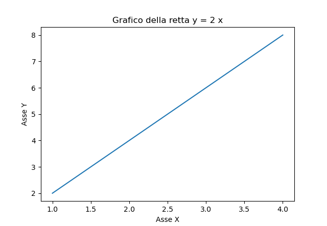
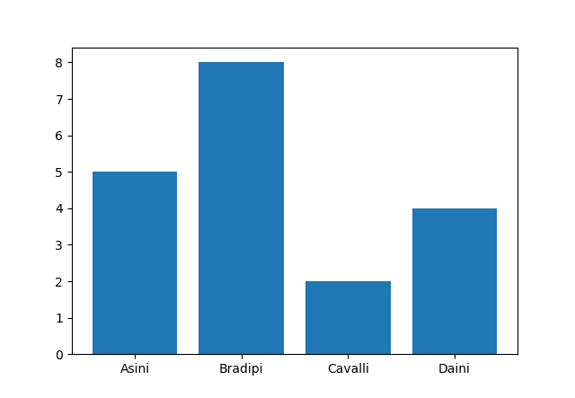

# Python Package Index


I moduli della libreria standard sono facilissimi da utilizzare (anche perché sono già installati sul computer...) 
ma fanno operazioni... standard, niente di veramente eclatante!

Python in realtà mette a disposizione dei suoi utenti miriadi di moduli per i compiti più disparati: creare un codice a barre, 
calcolare la distanza fra 2 stelle, trasferire una canzone tramite bluetooth, ecc...

La cosa veramente incredibile (su Python) è che tutti questi moduli, sviluppati da chicchessia, sono raccolti in un unico repository: 
il **Python Package index, PyPi**. [https://pypi.org](https://pypi.org/).


Qui sopra vedete la schermata iniziale del sito. Come vedete sono disponibili oltre 275.000 moduli... Potete cercare praticamente quello
che volete: io ho provato con "chicken", "football", "rock music" e ho avuto soddisfazione...

Certo, al nostro livello non siamo in grado ancora di usare qualsivoglia modulo (soprattutto perché siete ancora particolarmente allergici a
leggere la documentazione), ma imparare a scaricarli e a installarli (fatto uno, fatto tutti) e poi ad usare qualcuno dei più semplici... si
può!


Per installare un modulo di questi, non c'è bisogno di mettersi a cercarlo nel sito... basta usare Thonny!


Da lì digitate la stringa di ricerca (nell'esempio c'è la stringa *wxpython*) e cliccate sul pulsante di ricerca...


Trovato il pacchetto che vi serve, non serve altro che cliccare sul pulsante INSTALLA in basso e attendere :)


Se invece non avete (ancora) Thonny, aprite il prompt dei comandi Windows oppure il terminale Mac o Linux e digitate:


``` bash
pip install -U nomeModulo
```


Quando ha finito... ve ne accorgerete.


<!-- ############################################################################################ -->
## Modulo pillow


Il modulo `pillow` è considerato il modulo standard per la manipolazione delle immagini in Python. 
In realtà sarebbe un sostituto (*built-in replacement*) per la vera libreria di default per il trattamento delle
immagini: PIL, ovvero la **Python Image Library**. 
Ma ormai è considerata lo standard per lavorare con le immagini.

Installate il modulo `pillow` e poi procedete ad esaminare e testare il seguente esempio, aggiungendo ogni volta
un pezzetto al codice.


``` python
# per compatibilità con PIL anche il modulo pillow si chiama PIL
from PIL import Image

# Per aprire e visualizzare una immagine
# l'immagine deve trovarsi nella stessa cartella dello script
img = Image.open("python.png")
img.show()
```


Alcune operazioni sparse sull'immagine:


``` py title="ruota l'immagine di 90 gradi e la visualizza"
rotatedImg = img.rotate(90)
rotatedImg.show()
```

``` py title="ridimensiona l'immagine a 200x200 pixel"
resizedImg = img.resize((200,200))
resizedImg.show()
```

``` py title="ribalta l'immagine orizzontalmente"
# (oppure verticalmente, mettendo Image.FLIP_TOP_BOTTOM)
flippedImg = img.transpose(Image.FLIP_LEFT_RIGHT)
flippedImg.show()
```

``` py title="converte l'immagine in scala di grigi"
convertedImg = img.convert("L")
convertedImg.show()
```


Per ritagliare una immagine (crop) occorre utilizzare il metodo: `Image.crop( (left, upper, right, lower) )`


``` python
# ritagliamo l'immagine da (0,0) in alto a sx a (300,300) in basso a dx
croppedImage = img.crop( (0,0,300,300) )
```


Se invece volessimo salvare l'immagine modificata... (ad esempio quella in bianco e nero)
    
    
``` python title="Salva l'immagine su file"
convertedImg.save("pythonBN.png")
```

Proviamo adesso alcune opzioni per sfocare l'immagine (*blur*)


```python
# occorre importare anche l'oggetto ImageFilter
from PIL import Image, ImageFilter
img = Image.open("prova.jpg")

blurImage = img.filter(ImageFilter.BLUR)              # blur generico
boxBlurImage = img.filter(ImageFilter.BoxBlur(20))    # blur radiale
gaussImage = img.filter(ImageFilter.GaussianBlur(20)) # blur gaussiano
```


Basta!


### Esercizi

Volete fare, sapere di più? Leggete la documentazione! Ma per imparare ad usare qualcosa... occorre esercitarsi!!!


**Esercizio 661**

Data una immagine qualsiasi (ad esempio, la fantastica `pippo.jpg`, da mettere nella stessa cartella del seguente script) utilizzare il modulo pillow
per creare le immagini `pippoAllaRovescia.jpg`, contenente l'immagine iniziale rovesciata (ruotata di 180 gradi) e `pippoBiancoNeroRovesciato.jpg` contenente 
l'immagine iniziale rovesciata e in scala di grigi

------------------------------------------------------------------------------------------------

**Esercizio 662**

Data una immagine qualsiasi (ad esempio, la fantastica `pippo.jpg`, da mettere nella stessa cartella del seguente script) utilizzare il modulo pillow
per creare le immagini `pippo_100.jpg`, contenente l'immagine iniziale ridimensionata a 100 x 100 pixel e `pippo_100_50.jpg` contenente l'immagine precedente 
ritagliata dall'alto per diventare 100 x 50 pixel.

------------------------------------------------------------------------------------------------


<!-- ############################################################################################ -->
## Modulo pyscreenshot 


Il modulo `pyscreenshot` serve per fare gli screenshot del Desktop.
Semplice e veloce. Ricordate solo che questo modulo lavora con le
immagini, quindi per funzionare ha bisogno ***anche*** del modulo
`pillow`. Installate il modulo chiamato `pyscreenshot` (`pillow` ce lo
dovreste avere da prima), poi su una shell python digitate:


``` python
>>> import pyscreenshot
>>> dir(pyscreenshot)
```

vedrete elencate le funzioni offerte dal modulo `pyscreenshot`. Come ci
siamo sempre detti, quelle che iniziano con doppio underscore vanno
ignorate. Non sono tantissime. O meglio... questo è uno dei moduli più
semplici. Per fare lo screenshot ci interessa una singola funzione:
`grab`.


```python
import pyscreenshot

shot = pyscreenshot.grab()
shot.save('screenshot.png')
```


L'esempio sopra fa uno screenshot del Desktop e lo salva come file
*"screenshot.png"* nella stessa cartella ove si trova lo script Python con il codice sopra.

Se avete letto la documentazione della funzione `grab` saprete che
potete decidere di fare lo screenshot ad una sezione dello schermo. La
prova di questo ve la lascio come esercizio.


### Esercizi

Ed eccolo qui... il sottocapitolo che aspettavate :wink:


**Esercizio 671**

Utilizzare il modulo `pyscreenshot` per fare uno screenshot dello schermo, ridimensionarlo a 800 x 600 pixel e modificarlo in scala di grigi.
Salvare l'immagine ottenuta.

------------------------------------------------------------------------------------------------

**Esercizio 672**

Utilizzare i moduli `time` e `pyscreenshot` per fare uno screenshot del desktop vuoto: una volta eseguito, il programma fornirà 5 secondi al'utente prima di fare lo screenshot,
in modo tale da fornirgli il tempo di *liberare* lo schermo.

------------------------------------------------------------------------------------------------


<!-- ############################################################################################ -->
## Modulo matplotlib


Il modulo `matplotlib` serve per creare dei plot, ovvero dei grafici a
partire da funzioni algebriche nel piano e nello spazio.

Immaginate di voler disegnare il grafico della retta `y = 2 x`.

Scegliete alcuni punti per le ascisse `x = [ 1 , 2 , 3 , 4 ]`

Calcolate le ordinate corrispondenti `y = [ 2 , 4 , 6 , 8 ]`

Disegnate il piano cartesiano e vi ponete i punti calcolati: `(1,2) (2,4) (3,6) (4,8)`

Infine tirate una riga che passa per questi punti

Con `matplotlib` si possono fare cose del genere. Ci provo per la retta dell'esempio:


```python
import matplotlib.pyplot as plt

x = [1, 2, 3, 4]
y = [2, 4, 6, 8]

plt.plot(x, y)

plt.title("Grafico della retta y = 2 x")
plt.xlabel("Asse X")
plt.ylabel("Asse Y")

plt.show()
```


Con questo codice ho generato la seguente immagine:





Ovviamente potrei disegnare anche dei pezzi segmentati:


```python
import matplotlib.pyplot as plt

x = [0, 2, 4, 6]
y = [0, 2, 1, 3]

plt.plot(x, y) # per disegnare solo i punti, usa plot(x,y,"o")

plt.title("Punti a caso")

plt.show()
```


 


Per caratterizzare il grafico si potrebbe aggiungere una griglia:


```python
# inserisci una di queste funzioni PRIMA di plt.show()

# così visualizzi TUTTA la griglia
plt.grid()

# così visualizzi SOLO le righe VERTICALI
plt.grid(axis="x") 

# così visualizzi SOLO le righe ORIZZONTALI
plt.grid(axis="y")
```


Se vogliamo inserire più di un grafico, si potrebbe inserire una legenda

```python title="2 grafici nello stesso piano cartesiano"
import matplotlib.pyplot as plt

x = []
f1 = []
f2 = []

for n in range(1,10):
    x.append(n)
    f1.append(2*n)
    f2.append(n**2)

plt.plot( x , f1 , label="y=2x")   # aggiungi un'etichetta
plt.plot( x , f2 , label="y=x**2")

plt.legend()  # crea la legenda

plt.show()
```


Se invece di visualizzare l'immagine volete salvarla da qualche parte, invece di `show()`, 
dovete usare il metodo `savefig("nomeImmagine.estensione")`.


```python
plt.savefig("immagine.jpg")
```
    
 
Facile :smile:


Si può utilizzare questa libreria anche per disegnare barre verticali od orizzontali, i celebri *istogrammi*:


```python title="Barre Verticali"
import matplotlib.pyplot as plt

nomi = ["Asini", "Bradipi", "Cavalli", "Daini"]
numeri = [5, 8, 2, 4]

plt.bar(nomi,numeri) # per le barre orizzontali, usa barh()
plt.show()
```
    




Con quegli stessi dati posso disegnare anche un diagramma a torta:


```python
plt.pie(numeri , labels = nomi)
```


Basta!

Se volete approfondire un po', guardate il sito ufficiale: <https://matplotlib.org/>

Oltre alla documentazione (so che non la leggerete) ci sono molti esempi
e tutorial...


### Esercizi

Se proprio volete imparare... basta solo fare un po' di esercizio :wink:

------------------------------------------------------------------------------------------------

**Esercizio 681**

Provate a realizzare una coppia di grafici secondo le seguenti specifiche: sulle ascisse ci vanno le date delle valutazioni e sull'ordinata i voti ottenuti.
Il primo grafico rappresenta i voti di una materia a vostra scelta, mentre il secondo è la riga orizzontale fissa che rappresenta la sufficienza.
Visualizzare entrambi nello stesso plot.

------------------------------------------------------------------------------------------------

**Esercizio 682**

Crea un grafico che rappresenta la funzione `y = 3x + 1` nell'intervallo da `x = 0` a `x = 10`.

- Usa almeno 11 punti (da 0 a 10) 
- Aggiungi un titolo al grafico 
- Etichetta gli assi X e Y 
- Visualizza il grafico 

------------------------------------------------------------------------------------------------

**Esercizio 683**

Hai rilevato le temperature (in gradi Celsius) durante una settimana di ottobre:

- Lunedì: 18° 
- Martedì: 20° 
- Mercoledì: 19° 
- Giovedì: 22° 
- Venerdì: 21° 
- Sabato: 17° 
- Domenica: 16° 

Crea un grafico a barre che mostri le temperature dei diversi giorni.

- Usa `plt.bar()` per creare le barre 
- Aggiungi un titolo significativo 
- Etichetta correttamente gli assi 

------------------------------------------------------------------------------------------------

**Esercizio 684**

Hai ottenuto i seguenti voti durante il quadrimestre in Python:

6, 7, 7, 8, 7, 9, 8, 7

Crea un diagramma a torta che mostri la distribuzione percentuale dei voti (quanti 6, quanti 7, quanti 8, quanti 9 hai preso).

- Conta quante volte appare ogni voto 
- Usa `plt.pie()` per creare il diagramma 
- Aggiungi le etichette con i voti (6, 7, 8, 9) 

Prova a ripetere la generazione del grafico con un elenco di 20 voti generati casualmente scelti fra 6,7,8,9.

------------------------------------------------------------------------------------------------

**Esercizio 685**

Disegna nello stesso grafico due funzioni:

- `f(x) = x²` (parabola) 
- `g(x) = 4x` (retta) 

nell'intervallo da `x = 0` a `x = 5`.

- Usa almeno 20 punti per avere curve fluide 
- Aggiungi una legenda che distingua le due funzioni 
- Aggiungi una griglia per rendere il grafico più leggibile 
- Usa colori diversi per le due linee (parametro color in plot()) 
- Salva il grafico come file "confronto.png" invece di visualizzarlo 

<br>
<br>
<br>

