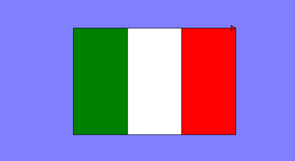
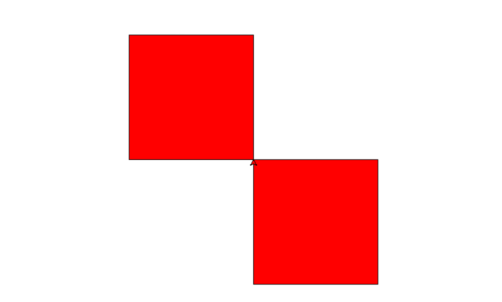
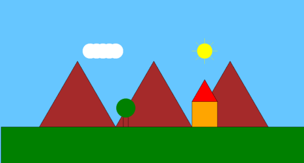
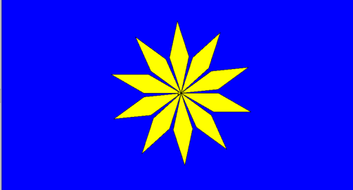
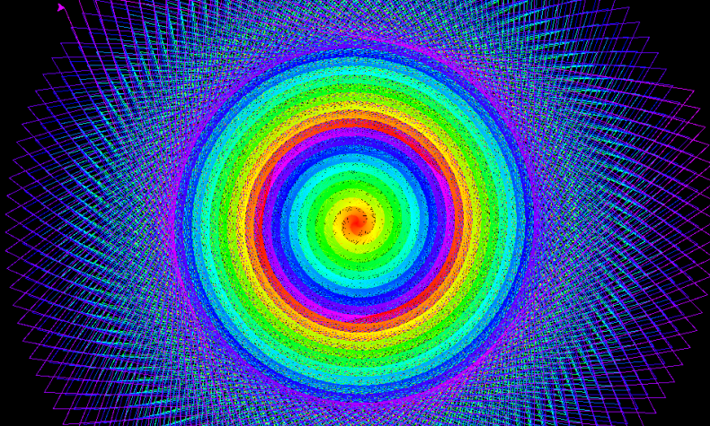

# Turtle Crash Course

Il modulo della tartaruga :)<br>
E' un modulo *didattico* predefinito in Python (non occorre installarlo, è già presente). Tramite codice
si muove una tartaruga (o più, o qualche forma che gli assomiglia) e si realizza qualche disegno più o meno
complicato imparando a programmare in maniera naturale.

Questo che trovate sotto è un ***Crash Course***: non ci sono spiegazioni, ma informazioni buttate là e qualche
obiettivo da raggiungere...

Buon divertimento!!!

<!-- ################################################################################# -->
## Fare cose con turtle

Inizia sempre con questo codice:

``` py
# qui importi la libreria turtle e tutte le sue cose
from turtle import *

# t ed s sono variabili: t è la tartaruga, s è lo sfondo
# dove la tartaruga si muove.
t = Turtle()
s = Screen()
```

## Le funzioni della tartaruga

<br>

- `t.forward( ppp )`: muove la tartaruga di `ppp` pixel in avanti (dritto al suo muso)
- `t.backward( ppp )`: muove la tartaruga di `ppp` pixel all'indietro
- `t.left( ggg )`: gira la tartaruga di `ggg` gradi verso sx (in senso antiorario)
- `t.right( ggg )`: gira la tartaruga di `ggg` gradi verso dx (in senso orario)

---

- `t.pendown()`: abbassa la penna (mentre la tartaruga cammina, la penna scrive)
- `t.penup()`: alza la penna (mentre la tartaruga cammina, la penna NON scrive)
- `t.pencolor( "color" )`: imposta il colore della penna a `color`
- `t.pensize ( ppp )`: imposta il tratto della penna a `ppp` pixel

---

- `t.fillcolor( "color" )`: imposta a `color` il colore di riempimento di una forma chiusa 
- `t.begin_fill()`: inizia a riempire una forma
- `t.end_fill()`: smette di riempire una forma

---

- `t.showturtle()`: mostra la tartaruga
- `t.hideturtle()`: nasconde la tartaruga

---

- `t.shape( "forma" )`: cambia la forma della tartaruga in uno fra: 
   - `arrow`,`turtle`,`circle`,`square`,`triangle`,`classic`
- `t.shapesize( ppp )`: cambia la dimensione della tartaruga di `ppp` pixel

--- 

- `t.circle ( ppp )`: disegna un cerchio di diametro `ppp` pixel
- `t.dot ( ppp ,"color" )`: disegna un punto (un cerchio pieno) di diametro `ppp` pixel e colore `color` 
- `t.stamp()`: stampa una copia della tartaruga (o della `forma`) nel punto ove essa si trova.
- `t.write ( "words" )`: scrive le parole indicate nella posizione corrente

--- 

- `t.speed( vvv )`: imposta la velocità della tartaruga
- `t.goto( x , y )`: porta la tartaruga al punto `(x,y)`
- `t.home()`: porta la tartaruga a casa (al centro)


## Il mondo della tartaruga

<br>

- `s.bgcolor( "color" )`: imposta il colore di sfondo
- `s.exitonclick()`: chiude la finestra `on click`
- `s.title( "Titolo della finestra" )`: imposta il titolo della finestra.


## Disegni con Turtle

Ok... ormai avete capito tutto di Turtle... vi inserisco alcuni <strike>esercizi</strike> disegni che ho fatto io... Provate a farli uguale o a rifarli meglio!!!







<br>
<br>
<br>

