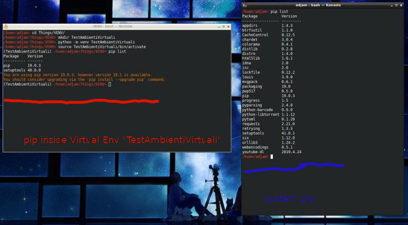

# Gli ambienti virtuali

Un ambiente virtuale è uno spazio indipendente dal resto del sistema in
cui è possibile lavorare e fare test con python e pip con la certezza di
non andare a sporcare o rovinare il proprio ambiente fisico, ovvero
l'installazione originale di Python nel nostro sistema!

La loro grande popolarità è dovuta sostanzialmente ai seguenti fatti:

-   è possibile creare molti ambienti virtuali contemporaneamente e
    quindi lavorare su progetti anche potenzialmente in conflitto tra
    loro senza farli "scontrare" minimamente;
-   è possibile installare moduli nuovi con pip senza i privileggi di
    amministratore, cosa che rende possibile sviluppare su qualunque
    dispositivo connesso alla rete;
-   è possibile installare su ambienti virtuali diverse versioni diverse
    dello stesso modulo o dello stesso software (basato su Python) per
    motivi di test e/o di sviluppo;
-   è possibile entrare e uscire velocemente da un ambiente virtuale
    "entrando" nell'ambiente di sviluppo e "ritornando" al sistema
    immacolato dell'utente

Fisicamente, un ambiente virtuale non è altro che una cartella
selezionata da noi in cui il modulo venv (Virtual ENVironment,
ricordate?) creerà una copia dei programmi "***python***" e "***pip***"
e una copia di tutte le librerie loro necessarie, così come della
cartella "***site-packages***" dove verranno installati i moduli
eventualmente aggiunti con pip.

L'attivazione dell'ambiente virtuale fa in modo che l'utente lì dentro
possa usare solo "***le copie***" di python e pip, così come solo i
moduli locali installati nella cartella "***virtuale***", così come i
moduli della libreria standard python: infatti i moduli della libreria
standard sono installati direttamente nelle cartelle "***base***" di
python e sono sempre disponibili per la versione a cui si riferiscono.

Facciamo una prova per capire il (semplice) funzionamento di un ambiente
virtuale

<!-- ################################################################################# -->
## Gestire un ambiente virtuale

Un ambiente virtuale si crea con il modulo venv che fa parte della
libreria standard di Python 3, dalla versione 3.4 in avanti. La scelta
di includere questo modulo nella libreria standard sottolinea due fatti:

1.  Creare ambienti virtuali è un'operazione "standard" per chi lavora
    in Python, incoraggiata da tutta la comunità tanto da includere il
    modulo che li gestisce nella libreria standard

2.  il modulo venv è la modalità prescelta dai progettisti python per la
    creazione di ambienti virtuali. In rete si trovano varie altre
    modalità per crearli e utilizzarli, ma il modulo venv è la modalità
    da considerare maggiormente.

Creiamo nel nostro sistema una cartella da destinare al nostro primo
ambiente virtuale; chiamiamola per esempio "TestAmbientiVirtuali" e
procediamo alla creazione dello stesso

Per creare l'ambiente virtuale

    $ python -m venv Percorso/Fino/Alla/Cartella/TestAmbientiVirtuali

Dopo un paio di secondi, l'ambiente virtuale è pronto!

Con l'operazione precedente abbiamo creato un ambiente virtuale che si
chiama "TestAmbientiVirtuali" (come la cartella). All'interno della
stessa il modulo venv avrà creato tutte le copie dell'eseguibile python,
di pip e della cartella (vuota) "site-packages" dove verranno installati
i moduli scaricati con il pip virtuale

Per attivare e disattivare l'ambiente virtuale, all'interno della
cartella "TestAmbientiVirtuali" venv ha creato gli script "activate" e
"deactivate". Su Windows si trovano dentro la cartella "Scripts", su Mac
e Linux si trovano dentro la cartella "bin".

Per attivare l'ambiente virtuale, su Windows

    > cd Percorso/Fino/Alla/Cartella/TestAmbientiVirtuali
    > Scripts/activate.bat

Per attivare l'ambiente virtuale, su Mac o Linux

    $ cd Percorso/Fino/Alla/Cartella/TestAmbientiVirtuali
    $ source bin/activate

Ovviamente, in maniera analoga alle istruzioni per l'attivazione, lo
script "deactivate" disattiva l'ambiente virtuale creato.

Se prima e dopo controllate i moduli installati con pip (oppure
utilizzate un altro prompt dei comandi) potete apprezzare la differenza
tra l'ambiente fisico e quello virtuale.

Ecco una schermata del mio computer.

Tutto qui!

Basta provare un paio di volte.

<!-- ################################################################################# -->
## Lavorare con un ambiente virtuale

Ok, siamo in grado di creare e attivare un ambiente virtuale. E adesso?
Cosa ci facciamo? Gli ambienti virtuali sono un grandissimo aiuto quando
si vuole sviluppare un'applicazione che si basa su moduli specifici non
solitamente installati sul sistema. Proviamo con un esempio.

Lo sviluppatore 1 vuole implementare nell'ambiente virtuale
"TestAmbientiVirtuali" appena creato un progetto per calcolare la
distanza fra le stelle conosciute e capire quali universi potrebbero
essere visitati dall'uomo, etc...

Il progetto sarà basato su skyfield e astropy, che sono due moduli
python utilizzati per i calcoli astronomici. All'interno del suo
ambiente virtuale installa i moduli a lui necessari:

    (TestAmbientiVirtuali) \$ pip install skyfield astropy

A questo punto, si crea una cartella che chiamerà "StarsTrips" e
utilizzerà i due moduli citati per scrivere il codice necessario per il
suo obiettivo.

    (TestAmbientiVirtuali) $ cd StarsTrips

    ... ore di coding, parolacce, merende varie ...

Terminato il suo lavoro, nella cartella StarsTrips ci sarà la sua
fantastica applicazione: per permettere a chiunque di eseguire
direttamente il suo codice gli manca solo di indicare quali moduli ha
utilizzato per lo sviluppo così che chiunque possa installarli e
aiutarlo nella sua impresa. Per fare ciò basta fare, dentro la cartella
StarsTrips:

Elenca i moduli installati nell'ambiente virtuale scrivendoli nel file
"requirements.txt"

    (TestAmbientiVirtuali) $ pip freeze > requirements.txt

Questo comando crea un file chiamato "requirements.txt" che elenca tutti
i moduli installati nel nostro ambiente virtuale. Fatto questo, lo
sviluppatore 1 può condividere con chiunque il proprio lavoro, presente
nella cartella StarsTrips e cancellare eventualmente l'ambiente
virtuale, semplicemente eliminando la cartella "TestAmbienteVirtuale".

Lo sviluppatore 2, che vuole testare il lavoro del suo amico/collega,
prende la cartella StarsTrips, crea un ambiente virtuale, lo attiva e lì
esegue il comando:

    (NuovoAmbienteVirtuale) $ pip install --r requirements.txt

Questo comando installa tutti i moduli python elencati nel file
requirements.txt. A questo punto lo sviluppatore 2 è pronto per testare
il lavoro importato.

 
 
 

