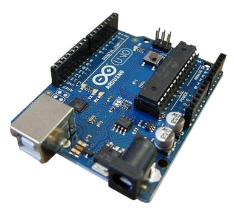

# Python & Arduino

Per sviluppare applicazioni in Python con interazione con un dispositivo
Arduino servono sostanzialmente 4 cose:

-   Python installato sul Computer :)
-   La libreria pyserial, per il collegamento con Arduino tramite
    seriale
-   Un dispositivo Arduino (dovrebbe funzionare con tutti i tipi)
-   L'ambiente di sviluppo per Arduino installato sul Computer

<!-- ################################################################################# -->
## Python & PySerial

Il modulo necessario per le implementazioni che vedremo si chiama
"PySerial". Per l'installazione dello stesso basta utilizzare pip, con
il comando indicato sotto

    $ pip install pyserial

oppure dalla linea di comando, invocando l'interprete Python

    $ python -m pip install pyserial

I comandi elencati funzionano sicuramente su Linux e Mac. Su Windows
dipende da come è stata fatta l'installazione di Python e in particolare
se l'eseguibile Python è stato inserito nel PATH.

Se così non fosse bisogna spostarsi con la console della riga di comando
fino alla cartella di installazione di Python ed eseguire il comando
sopra da lì.

Ad esempio se l'installazione è stata fatta su "C:\Python", allora il comando va
eseguito in quella cartella.

Per verificare che l'installazione del modulo è andata a buon fine basta
aprire l'interprete Python e provare a importare il modulo:

    >>> import serial

Se Python non si lamenta di nulla, siamo pronti per il prossimo step :)

<!-- ################################################################################# -->
## Ambiente Arduino

Il MicroProcessore libero Arduino si può acquistare a poco prezzo in un
negozio di prodotti informatici: una scheda singola costa fra i 10 e i
30 euro, mentre uno starter kit, che comprende una breadboard e alcuni
sensori semplici per le prime prove, si aggira intorno ai 40-70 euro.

Se economicamente possibile, uno starter kit è la scelta migliore. Vi
consiglio di cercare il prezzo migliore controllando i vari negozi
online di articoli informatici.

Il sito di riferimento ufficiale è
[https://www.arduino.cc](https://www.arduino.cc/). Lì si trovano
riferimenti per l'acquisto e per scaricare il software di sviluppo, che
si chiama Arduino IDE.

Non dovrebbe essere incredibilmente difficile riuscire nell'impresa di
acquistare un arduino e installare il suo IDE.

<!-- ################################################################################# -->
## Collegamento fra i dispositivi

I due esempi che seguono servono per verificare che sia possibile
instaurare una comunicazione nei due sensi: da Arduino al dispositivo
che esegue lo script Python e viceversa. I due esempi sono i più
semplici che sia possibile: nonostante ciò, richiedono comunque la
comprensione completa sia dei circuiti fisici che si vanno a
implementare con Arduino, sia dei collegamenti che si instaurano fra i
vari dispositivi.

<!-- ################################################################################# -->
## Da Arduino a Python

L'esempio da implementare è di una semplicità estrema: Arduino ogni TOT
secondi invierà un testo semplice tramite la porta seriale e Python
dovrà ogni volta individuare il testo inviarlo e trascriverlo sullo
schermo. Vediamo il codice:

Su **Arduino**:

    void setup() {
        Serial.begin(9600);
    }

    void loop() {
        Serial.print("Funziona!!!");
        delay(2000);
    }

Tramite l'ambiente di sviluppo, creare un nuovo progetto, copiare il
codice sovrastante in esso e "passarlo" al proprio Arduino.

Sul **Computer** con **Python**:

    import serial
    import time

    # Va individuata la porta seriale abbinata ad Arduino
    # Aiutatevi con Arduino IDE
    # Su Win, dovrebbe essere una "COMx" (con x che può essere 1,2,3,4)
    # Su Mac/Linux, dovrebbe essere "/dev/ttyACMx" (con x che va da 0 a...)

    portaSeriale = "boh"
    ad = serial.Serial(portaSeriale, 9600)
    
    while True:
        print( ad.realine() )

    time.sleep(2)

Eseguite questo pezzo di codice e "dovreste" vedere, ogni 2 secondi, la
scritta "**Funziona!!!**" apparire...

<!-- ################################################################################# -->
## Da Python ad Arduino

Per il secondo esempio le cose sono leggermente più complicate. L'idea è
quella di inviare una informazione tramite Python e fare in modo che
Arduino se ne accorga. Come facciamo però **NOI** ad essere sicuri che
Arduino se ne sia accorto???

La cosa più semplice è fargli fare qualcosa, ad esempio... accendere un led! 
Per fare ciò, occorre implementare il seguente circuito con Arduino, una breadboard, un led e una resistenza.

Implementato il circuito come in figura, andremo a caricare sulla scheda
il seguente codice per Arduino:

Codice per Arduino

    #define LED 13

    void setup() {
        pinMode(LED, OUTPUT);
        Serial.begin(9600);
    }

    void loop() {
        if (Serial.available()) {
            char c = Serial.read();
            if (c == \'S\')
                digitalWrite(LED, HIGH);
            if (c == \'N\')
                digitalWrite(LED, LOW);
        }
    }

Il codice è molto semplice da capire: il LED è collegato al pin 13, che
viene impostato in OUTPUT, ovvero i dati usciranno dalla scheda Arduino
al LED. Arduino è in ascolto sulla porta seriale e legge un carattere
per volta: se il carattere è 'S' imposta come acceso il LED; se il
carattere è 'N' lo imposta come spento.

Analogamente Python deve essere in grado di inviare i due caratteri ad
Arduino.

Codice Python

    import serial
    import time

    portaSeriale = "boh" # VEDI SOPRA

    arduino = serial.Serial(portaSeriale,9600)
    time.sleep(2)

    carattere = 'A'

    while carattere != 'C':
        carattere = input("S accende il LED, N lo spegne, C stop")
        c = carattere.encode('latin_1')
        arduino.write(c)    
        time.sleep(2)

    arduino.close()

Tutto qua!

Rimane da provare e sperimentare un po'...

 
 
 

