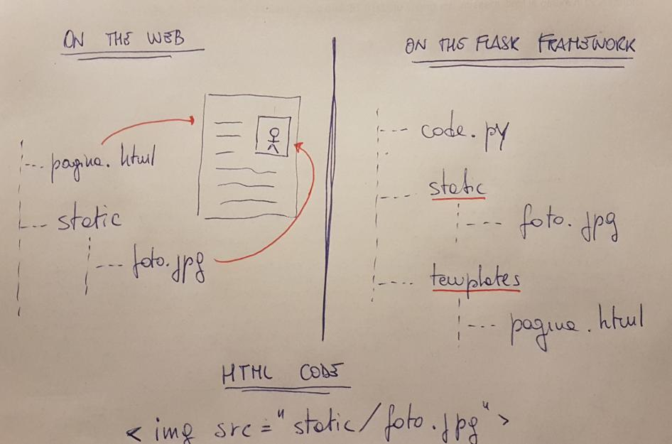

# Python: Flask Web Framework

Uno Web Framework rappresenta una collezione di librerie e moduli che
permette ad uno web developer di scrivere applicazioni web senza
occuparsi dei dettagli di basso livello.

Flask è uno Web Framework scritto in Python, basato sul toolkit WSGI
Werkzeug e sul template engine Jinja2.

WSGI (Web Server Gateway Interface ) è una specifica che definisce una
interfaccia universale di comunicazione fra un server web e una
applicazione web.

Werkzeug è semplicemente una implementazione WSGI utilizzata da Flask.

Jinja2 è un template engine molto popolare per il linguaggio Python. Un
sistema di web template combina un template (uno schema, uno scheletro)
con delle sorgenti dati per creare una pagina web dinamica.

Flask è disponibile in pochi istanti tramite pip:

pip install Flask

Oppure dall'interfaccia di Thonny per la gestione dei pacchetti.

<!-- ################################################################################# -->
## Primi esempi con Flask

La più semplice applicazione sviluppabile con la libreria Flask è
strutturata in questo modo:

from flask import Flask

app = Flask(\_\_name\_\_)

\@app.route(\"/\")

def index():

return \"Hello, World!\"

Se la eseguite con Thonny essa creera un avviso tipo questo:

\# Running the app with options chosen by Thonny. See Help for details.

\* Serving Flask app \'HelloWorld\' (lazy loading)

\* Environment: development

\* Debug mode: off

\* Running on **http://127.0.0.1:5000/** (Press CTRL+C to quit)

Cliccando sul link [**http://127.0.0.1:5000/**](http://127.0.0.1:5000/)
o aprendolo direttamente nel browser vedremo una pagina semplice
semplice con scritto \"Hello, World!\".

A vederlo così non sembra difficile, ma ci sono alcune cosine che
risultano un po\' strane a prima vista, provo a commentare tutto questo
primo codice e a spiegare la logica con cui si sviluppa utilizzando
Flask.

Importiamo l'oggetto Flask dal modulo flask

from flask import Flask

Questa operazione è l'operazione di base per lavorare con il modulo
Flask: non c'è molto altro da commentare se non che siamo già pratici di
questa modalità e che arriveranno man mano altri oggetti dal modulo
flask, secondo necessità.

Creiamo l'oggetto Flask che gestisce la nostra applicazione

app = Flask(\_\_name\_\_)

Tecnicamente questo oggetto rappresenta il server web... ovvero il
software che fornisce le pagine web agli utenti (che le richiedono
tramite i browser).

Per funzionare ha bisogno di un nome (si possono eseguire più oggetti
contemporaneamente, ma devono avere nome diverso).

Definiamo la funzione da eseguire.

def index():

return \"Hello, World!\"

Lo so, ho saltato la riga \"complicata\". Ma siccome ho bisogno di più
spazio per spiegarla... faccio prima questa che è facile.

La funzione in oggetto si chiama come vi pare e restituisce una stringa:
quella stringa sarà il contenuto della pagina web che vedremo sul
browser.

Impostiamo il decoratore della nostra applicazione

\@app.route(\"/\")

Un ***decoratore*** è una struttura Python relativamente complessa che
si abbina ad una funzione (quella che indicate sotto alla riga con la @)
e che ne modifica il comportamento (la ***decora***).

Il decoratore route, definito nella classe Flask di cui app è un oggetto
si comporta in questo modo: quando il PATH dell'URL richiesto
corrisponde al suo parametro esegue la funzione abbinata e restituisce
come contenuto della pagina WEB ciò che la funzione ritorna.

Il decoratore del nostro esempio viene scatenato perché il link in
questione è [**http://127.0.0.1:5000/**](http://127.0.0.1:5000/): il
PATH di questo URL è effettivamente la stringa \"/\".

Se volessimo \"aggiungere una pagina\" al nostro sito, raggiungibile
all'URL
[**http://127.0.0.1:5000/**](http://127.0.0.1:5000/nuovapagina/)[**nuovapagina/**](http://127.0.0.1:5000/nuovapagina/)
allora dovremmo aggiungere al nostro codice un nuovo decoratore abbinato
ad una nuova funzione: una cosa del tipo

\@app.route(\"/nuovapagina/\")

def nuovapagina():

s = \"\<h1\>Ciao\</h1\>

s += \"Sei sull'altra pagina...\"

return s

Spero sia tutto chiaro fin qui!

> Avrete notato che Thonny esegue la app di Flask nell'indirizzo locale
> 127.0.0.1, che non è raggiungibile dall'esterno.

> Per cambiare questo comportamento, eseguite in maniera esplicita la
> funzione run() terminando il codice con una cosa tipo:

if \_\_name\_\_ == \"\_\_main\_\_\":

app.run(host = \"0.0.0.0\", port = 5000, debug = False)

<!-- ################################################################################# -->
## Esercizio svolto

Ho scritto la mia bella pagina web in HTML, CSS, JS e via discorrendo.
Ho tutto pronto nel file \"pagina.html\": come la rendo disponibile
online?

Nella stessa cartella della pagina web creo uno script Python con il
seguente codice:

from flask import Flask

app = Flask(\_\_name\_\_)

\@app.route(\"/\")

def index():

file = open(\"pagina.html\")

content = file.read()

file.close()

return content

<!-- ################################################################################# -->
## L'esercizio svolto è sbagliato!

In che senso sbagliato... l'esercizio è giusto. Funziona! L'ho appena
provato... inoltre ha senso, combacia con la teoria spiegata nella
pagina precedente... Cosa ha di sbagliato?

In realtà nulla.

Il fatto è che tramite Flask è possibile fare le cose in maniera
addirittura più semplice!

Ho provato a disegnare uno schema per spiegare il concetto... se a
sinistra (on the web) descrivo come scriveresti una normale pagina web,
a destra (on the Flask framework) descrivo come andrebbero organizzati i
file.

Il web framework Flask considera (scontata) la presenza di 2 directory:

-   la cartella **static**, che andrà a contenere tutti file \"statici\"
    del sito: immagini, css, javascript, etc...
-   la cartella **templates**, che andrà a contenere tutti i file html
    del sito. Vengono definiti templates e non sono considerati statici
    perché possono essere completati o modificati tramite codice andando
    a creare contenuti dinamici.

Quando si utilizza la cartella templates, il (poco) lavoro svolto
nell'esempio svolto si fa in meno di una riga di codice, tramite la
funzione **render_template**

from flask import Flask,render_template

app = Flask(\_\_name\_\_)

\@app.route(\"/\")

def index():

return render_template(\"pagina.html\")

## Variabili dinamiche

Nel parametro del decoratore è possibile inserire delle variabili
dinamiche marcando alcune parole con le parentesi angolari:
\<variable\>.

Questo è uno di quegli innumerevoli casi in cui un esempio vale più di
mille parole...

from flask import Flask

app = Flask(\_\_name\_\_)

\@app.route(\"/post/\<id\>\")

def showPost(id):

\# do something\...

return \"the post you're searching for has id \" + id

\@app.route(\"/\<name\>\")

def test(name):

return \"Hello \" + name

\@app.route(\"/\<val1\>/\<val2\>\")

def dai(val1, val2):

return \"val 1 = \" + val1 + \", val 2 = \" + val2

Come vedete, è possibile generare una pagina specifica a seconda
dell'URL utilizzato e avendo magari un \"template\" di riferimento per
la stessa...

In effetti è proprio così: guardate che roba.

Create una pagina web chiamata welcome.html in cui digitate il seguente
codice HTML

\<h1\>Ciao!\</h1\>

So che ti chiami {{ nome_utente }}

Come vedete questa sintassi ***non è esattamente HTML***... questo è
***Jinja2***, quel web template che dicevamo permette di creare pagine
dinamiche... ricordate?

Salvata la pagina nella cartella dei templates, il codice che la fa
funzionare è semplicemente questo:

from flask import Flask,render_template

app = Flask(\_\_name\_\_)

\@app.route(\"/user/\<name\>\")

def index(name):

return render_template(\"pagina.html\", nome_utente=name)

Adesso vi basta eseguire questo script e visitare il link
<http://127.0.0.1:5000/user/unnomequalsiasi> \...

### Redirection Behaviour

Le due seguenti route sono diverse per la presenza o meno dello slash
finale:

\@app.route(\"/home/\")

def home():

return \"the home page\"

\@app.route(\"/about\")

def about():

return \"the about page\"

Nel primo caso (con lo slash alla fine) Flask immagina di riferirsi ad
una cartella (da cui pescare il file index.html): se l'utente digita
l'URL http://host:port/home (senza slash) Flask automaticamente lo
aggiunge per riferirsi (correttamente) alla cartella home.

Nel secondo caso (senza lo slash finale) Flask immagina che la pagina
about sia solo una pagina: se l'utente digita l'URL
http://host:port/about (senza slash) tutto funziona normalmente, ma se
l'utente aggiunge lo slash finale (digitando http://host:port/about/)
Flask ritorna un errore 404 di pagina non trovata.

## Gestione form

Un'altra cosa molto interessante che è possibile fare con il modulo
Flask è la gestione dei dati scambiati fra client e server, tipicamente
inviati con metodo POST (a volte anche con una semplice GET), quando ad
esempio si compila un form di iscrizione, si risponde ad un sondaggio
sul web o si mettono le proprie credenziali per accedere ad un servizio.

Per spiegare nella maniera più semplice possibile questa funzionalità ho
realizzato un esempio molto semplice in cui l'utente si trova davanti
due caselle di testo per inserire nome utente e password e Flask
raccoglie i dati e li rivisualizza come dimostrazione di averli letti.

Entrambe le pagine saranno servite dalla nostra applicazione Flask.

La pagina con il form HTML

\<form action=\"/data\" method=\"POST\"\>

USER: \<input name=\"username\"\>\<br\>

PASS: \<input name=\"password\" type=\"password\"\>\<br\>

\<input type=\"submit\" value=\"INVIA\"\>

\</form\>

Ovviamente l'esempio è molto scarno, ma già sufficiente per la
comprensione. Il metodo di invio è **POST**, i dati da inviare sono 2,
identificati dai nomi **username** e **password**. La pagina a cui
questi dati saranno inviati si trova all'URL relativo **/data**.

> Se possibile, quando si usa Flask, evitate di utilizzare il nome
> **pass**, che corrisponde ad una precisa istruzione Python... meglio
> evitare confusione!!!

La pagina si chiamerà \"login.html\" e sarà ovviamente collocata nella
cartella \"templates\" della nostra app.

La pagina per visualizzare i dati

USER: {{ username }} \<br\>

PASS: {{ password }} \<br\>

Ovviamente non ha molto senso visualizzare l'username e la password. Noi
qui lo facciamo solo per dimostrare che la lettura è andata a buon fine.

La pagina si chiamerà \"dati.html\" e (anche questa) sarà collocata
nella cartella \"templates\".

Il codice Python Flask

from flask import Flask,render_template,request

app = Flask(\_\_name\_\_)

\@app.route(\"/\")

def index():

return render_template(\"login.html\")

\@app.route(\"/data\", methods=\[\"POST\"\])

def login():

u = request.form\[\"username\"\]

p = request.form\[\"password\"\]

return render_template(\"data.html\",username = u,password = p)

Come vedete il codice introduce un nuovo oggetto: **request**.

Questo oggetto serve per la gestione delle richieste, dei dati che esse
veicolano e così via.

Ancora una volta si utilizza il web template Jinja2 per la compilazione
dei dati... mi sembra davvero molto comodo, invece che fare congiunzioni
e magie con le stringhe.

Il metodo di invio (POST, nel nostro caso) va indicato nel decoratore.

Fatto!

Detto tutto questo... basta provare!

TODO

esercizi mirati per ogni parte

integrazione con DB

Flask & mysql:
<https://www.askpython.com/python-modules/flask/flask-mysql-database>

Flask & sqlite: <https://pythonbasics.org/flask-sqlite/>

Flask & mongoDB: <https://pythonbasics.org/flask-mongodb/>
