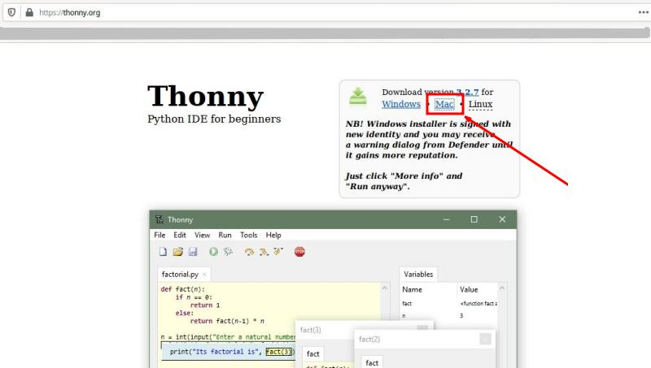
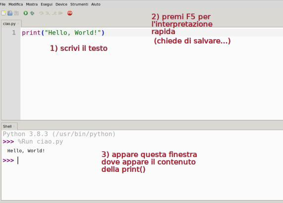

# Installazione

Per lavorare con Python basta avere l\'interprete Python con tutte le
sue librerie più importanti installato nel proprio sistema, utilizzare
il blocco note (o un altro editor di testo semplice) per scrivere il
codice e infine richiederne l\'esecuzione all\'interprete Python tramite
riga di comando.

Capite che questa modalità di lavoro, benché funzionante e sufficiente,
risulti complicata e inadatta a chi deve concentrarsi sull\'imparare il
linguaggio piuttosto che far funzionare tutto il sistema solo per
eseguire la prova di un semplice programma.

Per risolvere questo problema e favorire lo sviluppo semplice e veloce
delle applicazioni (**RAD**: [Rapid Application
Development](https://it.wikipedia.org/wiki/Rapid_application_development))
si è addirittura inventata una nuova categoria di software, denominata
**IDE** ([Integrated Development
Environment](https://it.wikipedia.org/wiki/Integrated_development_environment)).

Questi sono software che contengono più o meno tutto quanto necessario
per sviluppare una applicazione in uno o più linguaggi di
programmazione: un editor di testo per la scrittura del codice, il
compilatore e/o l\'interprete dei vari linguaggi, gli strumenti per il
debug, ovvero per la correzione degli errori del software, per\... tutto
quello che serve!

Esempi di IDE famosi (nella loro categoria) sono:

-   [Eclipse](https://it.wikipedia.org/wiki/Eclipse_(informatica))
    (multipiattaforma e multilinguaggio)
-   [KDevelop](https://it.wikipedia.org/wiki/KDevelop)
    (multipiattaforma, per linguaggi C e C++)
-   [NetBeans](https://it.wikipedia.org/wiki/NetBeans) (multipiattaforma
    e multilinguaggio)
-   [Visual
    Studio](https://it.wikipedia.org/wiki/Microsoft_Visual_Studio) (su
    Windows, per C++ e C#)
-   [Visual Studio
    Code](https://it.wikipedia.org/wiki/Visual_Studio_Code)
    (multipiattaforma e multilinguaggio)
-   [XCode](https://it.wikipedia.org/wiki/Xcode) (su MacOS, per C, C++,
    Swift, Obj-C)

Allo stesso modo per lavorare con Python noi utilizzeremo un IDE. Esempi
di IDE per Python che potreste provare sono:

-   [IDLE](https://en.wikipedia.org/wiki/IDLE), il più semplice IDE per
    Python, scritto in Python, multipiattaforma, disponibile
    nell\'installer ufficiale di Python.
-   [Visual Studio
    Code](https://it.wikipedia.org/wiki/Visual_Studio_Code), su Windows,
    MacOS e Linux. Offre un eccellente supporto per Python.
-   [PyCharm](https://en.wikipedia.org/wiki/PyCharm), sviluppato
    specificatamente per lo sviluppo in Python.

Le istruzioni che seguono servono per installare un altro IDE, chiamato
[Thonny](https://en.wikipedia.org/wiki/Thonny). La scelta fra tutta
questa abbondanza e questa qualità di software disponibili è ricaduta su
questo per una serie di motivi che vorrei mettere in evidenza, prima di
procedere:

-   Thonny è scritto in Python e disponibile per Windows, MacOS, Linux,
    Raspberry. Tutti sistemi operativi che potenzialmente useremo.
-   Thonny è scritto non da una azienda o da una comunità, ma
    direttamente dal dipartimento di informatica dell\'università di
    Tartu (Estonia)
-   Thonny è stato scritto specificatamente per la didattica con Python.
-   Thonny installa una copia di Python, rendendo semplicissima
    l\'installazione dell\'ambiente completo per tutti gli utenti.
-   Thonny fornisce una interfaccia semplice anche per l\'interazione
    con pip, il gestore di pacchetti Python (ne parleremo in seguito)

Insomma, un IDE a misura degli studenti! Passiamo all\'installazione sui
nostri sistemi (in rigoroso ordine alfabetico)!

## Installare Thonny su Linux

Installare software su Linux è affare allo stesso momento semplicissimo
e complicatissimo. Semplicissimo perché con il comando giusto, i sistemi
operativi basati su Linux eseguono download, installazione e prima
configurazione del software in pochissimo tempo. Complicatissimo perché
scegliere il comando giusto richiede una minima conoscenza del sistema
che non sempre tutti gli utenti hanno e che varia da sistema a sistema.

In generale, ho schematizzato i comandi da terminale per tutte le
distribuzioni più famose. Se pensate di non rientrare in nessuna di
queste, contattatemi e vedremo insieme cosa fare:

``` bash
# Debian, Rasbian, Ubuntu, Mint e altre
$ sudo apt install python3 thonny

# Fedora, Red Hat, Mandriva, OpenSuse e altre
$ sudo dnf install python3 thonny

# Arch Linux, Manjaro, Chakra, Parabola e altre
$ sudo pacman -S python3 thonny
```

Questo installerà l\'ultima versione di Python 3.x e Thonny sul vostro
sistema, rendendolo pronto all\'uso! Tutto qui! Passate a testare
l\'installazione con l\'Hello World Test in fondo!

## Installare Thonny su MacOS

Per installare Thonny su Mac, andate sul sito di Thonny
(<https://thonny.org/>), scaricate il pacchetto di installazione per Mac
e installatelo sul vostro sistema. Se avete già installato sul vostro
Mac un pacchetto .pkg non avrete alcuna difficoltà!



Terminata l\'installazione verificate che tutto funzioni con l\'Hello
World Test in fondo.

## Installare Thonny su Windows

Per installare Thonny su Windows, andate sul sito di Thonny
(<https://thonny.org/>), scaricate il pacchetto di installazione per
Windows e installatelo sul vostro sistema.


C\'è qualcuno che pensa evidentemente che gli utenti di Windows siano
tutti tonti: non avete idea di quanti tutorial si trovano su YouTube per
installare Thonny. Nel dubbio ne aggiungo qui uno\...

::: youtube
yMO-lNk6dgY
:::

Spero tutto questo sia sufficiente. Altrimenti contattatemi per avere
aiuto. Appena avete finito procedete con l\'Hello World Test sotto.

## Hello World Test

::: tip
::: title
Tip
:::

Gli *Hello World* sono programmi che scrivono (o mostrano) semplicemente
la scritta \"Hello, World!\".

Sono tipicamente i primi programmi che si vuole scrivere in un qualsiasi
linguaggio di programmazione e servono solo a testare l\'ambiente di
lavoro per assicurarsi che tutto funzioni.
:::

Si tratta di aprire Thonny, scrivere nell\'editor il seguente codice e
premere F5 per avviare l\'interpretazione.

``` bash
print("Hello, World!")
```


