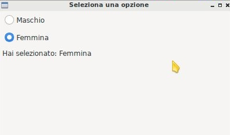
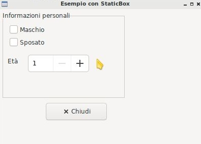
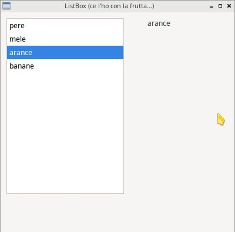

# Le widgets

!!! warning "Attenzione!"

    Negli esempi che seguono, scritti con l'unico obiettivo di presentare le widget, andremo a posizionare più oggetti nella stessa finestra
    tramite il cosiddetto **posizionamento assoluto**, inserendo tutte le widget in un `wx.Panel` e indicando **posizione (pos)** e 
    **dimensione (size)** degli oggetti.

    Questo modo di fare, pur semplice e intuitivo, è comunque assolutamente sconsigliato e sarà sostituito nel prossimo capitolo da un concetto
    molto più avanzato e funzionale: **i layout**!.
    
    Per adesso... cerchiamo di capire bene come funzionano le widgets!!!


In questa sezione andremo ad inserire le Widgets più semplici, per
capire come sono fatte e come funzionano. Per ognuna di esse sarà
proposta una descrizione sommaria delle sue caratteristiche,
un'immagine esplicativa, un semplice esempio di codice per testare il
funzionamento di base e alcuni esercizi basilari per prendere confidenza con il codice.

Ricordo che la documentazione completa di ognuna di queste widget è
disponibile nella [apposita sezione](/pyhandouts/wx/201_classes/).


<!-- ########################################################################################################### -->
## wx.Frame


La classe wx.Frame rappresenta una finestra vuota, con bordo e aspetto
nativo nel sistema operativo ospite, con le funzionalità tipiche delle
finestre già implementate e funzionanti senza fare nulla: trascinamento,
ridimensionamento, barra del titolo, riduzione ad icona,
massimizzazione, etc...


Non c'è molto da spiegare su questo che non abbiamo già visto...
provate a copiare l'esempio sotto e a giocare un pò con la finestra.
Poi magari date un occhio alla documentazione.

``` python
import wx

app = wx.App()
win = wx.Frame(None, title="Un Esempio con wx.Frame")
win.Show()
app.MainLoop()
```

<!-- ########################################################################################################### -->
## wx.Panel


La classe `wx.Panel` rappresenta una widget vuota, adatta ad essere
utilizzata come contenitore delle altre che vedremo.

La sua utilità sta nel fatto che fornisce nativamente interazione con la
tastiera (*Tab Traversal*, lo spostamento fra una widget e l'altra
premendo Tab) per sè e per tutte le widget al suo interno.

Da ora in poi la utilizzeremo in tutti i nostri progetti!. Anche dal
punto di vista visivo, un Frame senza un Panel sembra *vuoto*, mentre un
frame con dentro un *panel* sembra normalmente *pieno*.

!!! tip "Suggerimento (anzi no... Obbligo Perentorio!!!)"

    Da ora in poi utilizzeremo il `wx.Panel` in tutti i nostri progetti. Esso costituirà anche un livello 
    intermedio di parentela fra le widgets in maniera che:

    - il Frame nasce senza `parent`
    - il Panel nasce con `parent` il Frame (tipicamente `self`)
    - Tutte le widget inserite nella finestra, che giacciono sopra il Panel, hanno il panel stesso come `parent`

    Tutti gli esempi da qui in poi sono strutturati in questo modo: vi basterà osservarli un minimo :)


<br>

<!-- ########################################################################################################### -->
## wx.Button


La classe `wx.Button` rappresenta una widget che implementa un pulsante cliccabile con una etichetta di testo dentro.


Nell'esempio proposto quando si clicca il pulsante (evento `wx.EVT_BUTTON`) si riduce ad icona l'applicazione.

``` python
import wx

class Esempio(wx.Frame):

    def __init__(self):
        super().__init__(None, title="Iconificami")
        panel = wx.Panel(self)
        pulsante = wx.Button(panel, label="Riduci ad icona", pos=(5,5), size=(150,40))
        pulsante.Bind(wx.EVT_BUTTON, self.iconifica)

    def iconifica(self, evt):
        self.Iconize()
        return

# ----------------------------------------
if __name__ == "__main__":
    app = wx.App()
    window = Esempio()
    window.Show()
    app.MainLoop()
```

--------------------------------------------------------------------

**Esercizio 111 (Button)**

Creare una applicazione con un pulsante *CHIUDI*. Quando lo clicchi, l'applicazione si chiude.

--------------------------------------------------------------------

**Esercizio 112 (Button)**

Creare una applicazione con un pulsante *MASSIMIZZA*. Quando lo clicchi, l'applicazione si massimizza.

--------------------------------------------------------------------

**Esercizio 113 (Button)**

Creare una applicazione con un pulsante *NUOVA FINESTRA*. Quando lo clicchi, si apre una nuova finestra, identica alla precedente.


<br>

<!-- ########################################################################################################### -->
## wx.ToggleButton


La classe `wx.ToggleButton` rappresenta una widget che implementa un pulsante con due stati: cliccato e non cliccato.


Nell'esempio proposto quando si clicca il ToggleButton (evento `wx.EVT_TOGGLEBUTTON`) si mette a schermo intero 
la finestra e si cambia la scritta sul pulsante (che rimane cliccato). <br>
Cliccandolo di nuovo si ritorna alla situazione iniziale.

``` python
import wx

class Esempio(wx.Frame):

    def __init__(self):
        super().__init__(None, title="Fullscreen(er)")
        panel = wx.Panel(self)
        self.fullScreenButton = wx.ToggleButton(panel, label="Metti fullscreen", pos=(5,5), size=(150,40))
        self.fullScreenButton.Bind(wx.EVT_TOGGLEBUTTON, self.mettiFullScreen)

    def mettiFullScreen(self, evt):
        if not self.IsFullScreen():
            self.ShowFullScreen(True)
            self.fullScreenButton.SetLabel("Esci dal fullscreen")
        else:
            self.ShowFullScreen(False)
            self.fullScreenButton.SetLabel("Metti fullscreen")

# ----------------------------------------
if __name__ == "__main__":
    app = wx.App()
    window = Esempio()
    window.Show()
    app.MainLoop()
```

--------------------------------------------------------------------

**Esercizio 115 (ToggleButton)**

Creare una applicazione con una finestra con titolo *Ciccio* che
contiene un pulsante "Toggle". Quando clicchi il pulsante, il titolo
diventa *Pippo*, quando lo clicchi di nuovo ritorna ad essere *Ciccio* e
così via.

--------------------------------------------------------------------

**Esercizio 116 (ToggleButton)**

Creare una applicazione con una finestra che contiene un pulsante "Toggle". 
Quando clicchi il pulsante, appare una nuova finestra vuota di fianco a questa; quando lo clicchi di nuovo la finestra scompare.

<br>

<!-- ########################################################################################################### -->
## wx.StaticText


La classe `wx.StaticText` rappresenta una widget che implementa una etichetta dove il programmatore 
può inserire un testo da visualizzare all'utente.


Nel semplicissimo esempio proposto, viene utilizzata la widget `wx.StaticText` per visualizzare una poesia in più righe. 
La widget è inserita a "tutta finestra".

``` python
import wx

class Esempio(wx.Frame):

    def __init__(self):
        super().__init__(None, title="Soldati")
        testo = "\nSi sta come\nd'autunno\nsugli alberi\nle foglie\n"
        etichetta = wx.StaticText(self, label=testo)

# ----------------------------------------
if __name__ == "__main__":
    app = wx.App()
    window = Esempio()
    window.Show()
    app.MainLoop()
```


<!-- ########################################################################################################### -->
## wx.StaticLine


La classe `wx.StaticLine` rappresenta una widget che implementa una linea decorativa, orizzontale o verticale.


Inserire una `wx.StaticLine` è veramente semplice e serve solo a scopo decorativo. 
Approfitto di questa per farvi vedere come modificare il font di una `wx.StaticText` e realizzare una widget con 
titolo, linea e testo, come vedete nella figura.

``` python
import wx

class Esempio(wx.Frame):

    def __init__(self):
        super().__init__(None, title="Poesia")
        panel = wx.Panel(self)

        # Font grassetto di 20pt
        bigBoldFont = wx.Font( wx.FontInfo(20).Bold() )
        titolo = wx.StaticText(panel, label="Soldati",pos=(10,10), size=(200,30))
        titolo.SetFont(bigBoldFont)

        linea = wx.StaticLine(panel, pos=(10,50), size=(200,3))

        testo = "\nSi sta come\nd'autunno\nsugli alberi\nle foglie\n"
        etichetta = wx.StaticText(panel, label=testo, pos=(10,60), size=(200,150))

# ----------------------------------------
if __name__ == "__main__":
    app = wx.App()
    window = Esempio()
    window.Show()
    app.MainLoop()
```


<!-- ########################################################################################################### -->
## wx.TextCtrl


La classe `wx.TextCtrl` rappresenta una widget che implementa una casella di testo, con vari stili supportati, 
definibili in fase di inizializzazione:

``` python
casella = wx.TextCtrl( window , style=OPTIONS )
```

Cito qui i più importanti:

| Stile               |  Descrizione                                       |
|---------------------|----------------------------------------------------|
| (default)           | Linea singola di testo, digitabile dall'utente     |
| wx.TE_MULTILINE     | Permette alla TextCtrl di utilizzare più righe     |
| wx.TE_PASSWORD      | Ogni carattere viene visualizzato con un asterisco |
| wx.TE_READONLY      | Testo non modificabile dall'utente                 |
| wx.TE_PROCESS_ENTER | Gestisce il tasto INVIO come evento separato       |

Non ha un evento di default, ma ben due utilizzabili distintamente:

- `wx.EVT_TEXT`: viene scatenato ogni volta che cambia il testo contenuto nella widget
- `wx.EVT_TEXT_ENTER`: viene scatenato quando hai impostato lo stile `wx.TE_PROCESS_ENTER` e si preme INVIO nella widget

Nell'esempio proposto ho inserito una TextCtrl con caratteri oscurati (password). 
Man mano che si digita su di essa, il testo appare nella StaticText a fianco. Provate a testare l'esempio autonomamente e a
modificare il codice per visualizzare ciò che è stato digitato solo alla fine, quando si preme INVIO nella TextCtrl.


``` python
import wx

class Esempio(wx.Frame):

    def __init__(self):
        super().__init__(None, title="TextCtrl Examples")
        panel = wx.Panel(self)

        self.text1 = wx.TextCtrl(panel, style=wx.TE_PASSWORD, pos=(5,5), size=(200,50))
        self.static1 = wx.StaticText(panel, label="", pos=(5,70))
        self.text1.Bind(wx.EVT_TEXT, self.aggiornaTesto)

    def aggiornaTesto(self, evt):
        self.static1.SetLabel( self.text1.GetValue() )
        return

# ----------------------------------------
if __name__ == "__main__":
    app = wx.App()
    window = Esempio()
    window.Show()
    app.MainLoop()
```

--------------------------------------------------------------------

**Esercizio 131 (Button, StaticText, TextCtrl)**

Creare una applicazione con una finestra che contiene una StaticText,
inizialmente vuota, una TextCtrl e un pulsante. Quando l'utente clicca
sul pulsante, il testo contenuto nella TextCtrl viene copiato nella
StaticText e la TextCtrl ripulita.

--------------------------------------------------------------------

**Esercizio 132 (TextCtrl, Button)**

Salvate questo esercizio come `es132.py` in una cartella e nella stessa creerete un file
chiamato `testo.txt` contenente un testo a piacere.

Create una Finestra con una TextCtrl multilinea vuota e un pulsante. Quando
l'utente clicca il pulsante, il programma carica dal file `testo.txt` il contenuto 
e lo visualizza nella TextCtrl.

<br>

<!-- ########################################################################################################### -->
## wx.ComboBox


La classe `wx.ComboBox` rappresenta una widget che implementa un menù a tendina


La ComboBox supporta i seguenti stili di lavoro:

|  Stile               |  Descrizione                                      |
|----------------------|---------------------------------------------------|
| (default)            | Linea singola di testo editabile + menù a tendina |
| wx.CB_READONLY       | Linea di testo NON editabile.                     |
| wx.CB_SORT           | Ordina automaticamente le voci                    |
| wx.TE_PROCESS_ENTER  | Gestisce il tasto INVIO come evento separato      |

Nell'esempio proposto vediamo una etichetta e un menù a tendina.
Selezionando una voce del menù a tendina (evento `wx.EVT_COMBOBOX`) si modifica il contenuto dell'etichetta.

``` python
import wx

class Esempio(wx.Frame):

    def __init__(self):
        super().__init__(None, title="Cambia l'etichetta")

        panel = wx.Panel(self)       
        self.etichetta = wx.StaticText(panel, label="seleziona una voce", pos=(5,5), size=(200,30))
        frutta = ["pere", "mele", "arance", "banane"]
        self.combo = wx.ComboBox(panel, choices=frutta, style=wx.CB_READONLY, pos=(5,40), size=(200,30))
        self.combo.Bind(wx.EVT_COMBOBOX, self.visualizzaSelezione)

    def visualizzaSelezione(self, evt):
        f = self.combo.GetValue()
        self.etichetta.SetLabel("Hai selezionato: " + f)
        return

# ----------------------------------------
if __name__ == "__main__":
    app = wx.App()
    window = Esempio()
    window.Show()
    app.MainLoop()
```

--------------------------------------------------------------------

**Esercizio 136 (TextCtrl, Button, ComboBox)**

La finestra presenta una TextCtrl, un pulsante e una ComboBox,
inizialmente con un'unica opzione (un testo a piacere). L'utente
inserisce una stringa nella TextCtrl e se non è vuota, quando clicca il
pulsante quella stringa viene aggiunta come opzione alla ComboBox e la
TextCtrl ripulita.

--------------------------------------------------------------------

**Esercizio 137 (Frame, ComboBox)**

la finestra presenta una ComboBox con opzioni '600x400', '800x600',
'massimizza'. Quando l'utente seleziona una delle opzioni la finestra
si ridimensiona secondo quanto indicato.

--------------------------------------------------------------------

**Esercizio 138 (ComboBox, TextCtrl, Button)**

Inserite nella finestra una ComboBox inizialmente vuota, una TextCtrl e
un Button. L'utente digita qualcosa nella TextCtrl e quando clicca il
pulsante, se la TextCtrl non è vuota, aggiunge la parola alla ComboBox e
pulisce la TextCtrl.


<br>


<!-- ########################################################################################################### -->
## wx.CheckBox


La classe `wx.CheckBox` rappresenta una widget che implementa una casella di spunta.


Nell'esempio proposto abbiamo una sola casella di spunta che quando
viene abilitata imposta lo sfondo rosso della finestra, riportando
quello originale se deselezionata.

``` python
import wx

class Esempio(wx.Frame):

    def __init__(self):
        super().__init__(None, title="Cambia il colore di sfondo")
        self.panel = wx.Panel(self)

        self.color = self.panel.GetBackgroundColour()

        self.check = wx.CheckBox(self.panel, label="sfondo rosso", pos=(5,5))
        self.check.Bind(wx.EVT_CHECKBOX, self.cambiaSfondo)

    def cambiaSfondo(self, evt):
        if self.check.GetValue():
            self.panel.SetBackgroundColour("red")
            self.check.SetForegroundColour("white")
        else:
            self.panel.SetBackgroundColour(self.color)
            self.check.SetForegroundColour("black")

        self.Refresh()
        return

# ----------------------------------------
if __name__ == "__main__":
    app = wx.App()
    window = Esempio()
    window.Show()
    app.MainLoop()
```

--------------------------------------------------------------------

**Esercizio 141 (StaticText, CheckBox)**

Serie di 5 CheckBox con una selezione di cibi (es: pasta, pizza,
etc...). Man mano che l'utente seleziona cibi la StaticText sotto alle
CheckBox si aggiorna mostrando tutti i cibi selezionati.

--------------------------------------------------------------------

**Esercizio 142 (StaticText, CheckBox)**

Identico all'esercizio precedente, ma la StaticText non visualizza il
testo delle CheckBox selezionate ma il numero di queste. Ad esempio
all'inizio vi sarà scritto "0 CheckBox selezionate" e il numero
crescerà o diminuirà a seconda che vengono attivate o no le CheckBox.

--------------------------------------------------------------------

**Esercizio 143 (Button, CheckBox)**

la finestra contiene 3 pulsanti: il primo massimizza la finestra, il
secondo la iconizza sulla barra delle applicazioni, il terzo la chiude.
Sotto i pulsanti ci sono 3 CheckBox che corrispondono ognuna ad un
pulsante: se la CheckBox è spuntata, il pulsante corrispondente è
abilitato, altrimenti è disabilitato. Fate attenzione a sincronizzare la
spunta sulla CheckBox con l'abilitazione del pulsante corrispondente e
viceversa.

--------------------------------------------------------------------

**Esercizio 144 (Frame, ComboBox, CheckBox)**

Dichiarate una tupla di valori qualsiasi e con essa create sia una
ComboBox che elenca tutti gli elementi della tupla, sia una serie di
CheckBox, una per ogni valore della tupla. Quando l'utente seleziona
uno dei valori della ComboBox, la CheckBox corrispondente cambia stato,
venendo spuntata oppure no a seconda del suo stato precedente.

PS: se non avete pensato ad usare un dizionario... beh... ricominciate
a pensare!


<br>


<!-- ########################################################################################################### -->
## wx.RadioButton


La classe `wx.RadioButton` rappresenta una widget che implementa un pulsante selezionabile in maniera mutualmente esclusiva.



Per definire il comportamento tipico dei RadioButton della mutua esclusività si deve dichiarare nella prima widget lo stile
`wx.RB_GROUP`: tutte le RadioButton seguenti faranno parte del gruppo del primo. Se si vuole iniziare un nuovo gruppo, 
basterà inserire di nuovo lo stile necessario.

Nell'esempio proposto saranno inserite 2 radio buttons per selezionare il sesso (M/F). 
Al click su una di loro (evento `wx.EVT_RADIOBUTTON`) l'altra si deselezionerà automaticamente e l'etichetta sotto verrà
aggiornata.

``` python
import wx

class Esempio(wx.Frame):

    def __init__(self):
        super().__init__(None, title="Seleziona una opzione")
        panel = wx.Panel(self)

        self.rbM = wx.RadioButton(panel, label="Maschio", style=wx.RB_GROUP, pos=(5,5))
        self.rbF = wx.RadioButton(panel, label="Femmina", pos=(5,35))
        self.testo = wx.StaticText(panel, label="Voce selezionata: Maschio", pos=(5,65))

        self.rbM.Bind(wx.EVT_RADIOBUTTON, self.impostaSesso)
        self.rbF.Bind(wx.EVT_RADIOBUTTON, self.impostaSesso)

    def impostaSesso(self, evt):
        if self.rbM.GetValue():
            self.testo.SetLabel("Hai selezionato: Maschio")
        else:
            self.testo.SetLabel("Hai selezionato: Femmina")
        return

# ----------------------------------------
if __name__ == "__main__":
    app = wx.App()
    window = Esempio()
    window.Show()
    app.MainLoop()
```

--------------------------------------------------------------------

**Esercizio 146 (RadioButton, StaticText)**

Implementare un testo con domanda: *Dimmi come vieni a scuola* e un
elenco di opzioni a vostra scelta, tra cui ad esempio auto, moto, bici,
bus, etc.. Sotto a questo, un'altra StaticText, che alla selezione di
un mezzo di trasporto selezionerà la scritta: *vieni a scuola in
MEZZODITRASPORTO*.

--------------------------------------------------------------------

**Esercizio 147 (TextCtrl, RadioButton, Button, StaticText)**

Applicazione con una TextCtrl per inserire il nome e un RadioButton per
selezionare il sesso (opzioni *Maschio*, *Femmina*) più un pulsante e
una StaticText. Al click sul pulsante va visualizzata nella StaticText
la scritta *Buongiorno signor NOME* oppure *Buongiorno signora NOME* a
seconda del sesso selezionato.

Come ulteriore difficoltà si può aggiungere il controllo dell'ora: se
il pulsante viene cliccato fra le 6 e le 14, si utilizza *Buongiorno*,
fra le 14 e le 22 si scrive *Buonasera*, fra le 22 e le 6 si scrive
*Buonanotte*.

--------------------------------------------------------------------

**Esercizio 148 (TextCtrl, RadioButton, Button)**

Applicazione con una TextCtrl e un pulsante. L'utente scrive una serie
di parole separate da virgola nella TextCtrl e quando preme il pulsante
appare un RadioButton con le opzioni indicate nella TextCtrl e separate
da virgole.


<br>


<!-- ########################################################################################################### -->
## wx.Slider

La classe `wx.Slider` rappresenta una widget che implementa un cursore ad
avanzamento lineare.


Nell'esempio proposto ho implementato uno slider che va da 0 a 10 (il range predefinito è 0-100) e ho impostato il valore iniziale a 5. 
Sotto c'è una etichetta che si aggiorna automaticamente quando si muove lo slider (evento `wx.EVT_SLIDER`)

``` python
import wx

class Esempio(wx.Frame):

    def __init__(self):
        super().__init__(None, title="Muovi lo slider")
        panel = wx.Panel(self)
        self.slide = wx.Slider(panel, pos=(5,5), size=(250,-1))
        self.slide.SetRange(0,10)
        self.slide.SetValue(5)
        self.testo = wx.StaticText(panel, label="Valore: 5", pos=(5,35))

        self.slide.Bind(wx.EVT_SLIDER, self.aggiornaValore)

    def aggiornaValore(self, evt):
        v = self.slide.GetValue()
        self.testo.SetLabel("Valore: " + str(v))
        return

# ----------------------------------------
if __name__ == "__main__":
    app = wx.App()
    window = Esempio()
    window.Show()
    app.MainLoop()
```

--------------------------------------------------------------------

**Esercizio 151 (Slider, StaticText)**

Inserite nella finestra uno Slider che va da 1 a 10 e aggiungete una
StaticText che visualizza il suo valore aggiornato in tempo reale.

--------------------------------------------------------------------

**Esercizio 152 (TextCtrl, Button, Slider)**

Inserite nella finestra due coppie TextCtrl/Button. La prima coppia
decide il valore minimo dello Slider, la seconda coppia il valore
massimo. I pulsanti aggiornano lo stato dello Slider.

--------------------------------------------------------------------

**Esercizio 153 (Slider, Button)**

Inserite nella finestra due Slider, uno orizzontale che va da 200 a 800
per la larghezza e uno verticale che va da 100 a 500 per l'altezza.
L'utente muove gli slider a piacimento e quando clicca il pulsante si
modifica la dimensione della finestra.


<br>


<!-- ########################################################################################################### -->
## wx.SpinCtrl


La classe `wx.SpinCtrl` rappresenta una widget che implementa un selettore numerico con pulsanti di avanzamento.


Nell'esempio proposto quando muovo il controllo della `wx.SpinCtrl` l'etichetta si aggiorna automaticamente (evento `wx.EVT_SPINCTRL`).
Come ormai tradizione in questi esempi, approfitto di una widget *facile* per introdurre una piccola novità: Il pulsante a due stati
serve per abilitare e disabilitare la widget. Provate!

``` python
import wx

class Esempio(wx.Frame):

    def __init__(self):
        super().__init__(None, title="Seleziona numero")
        panel = wx.Panel(self)
        self.spin = wx.SpinCtrl(panel, value="0", pos=(5,5), size=(150,30))
        self.spin.SetRange(-10,10)
        self.testo = wx.StaticText(panel, label="Valore: 0", pos=(5,45), size=(150,30))
        self.pulsante = wx.ToggleButton(panel, label="Blocca spin", pos=(5,85), size=(150,30))

        self.spin.Bind(wx.EVT_SPINCTRL, self.aggiornaValore)
        self.pulsante.Bind(wx.EVT_TOGGLEBUTTON, self.bloccaSpinCtrl)

    def aggiornaValore(self, evt):
        v = self.spin.GetValue()
        self.testo.SetLabel("Valore: " + str(v))
        return

    def bloccaSpinCtrl(self, evt):
        if self.pulsante.GetValue():
            self.spin.Enable(False)
            self.pulsante.SetLabel("Sblocca")
        else:
            self.spin.Enable(True)        
            self.pulsante.SetLabel("Blocca spin")
        return

# ----------------------------------------
if __name__ == "__main__":
    app = wx.App()
    window = Esempio()
    window.Show()
    app.MainLoop()
```

--------------------------------------------------------------------

**Esercizio 156 (SpinCtrl, Button, StaticText)**

Inserite nella finestra una SpinCtrl per inserire un intero fra 1 e 10.
Quando si clicca il pulsante nella StaticText sotto appare il countdown
dal numero selezionato fino a zero.

--------------------------------------------------------------------

**Esercizio 157 (SpinCtrl...)**

Un altro esercizio con la SpinCtrl


<br>


<!-- ########################################################################################################### -->
## wx.StaticBox


La classe `wx.StaticBox` rappresenta una widget che implementa una decorazione per raggruppare le widget. <br>
Utile per organizzare il layout.



Nell'esempio proposto vediamo come la StaticBox, con etichetta
"Informazioni Personali" serva a raggruppare logicamente le widget che
permettono all'utente di inserirli. Non sapendo ancora organizzare un
layout (lo vedremo a breve!!!) voglio farvi notare che gli oggetti sono
*dentro* la StaticBox solo perché a livello di dimensione essa riesce a
contenerli tutti tranne il pulsante in fondo!!!

Provate a giovare un pò con i valori del parametro size per rendervene
conto.

``` python
import wx

class Esempio(wx.Frame):

    def __init__(self):
        super().__init__(None, title="Esempio con StaticBox")
        panel = wx.Panel(self)
        self.box = wx.StaticBox(panel, label='Informazioni personali', pos=(5, 5), size=(240, 170))
        self.sex = wx.CheckBox(panel, label='Maschio', pos=(15, 30))
        self.married = wx.CheckBox(panel, label='Sposato', pos=(15, 55))
        self.text = wx.StaticText(panel, label='Età', pos=(15, 95))
        self.age = wx.SpinCtrl(panel, value='1', pos=(55, 90), size=(120, -1), min=1, max=120)

        self.button = wx.Button(panel, label="Chiudi", pos=(90, 185), size=(120, -1))
        self.button.Bind(wx.EVT_BUTTON, self.chiudi)

    def chiudi(self, evt):    
        self.Close()
        return

# ----------------------------------------
if __name__ == "__main__":
    app = wx.App()
    window = Esempio()
    window.Show()
    app.MainLoop()
```


<!-- ########################################################################################################### -->
## wx.ListBox


La classe `wx.ListBox` rappresenta una widget che implementa una lista di voci selezionabili in maniera singola o multipla.



Questa widget supporta 2 eventi considerabili ***di default***:

- `wx.EVT_LISTBOX`: scatenato quando si seleziona un elemento della lista
- `wx.EVT_LISTBOX_DCLICK`: scatenato quando si fa doppio click su un elemento della lista

Come al solito vediamo il codice che genera l'immagine che vedete sopra:

``` python
import wx

class Esempio(wx.Frame):

    def __init__(self):
        super().__init__(None, title="ListBox (ce l'ho con la frutta...)")
        panel = wx.Panel(self)
        frutta = ["pere", "mele", "arance", "banane"]
        self.list = wx.ListBox(panel, choices=frutta, pos=(10,10), size=(200,300))
        self.etichetta = wx.StaticText(panel, pos=(250,10), size=(200,50))
        self.list.Bind(wx.EVT_LISTBOX, self.updateLabel)

    def updateLabel(self, evt):
        index = self.list.GetSelection()
        self.etichetta.SetLabel( self.list.GetString(index) )
        return

# ----------------------------------------
if __name__ == "__main__":
    app = wx.App()
    window = Esempio()
    window.Show()
    app.MainLoop()
```

Provate a cambiare l'evento nel Bind per vedere la differenza di funzionamento.


--------------------------------------------------------------------

**Esercizio 166 (ListBox, Button, StaticText)**

Inserite nella finestra una ListBox con una sequenza di voci e la
possibilità di selezionarne contemporaneamente più di una. Quando
l'utente clicca il pulsante nella StaticText vengono visualizzate tutte
le voci selezionate, separate da virgola.

--------------------------------------------------------------------

**Esercizio 167 (ListBox, TextCtrl, Button)**

Inserite nella finestra una ListBox inizialmente vuota, una TextCtrl e
un pulsante. L'utente digita qualcosa nella TextCtrl e quando clicca il
pulsante, se la TextCtrl non è vuota, aggiunge la parola alla ListBox e
pulisce la TextCtrl.

--------------------------------------------------------------------

**Esercizio 168 (ListBox, Button)**

Inserite nella finestra una ListBox vuota e un pulsante. Quando
l'utente clicca il pulsante, il programma carica dal file *dati.txt*
presente nella stessa cartella (dovete crearlo voi, con una parola ogni
riga: ogni riga del file diventerà una voce nella ListBox).

<br>

