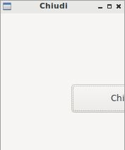
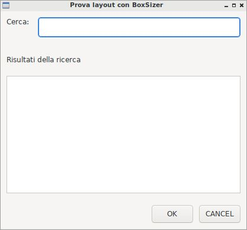
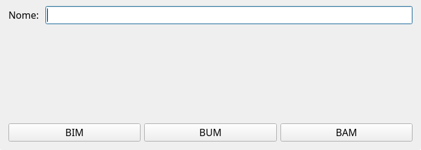
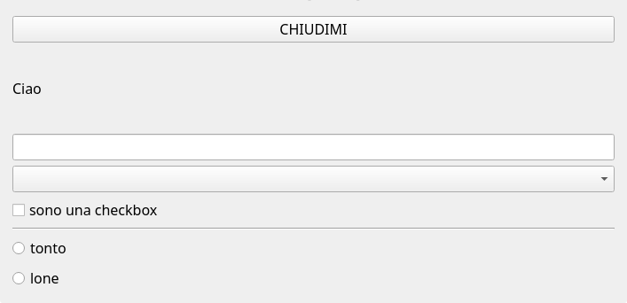
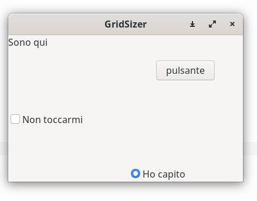
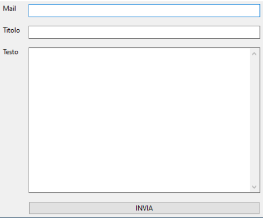
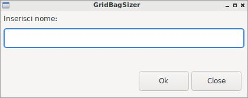
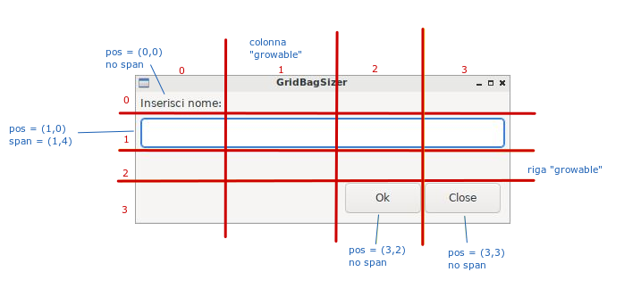

# Gestione del Layout

Il **layout management**, ovvero la gestione del posizionamento delle
widget all'interno della finestra è l'arte di collocare gli oggetti
tramite strumenti che permettano un posizionamento semplice e allo
stesso tempo all'applicazione di avere elasticità nei movimenti e nei
ridimensionamenti.

Invece di chiacchierare oltre, partiamo con un esempio: ricordate la
solita finestrella con pulsante chiudi collegato in un certo punto con
una certa dimensione? Bene! Vi ripropongo il codice che abbiamo già
visto un paio di volte:

``` python
import wx

class Esempio(wx.Frame):

    def __init__(self):
        super().__init__(None, title="Chiudi")
        pannello = wx.Panel(self)
        self.pulsante = wx.Button(pannello, label="Chiudi", pos=(100,100), size=(150,40))
        self.pulsante.Bind(wx.EVT_BUTTON, self.chiudiFinestra)

    def chiudiFinestra(self, evt):
        self.Close()

# ----------------------------------------
if __name__ == "__main__":
    app = wx.App()
    window = Esempio()
    window.Show()
    app.MainLoop()
```

Ok... questa è l'immagine della finestra creata con questo codice:


Bene, adesso invece di cliccare sul pulsante provate a ridimensionare la
finestra... visto cosa succede? Il pulsante rimane fermo nella sua
posizione senza ridimensionarsi o *spostarsi* minimamente e viene presto
coperto dalla finestra contenitrice, anche se avrebbe spazio a sinistra
per rendersi visualizzabile.



Infatti con il posizionamento assoluto, ovvero inserendo le widget con
*pos* e *size*, il contenitore (ovvero la finestra con bordo) non ha
voce in capitolo sul posizionamento delle widget contenute. Immaginate
una finestra con parecchie widget, un disastro!!

Per implementare correttamente un layout in wxPython dobbiamo ricorrere ai **contenitori di ridimensionamento (sizers)**!!! 
Questi oggetti (non grafici) possono contenere oggetti grafici secondo una disposizione a
fila o a griglia e organizzano la dimensione del contenente (tipicamente
la finestra o il pannello) in base alle dimensioni del contenuto
(tipicamente... le widgets). Questi contenitori presentano una serie di
caratteristiche comuni:

- **Una dimensione minima**: che è tipicamente identica alla dimensione iniziale delle widget contenute in esso 
  ma che può essere esplicitata dal programmatore tramite codice.

- **Un bordo**: uno spazio vuoto utile solo a distanziare minimamente le widgets dal bordo reale del contenitore (la finestra o altro). 
  Il programmatore ha pieno controllo di esso nelle quattro direzioni.

- **Un allineamento**: questo è tipicamente il compito principale del sizer. Ogni sizer induce un allineamento caratteristico. 
  Li vedremo nel dettaglio studiandoli uno ad uno.

- **Un fattore di allungamento**: una caratteristica che controlla il ridimensionamento delle widgets quando viene ridimensionato 
  il loro contenitore. Cosa succede se aumentiamo la larghezza di una finestra in cui abbiamo oggetti gestiti da un sizer? 
  Questo parametro regola il comportamento degli stessi in questo caso.


La libreria wxPython offre i seguenti oggetti per gestire il layout:

|  Sizer              | Descrizione                                                      |
|---------------------|------------------------------------------------------------------|
| wx.BoxSizer         | Contenitore per una riga (o una colonna) di widget               |
| wx.StaticBoxSizer   | Come il Box Sizer ma con un contorno evidenziato (una StaticBox) |
| wx.GridSizer        | Contenitore a tabella per le widget                              |
| wx.FlexGridSizer    | Contenitore a tabella per le widget con dimensioni variabili     |
| wx.GridBagSizer     | Contenitore a tabella con spanning                               |


Prima di iniziare a preoccuparvi, sappiate che i contenitori sono solo di 2 tipi:

1. **Contenitori a fila**, come il Sizer `wx.BoxSizer` che può essere impostato in senso orizzontale oppure verticale o come
    `wx.StaticBoxSizer`, che funziona esattamente come il precedente con la differenza di avere un contorno evidenziato intorno: un
    abbellimento e nulla più.
2.  **Contenitori a griglia**, che determinano una organizzazione tabellare (pensate ad una calcolatrice, o a un form da compilare).
    Il primo, `wx.GridSizer` è quello più semplice; gli altri due aggiungono alcune caratteristiche avanzate di cui ci renderemo conto
    negli esempi sotto.

Ok, proviamo a vedere come funziona ognuno di questi, partendo dalle
loro caratteristiche e vedendoli all'opera con qualche esempio di
codice.

<!-- ################################################################################################################################## -->
## BoxSizer


> **Documentazione ufficiale <a href="https://docs.wxpython.org/wx.BoxSizer.html" target="_blank">wx.BoxSizer</a>**
> 
> Contenitore per una riga (o una colonna) di widget


La classe `wx.BoxSizer` può essere utilizzata per creare un layout orizzontale oppure verticale.

``` python
# se vuoi un layout orizzontale
hBox = wx.BoxSizer( wx.HORIZONTAL )   

# se vuoi un layout verticale
vBox = wx.BoxSizer( wx.VERTICAL )   
```

E fino a qui è molto semplice.

Per aggiungere widget al layout bisogna utilizzare la funzione *Add* che
presenta una serie di opzioni che determinano come le widget si
*allargheranno* nello spazio disponibile e metteranno *bordo* fra di
loro. Vediamo la sintassi:

``` python
box.Add(widget, proportion = 0, flag = 0, border = 0)
```

Vediamo i parametri:

- **widget** è la widget da inserire

- **proportion** può essere 0,1,2

    * 0 (valore di *default*) significa che la widget non si ridimensionerà
    * 1 significa che la widget si ridimensionerà proporzionalmente al suo contenitore
    * 2 significa che la widget cercherà di occupare il doppio del posto di quelle con valore 1

- **flag** permette di decidere come la widget deve comportarsi **all'interno del layout**.

    Diciamo subito che esistono 2 tipi di flag: *flag di bordo* e *flag di allineamento*.

    I flag di bordo possono decidere *la direzione del bordo* fra una widget e l'altra:

    * wx.TOP: bordo verso l'alto
    * wx.RIGHT: bordo verso destra
    * wx.BOTTOM: bordo verso il basso
    * wx.LEFT: bordo verso sinistra
    * wx.ALL: bordo in tutte le direzioni

    I flag di allineamento possono decidere l'allineamento della widget rispetto al contenitore (il layout stesso). 
    In questo caso dobbiamo distinguere il comportamento a seconda del contenitore. Mi spiego.

    <br>
    
    In un **layout orizzontale**, gli allineamenti disponibili sono:

    * wx.ALIGN_TOP, incolonnata in alto
    * wx.ALIGN_BOTTOM, incolonnata in basso
    * wx.ALIGN_CENTER_VERTICAL, allineamento verticale al centro

    <br>
    
    In un **layout verticale**, gli allineamenti disponibili sono:

    * wx.ALIGN_LEFT, allineata a sinistra
    * wx.ALIGN_RIGHT, allineata a destra
    * wx.ALIGN_CENTER_HORIZONTAL, allineamento orizzontale al centro

    <br>
    
    In un **layout a griglia** funzionano tutti gli allineamenti indicati e in più il seguente:

    * wx.ALIGN_CENTER, allineamento centrato orizzontalmente e verticalmente

    <br>
    
    C'è inoltre un ultimo flag, alternativo a tutti gli altri flag di allineamento, che permette alla widget di espandersi verso direzioni
    predefinite:

    * wx.EXPAND: widget espansa su tutto lo spazio disponibile (ortogonalmente nel caso di un sizer lineare, nelle due direzioni per un sizer a griglia)

    <br>
    
    Va detto che è possibile combinare 2 o più flag con il simbolo "|" (la barra verticale, si chiama *pipe*). Vediamo qualche esempio:

``` python
# bordo in alto e a sinistra con la widget in espansione
... flag = wx.TOP | wx.LEFT | wx.EXPAND ... 

# widget allineata a destra con 10 pixel di bordo
... flag = wx.ALIGN_RIGHT | wx.RIGHT, border = 10 )
```

- **border** rappresenta la dimensione in pixel del bordo della widget, nelle direzioni indicate dai flag di bordo 
  (se non ci sono flag di bordo, è un parametro inutile).


Quando hai finito di lavorare con layout e widget devi applicare il layout al suo contenitore, 
che nei nostri esempi sarà sempre un pannello, quindi dovrai fare una cosa del genere:

``` python
# ...
# per inserire il BoxSizer come layout del Panel
panel.SetSizer(box)
```

Sembra complicato all'inizio, ma guardiamo qualche esempio e avremo tutto chiaro.

Il prossimo codice crea un layout orizzontale con 2 pulsanti che vogliamo ridimensionarsi con la finestra (quindi *proportion = 1*) 
e con un pochino di bordo in tutte le direzioni.

``` python
import wx

class Esempio(wx.Frame):

    def __init__(self):
        super().__init__(None, title="BoxSizer Orizzontale")
        panel = wx.Panel(self)
        box = wx.BoxSizer(wx.HORIZONTAL)
        p1 = wx.Button(panel, label="testo1")
        p2 = wx.Button(panel, label="testo2")

        # i 2 pulsanti si espandono allo stesso modo
        # e hanno 5 pixel di bordo (fisso) in tutte le direzioni.
        box.Add(p1, proportion=1, flag=wx.ALL, border=5)
        box.Add(p2, proportion=1, flag=wx.ALL, border=5)

        panel.SetSizer(box)
        self.Centre()

# ----------------------------------------
if __name__ == "__main__":
    app = wx.App()
    window = Esempio()
    window.Show()
    app.MainLoop()
```

Il risultato del codice precedente è questo:


!!! warning "Attenzione!"

    Prima di andare avanti, proviamo a capire quello che abbiamo visto e fatto fino ad ora! 
    Prova a fare le seguenti modifiche al codice precedente:

    - metti a 0 il valore di proportion di uno dei due pulsanti
    - metti a 2 il valore di proportion di uno dei due pulsanti
    - aggiungi wx.EXPAND ai flag dei pulsanti
    - modifica il valore del bordo per uno dei pulsanti.
    - togli wx.ALL dai flag e metti qualcuno degli altri flag disponibili

    Fatte queste prove potrai apprezzare meglio quanto appreso finora ;)


Il prossimo esempio è leggermente più complicato (soprattutto perché è
più lungo): mette insieme vari layout orizzontali e verticali
combinandoli assieme fino ad ottenere ciò che vedete nella prossima
immagine.

Si parte da un pannello e un layout verticale. Poi si crea man mano un
layout orizzontale, si mettono le widget in esso e infine si inserisce
il layout orizzontale in quello verticale principale. Ad un certo punto
ho aggiunto anche degli spazi, che ho spiegato con un commento.



``` python
import wx

class Esempio(wx.Frame):

    def __init__(self):
        super().__init__(None, title="Prova layout con BoxSizer")

        panel = wx.Panel(self)
        vbox = wx.BoxSizer(wx.VERTICAL)

        hbox1 = wx.BoxSizer(wx.HORIZONTAL)
        st1 = wx.StaticText(panel, label="Cerca: ")
        self.tc1 = wx.TextCtrl(panel)
        hbox1.Add(st1, proportion = 0 , flag = wx.ALL, border = 5)
        hbox1.Add(self.tc1, proportion = 1, flag = wx.ALL, border = 5)
        vbox.Add(hbox1,proportion = 0 , flag = wx.ALL | wx.EXPAND, border = 5)

        hbox2 = wx.BoxSizer(wx.HORIZONTAL)
        st2 = wx.StaticText(panel, label="Risultati della ricerca")
        hbox2.Add(st2, proportion = 0, flag = wx.ALL | wx.ALIGN_BOTTOM, border = 5)
        vbox.Add(hbox2,proportion = 0, flag = wx.ALL | wx.EXPAND, border = 5)

        hbox3 = wx.BoxSizer(wx.HORIZONTAL)
        self.tc2 = wx.TextCtrl(panel, style=wx.TE_MULTILINE)
        hbox3.Add(self.tc2, proportion = 1, flag = wx.ALL | wx.EXPAND, border = 5)
        vbox.Add(hbox3, proportion = 1, flag = wx.ALL | wx.EXPAND, border = 5)

        hbox4 = wx.BoxSizer(wx.HORIZONTAL)
        pulsanteOk = wx.Button(panel, label="OK")
        pulsanteCancel = wx.Button(panel, label="CANCEL")
        hbox4.Add(pulsanteOk, proportion = 0, flag = wx.ALL, border = 5)
        hbox4.Add(pulsanteCancel, proportion = 0, flag = wx.ALL, border = 5)
        vbox.Add(hbox4, proportion = 0, flag = wx.ALL | wx.ALIGN_RIGHT, border = 5)

        panel.SetSizer(vbox)
        self.Centre()

# ----------------------------------------
if __name__ == "__main__":
    app = wx.App()
    window = Esempio()
    window.Show()
    app.MainLoop()
```


!!! tip "Suggerimento"

    Capisco perfettamente che non vi sentiate ancora in grado di implementare layout così complicati! 
    Scrivo però alcuni suggerimenti banali:

    1. scrivete sempre tutti i parametri nella funzione *Add*: *sizer.Add(widget, proportion = 0, flag = wx.ALL, border = 5)*
    2. partiamo da una situazione semplice: proporzione ZERO, e bordo 5 da tutti i lati.
    3. se qualcosa non quadra, fate una modifica per volta e guardate subito cosa succede!


<!-- ################################################################################################################################## -->
## StaticBoxSizer


> **Documentazione ufficiale <a href="https://docs.wxpython.org/wx.StaticBoxSizer.html" target="_blank">wx.StaticBoxSizer</a>**
> 
> Contenitore per una riga (o una colonna) di widget con contorno evidenziato


Lo StaticBoxSizer è esattamente identico al BoxSizer se non per il fatto 
che contiene al suo interno già una StaticBox per decorare ed
evidenziare il layout creato.

A livello operativo bisogna dunque fornire, in fase di definizione,
anche un genitore (per la StaticBox, solitamente un pannello) e il testo
della stessa.

``` python
# se vuoi una BoxSizer
box = wx.BoxSizer( wx.HORIZONTAL )

# se vuoi una StaticBoxSizer
sbox = wx.StaticBoxSizer( wx.HORIZONTAL, panel, "titolo" )
```

Negli esempi relativi al BoxSizer provate a cambiarne qualcuno con uno
StaticBoxSizer per apprezzare la differenza. E poi passate al prossimo
layout!


### Esercizi *BoxSizer


**Esercizio 201 (line)**




-------------------------------------------------------------------------------------------------------


**Esercizio 202 (line)**




------------------------------------------------------------------------------------------------------


<!-- ################################################################################################################################## -->
## GridSizer


> **Documentazione ufficiale <a href="https://docs.wxpython.org/wx.GridSizer.html" target="_blank">wx.GridSizer</a>**
> 
> Contenitore a tabella per le widget


La classe `wx.GridSizer` può essere utilizzata per creare un layout a griglia uniforme, ovvero con lo stesso spazio (più o meno) 
per tutte le caselle della griglia. Quando si definisce, è possibile anche specificare un margine orizzontale e verticale 
fra gli elementi della griglia.

``` python
wx.GridSizer(rows = 1, cols = 0, vgap = 0, hgap = 0)

# esempio di layout a griglia con 4 righe e 3 colonne e 5 pixel di margine orizzontale e verticale
grid = wx.GridSizer( rows = 4 , cols = 3, vgap = 5 , hgap = 5 )
```

!!! note "Applicazioni della OOP"
    Ok, adesso proviamo a guadagnare punti a favore della OOP. Come si fa ad aggiungere widgets ad un GridSizer? 
    Esattamente con la stessa identica funzione della BoxSizer. Perchè? Beh... perché derivano entrambe dalla stessa classe
    (la classe `wx.Sizer`, che **non** studieremo) ed ereditano entrambe la funzione **Add**. 

L'unica cosa da sapere, oltre alla OOP, è il fatto che le widget vengono aggiunte alla GridSizer tramite la funzione Add in fila, 
a partire da in alto a sinistra, poi si procede in riga e terminata la riga in alto si continua sotto.

Alla luce delle nuove conoscenze acquisite, facciamo subito una prova semplice semplice:

``` python
import wx

class Esempio(wx.Frame):

    def __init__(self):
        super().__init__(None, title="GridSizer")

        panel = wx.Panel(self)

        grid = wx.GridSizer(rows = 2, cols = 2, vgap = 10, hgap = 10)

        label = wx.StaticText(panel, label="Sono qui")
        pulsante = wx.Button(panel, label="pulsante")
        checkbox = wx.CheckBox(panel, label="Non toccarmi")
        radio = wx.RadioButton(panel, label="Ho capito")

        grid.Add(label, proportion = 0, flag=wx.ALIGN_TOP, border = 0)
        grid.Add(pulsante, proportion = 0, flag=wx.ALIGN_CENTER, border = 0)
        grid.Add(checkbox, proportion = 0, flag=wx.ALIGN_LEFT, border = 0)
        grid.Add(radio, proportion = 0, flag=wx.ALIGN_BOTTOM, border = 0)

        panel.SetSizer(grid)
        self.Centre()

# ----------------------------------------
if __name__ == "__main__":
    app = wx.App()
    window = Esempio()
    window.Show()
    app.MainLoop()
```

Risultato:



!!! warning "Attenzione!"

    Anche qui, prima di andare avanti, copia e incolla il primo esempio e fai i seguenti tentativi:

    - metti *proportion = 1* sui 4 oggetti (nella GridSizer il concetto della proporzione non funziona! Non cambia nulla!)
    - sostituisci il flag del pulsante con wx.EXPAND
    - aggiungi un bordo a tutti gli oggetti
    - cambia gli allineamenti per tutti gli oggetti!


Come già sperimentato precedentemente, passiamo a visionare il codice e il risultato relativo ad un esempio un pochino più complicato, in cui il
GridSizer viene inserito dentro un layout verticale, fino a formare una pseudo calcolatrice.

``` python
import wx

class Esempio(wx.Frame):

    def __init__(self):
        super().__init__(None, title="GridSizer")

        panel = wx.Panel(self)
        vbox = wx.BoxSizer(wx.VERTICAL)

        hbox1 = wx.BoxSizer(wx.HORIZONTAL)
        self.line = wx.TextCtrl(panel)
        hbox1.Add(self.line, proportion = 1, flag = wx.ALL, border = 5)
        vbox.Add(hbox1, proportion = 1, flag = wx.ALL | wx.EXPAND, border = 5)

        grid = wx.GridSizer(rows = 4, cols = 4, vgap = 5, hgap = 5)
        self.labels = "789/456*123-.0=+"
        self.buttons = {}
        many = []
        for lab in self.labels:
            btn = wx.Button(panel, label=lab)
            self.buttons[lab] = btn
            grid.Add(btn, proportion = 0, flag = wx.ALL | wx.EXPAND, border = 5)

        vbox.Add(grid, proportion = 0, flag = wx.ALL | wx.EXPAND, border = 5)

        panel.SetSizer(vbox)
        self.Centre()

# ----------------------------------------
if __name__ == "__main__":
    app = wx.App()
    window = Esempio()
    window.Show()
    app.MainLoop()
```

Copiate il codice, eseguite, dovreste vedere una window tipo questa.


Adesso però tornate su e ricontrollate il codice che avete copiato cercando di comprendere l'organizzazione del layout.


<!-- ################################################################################################################################## -->
## FlexGridSizer


> **Documentazione ufficiale <a href="https://docs.wxpython.org/wx.FlexGridSizer.html" target="_blank">wx.FlexGridSizer</a>**
> 
> Contenitore a tabella per le widget con dimensioni variabili


La classe `wx.FlexGridSizer` può essere utilizzata per creare un layout a
griglia flessibile, ovvero con righe o colonne di dimensione diversa.
Questo può ritornare utile soprattutto in alcuni casi specifici, che
vedremo fra un attimo.

La definizione di un FlexGridSizer è identica a quella di un GridSizer:

``` python
wx.FlexGridSizer(rows = 1, cols = 0, vgap = 0, hgap = 0)

# esempio di layout con FlexGridSizer con 4 righe e 3 colonne e 5 pixel di margine orizzontale e verticale
grid = wx.FlexGridSizer( rows = 4 , cols = 3, vgap = 5 , hgap = 5 )
```

La differenza fondamentale fra un GridSizer e un FlexGridSizer è che il
GridSizer subisce un espansione in quei campi in cui le widget vengono
inserite con flag wx.EXPAND, mentre il FlexGridSizer all'inizio non è
per niente allungabile: inutile mettere wx.EXPAND!

Per permettere ad un FlexGridSizer di espandere una riga o una colonna
bisogna indicarlo esplicitamente con una delle seguenti funzioni:

``` python
# Permette di allungare una riga
AddGrowableRow(rowNumber)

# Permette di allungare una colonne
AddGrowableCol(colNumber)
```

Nell'esempio che segue viene utilizzato un FlexGridSizer per permettere
di allungare la seconda colonna e la terza riga (ricordate che si inizia
a contare da ZERO!!!)



``` python
import wx

class Esempio(wx.Frame):

    def __init__(self):
        super().__init__(None, title="FlexGridSizer")

        panel = wx.Panel(self)

        flex = wx.FlexGridSizer(rows=4, cols=2, vgap=5, hgap=5)

        mailText = wx.StaticText(panel, label="Mail")
        flex.Add(mailText, proportion=0, flag=wx.ALL, border=5)

        mailTextControl = wx.TextCtrl(panel)
        flex.Add(mailTextControl, proportion=0, flag=wx.EXPAND|wx.ALL, border=5)

        titolo = wx.StaticText(panel, label="Titolo")
        flex.Add(titolo, proportion=0, flag=wx.ALL, border=5)

        titoloTextControl = wx.TextCtrl(panel)
        flex.Add(titoloTextControl, proportion=0, flag=wx.EXPAND|wx.ALL, border=5)

        testo = wx.StaticText(panel, label="Testo")
        flex.Add(testo, proportion=0, flag=wx.ALL, border=5)

        testoTextControl = wx.TextCtrl(panel, style=wx.TE_MULTILINE)
        flex.Add(testoTextControl, proportion=0, flag=wx.EXPAND|wx.ALL, border=5)

        vuota = wx.StaticText(panel, label="")
        flex.Add(vuota,proportion=0, flag=wx.ALL, border=5)

        pulsante = wx.Button(panel, label="INVIA")
        flex.Add(pulsante,proportion=0, flag=wx.EXPAND|wx.ALL, border=5)

        flex.AddGrowableRow(2)
        flex.AddGrowableCol(1)

        self.SetMinSize( (200,300) )
        panel.SetSizer(flex)
        self.Centre()

# ----------------------------------------
if __name__ == "__main__":
    app = wx.App()
    window = Esempio()
    window.Show()
    app.MainLoop()
```

<!-- ################################################################################################################################## -->
## GridBagSizer


> **Documentazione ufficiale <a href="https://docs.wxpython.org/wx.GridBagSizer.html" target="_blank">wx.GridBagSizer</a>**
> 
> Contenitore a tabella con spanning


La classe `wx.GridBagSizer` implementa il contenitore più flessibile in
wxPython e un concetto analogo risulta presente in molti altri toolkit
grafici: in questo Sizer infatti, le widget possono occupare qualunque
posizione e comprendere anche più di una riga o una colonna.

Si definisce senza precisare il numero di righe e colonne, ma solo lo
spazio fra queste:

``` python
wx.GridBagSizer( vgap , hgap )
```

In questo Sizer è stato reimplementato il metodo *Add*, l'unico
utilizzabile per inserirvi elementi

``` python
bag = wx.GridBagSizer( vgap=5, hgap=5 )
bag.Add ( widget , pos = (row,column) , span = wx.DefaultSpan, flag = 0, border = 0)
```

Vediamo i parametri:

-   **widget** è la widget da inserire
-   **pos** è la posizione della widget nella griglia. Ricordate che si
    inizia a contare da ZERO.
-   **span** indica di quanto la widget si deve allargare. Di default
    occupa solo la sua casella. Prende una tupla 2D. Ad esempio
    inserendo span = (2,3) dite che la widget deve allargarsi di 2 righe
    e 3 colonne.
-   **flag** e **border** sono gli stessi del solito.

Di default le caselle della griglia mantengono la loro proporzione se la
finestra viene ridimensionata. Se volete invece fare in modo che una
riga o una colonna si comporti come nel FlexGridSizer, usate i seguenti
metodi:

``` python
bag = wx.GridBagSizer( vgap=5, hgap=5 )

# ...
# numero di riga
bag.AddGrowableRow (row)
# ...
# numero di colonna
bag.AddGrowableCol (col)
```

Per concludere arriviamo finalmente all'ultimo esempio con un layout
GridBagSizer. Stavolta parto dall'immagine del layout da disegnare:



L'idea con cui realizzarlo è abbastanza semplice: provate a dividere
con qualche linea *immaginaria* il layout in questione e a formulare un
piano d'azione. In questo primo esempio ho provato io a darvi un'idea
di come potete organizzare.



Concludo con qualche appunto prima di farvi vedere il codice (che a questo punto dovreste già immaginare):

- gli oggetti che non hanno span o che non capitano in righe o colonne *growable* non hanno bisogno di wx.EXPAND
- gli oggetti che hanno span o che capitano in righe o colonne *growable*, per essere loro stessi espandibili, hanno bisogno di wx.EXPAND
- la riga e la colonna *growable* (almeno una per dimensione) rendono il layout fluido: per verificarlo, provate a commentare quelle righe

Ecco il codice che implementa quest'ultimo esempio:

``` python
import wx

class Esempio(wx.Frame):

    def __init__(self):
        super().__init__(None, title="GridBagSizer")

        panel = wx.Panel(self)
        bag = wx.GridBagSizer(vgap=5, hgap=5)

        text = wx.StaticText(panel, label="Inserisci nome: ")
        bag.Add(text, pos=(0,0), flag=wx.ALL, border=5)

        tc = wx.TextCtrl(panel)
        bag.Add(tc, pos=(1,0), span=(1,4), flag=wx.ALL | wx.EXPAND, border=5)

        buttonOk = wx.Button(panel, label="Ok")
        buttonClose = wx.Button(panel, label="Close")
        bag.Add(buttonOk, pos=(3,2), flag=wx.ALL, border=5)
        bag.Add(buttonClose, pos=(3,3), flag=wx.ALL, border=5)

        # commenta via una di queste per volta per vedere la differenza!!!
        bag.AddGrowableCol(1)
        bag.AddGrowableRow(2)

        panel.SetSizer(bag)
        self.Centre()

# ----------------------------------------
if __name__ == "__main__":
    app = wx.App()
    window = Esempio()
    window.Show()
    app.MainLoop()
```

!!! tip "Suggerimenti per la creazione del layout"

    Ok, state provando a creare un layout, partendo da una idea che avete e
    non state riuscendo... Ci sono due suggerimenti che posso darvi.

    Il primo è quello di disegnare **prima** su carta il layout che volete
    ottenere, in modo da poter ragionare su quale *Sizers* possono
    realizzarlo più correttamente.

    In questo modo dovreste riuscire ad avere l'idea giusta su come
    realizzare il layout. Poi scrivete il codice, lo testate... e non
    funziona ancora :(

    Il secondo suggerimento è quello di utilizzare uno strumento di debug,
    fornito direttamente da wxPython: **The Widget Inspection Tool (WIT)**.
    Ne parlo un pochino in questa [pagina](/wx/293_tools_wit/)

    Buona lettura!


### Esercizi *GridSizer


**Esercizio 251 (grid)**


------------------------------------------------------------------------------------------------------


**Esercizio 252 (grid)**


------------------------------------------------------------------------------------------------------


**Esercizio 253 (grid)**


------------------------------------------------------------------------------------------------------


<!-- ################################################################################################################################## -->
## Layout Sizing


Per concludere il discorso del layout non posso non dedicare qualche
riga al (ri)dimensionamento delle finestre. Niente di complicato, per
carità... il ridimensionamento iniziale di una widget dovrebbe essere
gestito automaticamente (cioè... senza fare nulla) se il layout viene
implementato correttamente. Anzi... quando la dimensione iniziale non
ci soddisfa, il più delle volte significa che abbiamo sbagliato qualche
parametro nel layout!

Ci sono però alcune scelte (poche... tranquilli) che possiamo indurre
tramite codice e che possono migliorare il comportamento della nostra
finestra. Vediamole una per una!

<br>

**wx.Window.SetMinSize && wx.Window.SetMaxSize**

:   Imposta la dimensione minima/massima della finestra. 
    
Esempio banale:

``` python
# ...
self.SetMinSize( (400,250) )
panel.SetSizer(vbox)
# ...
```

<br>

**wx.Sizer.Fit(self, window) && wx.Window.SetSizerAndFit(wx.Sizer)**

:   La funzione *Fit*, disponibile in tutti i sizer, dice al sizer di
    ridimensionare la finestra per aderire alla dimensione minima del
    sizer. Va ovviamente chiamata *dopo* aver impostato un sizer in una
    finestra con *SetSizer*.

    È possibile ovviare alla chiamata delle due funzioni consecutive
    inserendo il sizer nella finestra con *SetSizerAndFit*. 
    
Esempi banali:

``` python
# ...
# utilizza prima SetSizer e dopo Fit...
panel.SetSizer(vbox)
vbox.Fit(self)
# ...
# oppure insieme, con SetSizerAndFit
panel.SetSizerAndFit(vbox)
# ...
```

Volendo approfondire il comportamento dei sizer nel ridimensionamento delle finestre vi consiglio di dare un occhio alle funzioni
*wx.Window.ClientToWindowSize* e *wx.Window.WindowToClientSize*. 

In generale, c'è una parte specifica della documentazione a proposito di
questo problema: **<a href="https://docs.wxpython.org/window_sizing_overview.html" target="_blank">https://docs.wxpython.org/window_sizing_overview.html</a>**

Se invece pensate sia sufficiente quello che avete visto qui... passate
agli esercizi del prossimo capitolo!!!

<br>
<br>
<br>

