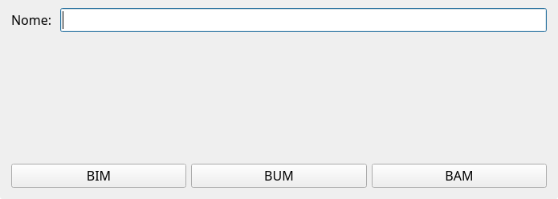
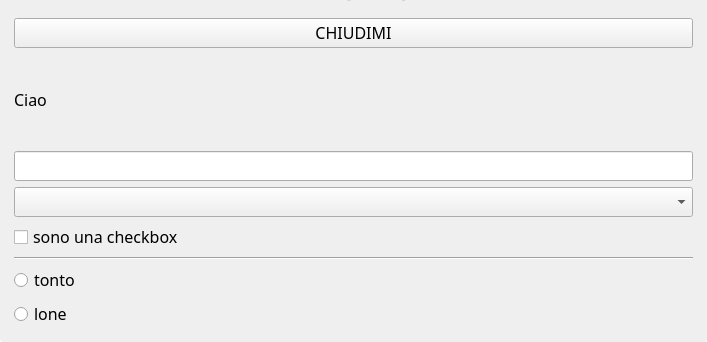
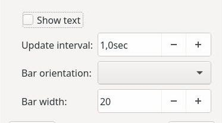
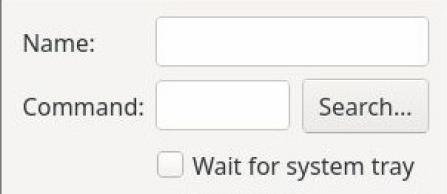

# Esercizi sul layout

Alcuni esercizi in cui ricostruire il layout dell'immagine proposta.

Buon lavoro!

**Esercizio 181 (line)**

------------------------------------------------------------------------------------------------------------------------------------------

**Esercizio 182 (line)**

------------------------------------------------------------------------------------------------------------------------------------------

**Esercizio 183 (grid)**

------------------------------------------------------------------------------------------------------------------------------------------

**Esercizio 184 (grid)**

------------------------------------------------------------------------------------------------------------------------------------------

**Esercizio 185 (grid)**

------------------------------------------------------------------------------------------------------------------------------------------

**Esercizio 186 (grid)**

