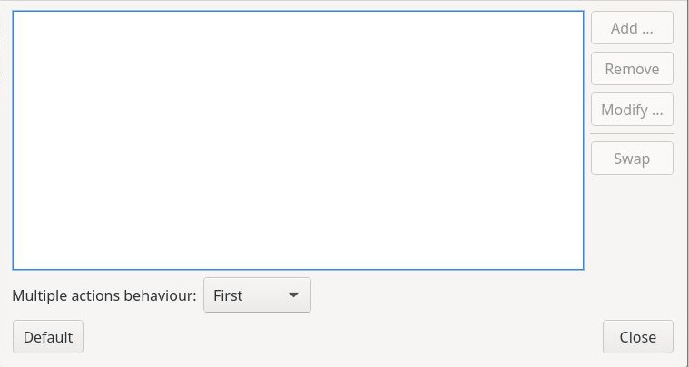
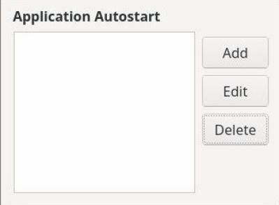
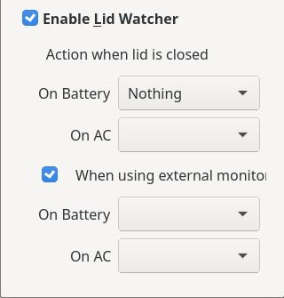

# Esercizi sul layout

Alcuni esercizi in cui ricostruire il layout dell'immagine proposta.

Buon lavoro!

**Esercizio 181**

------------------------------------------------------------------------------------------------------------------------------------------

**Esercizio 182**

------------------------------------------------------------------------------------------------------------------------------------------

**Esercizio 183**

------------------------------------------------------------------------------------------------------------------------------------------

**Esercizio 184**

------------------------------------------------------------------------------------------------------------------------------------------

**Esercizio 185**

------------------------------------------------------------------------------------------------------------------------------------------

**Esercizio 186**

