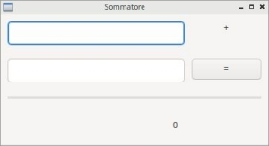
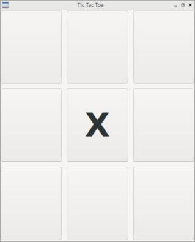
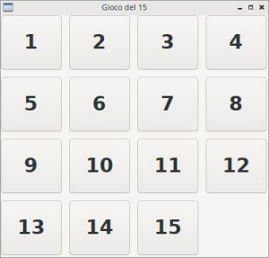

# Esercizi strutturati

Negli esercizi che seguono dovete implementare layout e funzionalità:
nessuno di questi è un esercizio banale, ma sono tutti più che fattibili
con un minimo di organizzazione: pensate prima (magari su un foglio di
carta) a come strutturare la vostra soluzione, poi dedicatevi
esclusivamente a "disegnare" l'interfaccia, infine implementate le
funzionalità richieste.

Buon lavoro!

**Esercizio 301 (Sommatore)**

In questa applicazione bisogna implementare una widget per fare le
somme. Sarà l'occasione per ragionare un pò sui layout e per curiosare
un pochino nella documentazione degli oggetti utilizzati.

Come vedete, si parte con un layout verticale in cui sono inseriti una
serie di layout orizzontali contenenti gli oggetti... Per quanto
riguarda l'implementazione, vi voglio far notare che i dati nelle
TextCtrl sono comunque stringhe, quindi quando li prendete dovete
convertirli in int (oppure in float), poi potete sommarli e infine, per
visualizzarli dovete ritrasformare il risultato in una stringa.

--------------------------------------------------------------------------------------------------

**Esercizio 302 (Calcolatrice)**

Evoluzione del programma sommatore. Nella calcolatrice è presente anche
un layout a griglia. La TextCtrl è impostata in modalità READONLY e ogni
pulsante ha la sua ovvia funzione. Copiate il funzionamento da una
calcolatrice tradizionale. La nostra dovrà comportarsi in maniera
esattamente identica!!

-------------------------------------------------------------------------------------------------

**Esercizio 303 (Lista spesa)**

La lista della spesa è poco più di un semplice esercizio sulla ListBox.
Menzione particolare al layout, nel mio caso implementato con un'unica
BagSizer. Attenzione alle righe e alle colonne da far allargare!

-   pulsante AGGIUNGI: aggiunge la voce presente nella TextCtrl (se non
    vuota) e la pulisce.
-   pulsante ELIMINA: elimina la voce selezionata della ListBox (oppure
    nulla, se nulla è selezionato)
-   pulsante CHIUDI: chiude l'applicazione

Aggiungo 2 livelli di difficoltà (opzionali):

1.  il pulsante ELIMINA disabilitato all'inizio e abilitato solo se
    c'è una voce selezionata nella ListBox.
2.  Invece di CHIUDI, implementare SALVA E CHIUDI che prima di chiudere
    l'applicazione salva i dati nel file *lista_della_spesa.txt* sul
    Desktop dell'utente. I dati vanno salvati uno per riga.
    

---------------------------------------------------------------------------------------------

**Esercizio 304 (Tic Tac Toe)**

Il **Tic Tac Toe** non è nient'altro che il gioco del Tris!
Implementate una griglia di 9 pulsanti con etichetta nulla. Cliccando su
un pulsante con etichetta nulla appare la **X** o la **O**. Se scegliete
un font importante sarà molto carino!

Potete implementarne due versioni (in due programmi diversi):

-   *User vs CPU*: in questa versione l'utente inizia sempre a giocare;
    quando clicca su un pulsante appare la "X" e subito dopo il
    programma valuta se l'utente ha vinto e se no fa giocare la CPU,
    aggiungendo una "O" in una casella libera. Più implementate la CPU
    in maniera intelligente, più sarà divertente giocare :)
-   *User vs User*: in questa versione si gioca in due. Il primo che
    clicca mette una "X", quello dopo una "O". Ogni volta il
    programma valuta chi vince!

Per implementare la vittoria potete disabilitare tutti i pulsanti e fare
apparire una nuova finestra con l'etichetta HAI VINTO. O più
semplicemente scriverlo sul titolo.

-------------------------------------------------------------------------------------------

**Esercizio 305 (Fifteen puzzle)**

Il *Fifteen Puzzle* o gioco del 15 si implementa con una semplice
griglia in cui inserire 15 pulsanti. Per quanto riguarda le regole del
gioco... faccio finta che tutti sappiate giocare e abbiate giocato
almeno una volta...

L'implementazione di ognuno può essere diversa e comunque corretta, ma
io voglio darvi un suggerimento: inserite non 15 ma 16 pulsanti nella
griglia, riempiendola completamente! Il 16-esimo pulsante non ha
etichetta e va nascosto. Ogni volta che si clicca sul pulsante vicino,
quello in realtà non si sposta, ma lo si nasconde, si fa apparire il
pulsante nascosto e si copia l'etichetta dal primo sul secondo.

Dovete implementare una funzione *mischia* che all'inizio prepara il
gioco, far muovere i pulsanti al click e una funzione
*controllaSeHaiVinto* che appunto ti dice se sei riuscito a riordinare
il puzzle!

 
 
 

