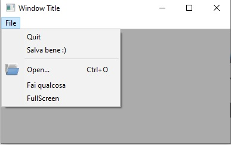
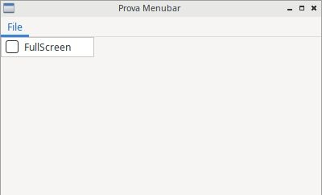
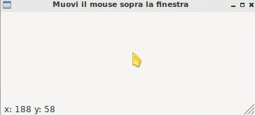
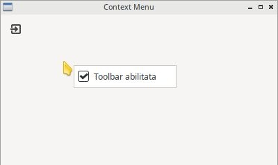

# GUI complete

In questo capitolo cercheremo di introdurre tutti quegli elementi
grafici che completano una GUI moderna: barra dei menù, azioni, icone,
barre degli strumenti, etc\... Iniziamo subito!

# Azioni predefinite

Domanda a bruciapelo: pensate a Microsoft Word o a LibreOffice Writer e
ditemi: *In quanti modi diversi si può fare copia e incolla?*

Tra scorciatoie da tastiera, pulsantini sulla barra degli strumenti,
voci nei menù, contestuali e sulla barra, a me ne vengono in mente
almeno 4\... se non 5\... Adesso mettetevi un secondo il vostro cappello
da programmatore e rispondete alla prossima domanda: *Ma se uno può fare
copia e incolla in 4 modi, significa che un altro lo ha implementato 4
volte?*

Fortunatamente la risposta a quest\'ultima domanda è **no**! In questo
contesto rientra un concetto tipico della programmazione grafica: il
concetto di **azione**. E cosa è un\'azione?

Un azione è un\'astrazione di una funzionalità che il nostro programma
vuole offrire all\'utente. Viene identificata univocamente tramite un
nome (ad esempio: COPIA), un\'icona (\...), una scorciatoia (CTRL + C),
una descrizione.

La libreria wxPython per assicurare uniformità nelle azioni più comuni,
come ad esempio APRI, SALVA, ESCI, etc\... ha pensato bene di definirle
tramite degli ID: ad esempio l\'ID per l\'azione SALVA si chiama
wx.ID_SAVE. Voi identificate un pulsante con quell\'ID e quello diventa
automaticamente il pulsante SALVA! Ha un testo, una scorciatoia, etc\...

Su Linux (precisamente, se wxPython utilizza il backend wxGTK) la nostra
azione avrà anche un\'icona di default. Purtroppo questo non vale per
tutte le piattaforme supportate\... poco male comunque! Possiamo
inserire le icone necessarie tramite la classe **wx.ArtProvider**, come
visto nella parte sulle immagini.

``` python
# immaginiamo di creare una generica azione SALVA
var = wx.RobaGrafica( parent, id = wx.ID_SAVE , bitmap = wx.ArtProvider.GetBitmap(wx.ART_SAVE) )
```

Ok, ci manca solo l\'elenco completo degli ID delle azioni predefinite
in wxPython. Come noterete osservando la tabella e come spiegato prima,
questi ID hanno abbinata una etichetta (e una scorciatoia) predefinita,
tipicamente in lingua inglese. La buona notizia è che wxPython supporta
l\'internazionalizzazione (i18n) e quindi se (ad esempio) il vostro
sistema operativo è in lingua italiana, troverete le stringhe
predefinite già tradotte!!!

  ACTION ID               DEFAULT LABEL
  ----------------------- -----------------
  wx.ID_ABOUT             About
  wx.ID_ADD               Add
  wx.ID_APPLY             Apply
  wx.ID_BACKWARD          Back
  wx.ID_BOLD              Bold
  wx.ID_BOTTOM            Bottom
  wx.ID_CANCEL            Cancel
  wx.ID_CDROM             CD-Rom
  wx.ID_CLEAR             Clear
  wx.ID_CLOSE             Close
  wx.ID_CONVERT           Convert
  wx.ID_COPY              Copy
  wx.ID_CUT               Cut
  wx.ID_DELETE            Delete
  wx.ID_DOWN              Down
  wx.ID_EDIT              Edit
  wx.ID_EXECUTE           Execute
  wx.ID_EXIT              Quit
  wx.ID_FILE              File
  wx.ID_FIND              Find
  wx.ID_FIRST             First
  wx.ID_FLOPPY            Floppy
  wx.ID_FORWARD           Forward
  wx.ID_HARDDISK          Harddisk
  wx.ID_HELP              Help
  wx.ID_HOME              Home
  wx.ID_INDENT            Indent
  wx.ID_INDEX             Index
  wx.ID_INFO              Info
  wx.ID_ITALIC            Italic
  wx.ID_JUMP_TO           Jump to
  wx.ID_JUSTIFY_CENTER    Centered
  wx.ID_JUSTIFY_FILL      Justified
  wx.ID_JUSTIFY_LEFT      Align Left
  wx.ID_JUSTIFY_RIGHT     Align Right
  wx.ID_LAST              Last
  wx.ID_NETWORK           Network
  wx.ID_NEW               New
  wx.ID_NO                No
  wx.ID_OK                Ok
  wx.ID_OPEN              Open
  wx.ID_PASTE             Paste
  wx.ID_PREFERENCES       Preferences
  wx.ID_PREVIEW           Print previe&w
  wx.ID_PRINT             Print
  wx.ID_PROPERTIES        Properties
  wx.ID_REDO              Redo
  wx.ID_REFRESH           Refresh
  wx.ID_REMOVE            Remove
  wx.ID_REPLACE           Replace
  wx.ID_REVERT_TO_SAVED   Revert to Saved
  wx.ID_SAVE              Save
  wx.ID_SAVEAS            Save As
  wx.ID_SELECTALL         Select All
  wx.ID_SELECT_COLOR      Color
  wx.ID_SELECT_FONT       Font
  wx.ID_SORT_ASCENDING    Ascending
  wx.ID_SORT_DESCENDING   Descending
  wx.ID_SPELL_CHECK       Spell Check
  wx.ID_STOP              Stop
  wx.ID_STRIKETHROUGH     Strikethrough
  wx.ID_TOP               Top
  wx.ID_UNDELETE          Undelete
  wx.ID_UNDERLINE         Underline
  wx.ID_UNDO              Undo
  wx.ID_UNINDENT          Unindent
  wx.ID_UP                Up
  wx.ID_YES               Yes
  wx.ID_ZOOM_100          Actual Size
  wx.ID_ZOOM_FIT          Zoom to Fit
  wx.ID_ZOOM_IN           Zoom In
  wx.ID_ZOOM_OUT          Zoom Out

# Menubar

I menù sono oggetti grafici che tutti conosciamo e a cui tutti siamo
abituati, non ho bisogno di grandi introduzioni! Poiché la nostra
applicazione iniziale (un oggetto della classe wx.Frame) è completamente
spoglia, come prima cosa dovremo inserire una MenuBar (una barra dei
menù) e quando sarà pronta impostarla come barra della nostra Frame
Widget:

``` python
mb = wx.MenuBar()

# ... metti qualcosa nella MenuBar...

window.SetMenuBar(mb)
```

Non appena avete creato la MenuBar, sarà possibile inserirvi dentro menù
con azioni predefinite o personalizzate. Ecco alcuni esempi:

``` python
# 1) PRIMA crea il menù...
fileMenu = wx.Menu()

# 2) ...POI aggiungi alcune azioni...
# inserimento DIRETTO di azione predefinita (senza icona su Windows e MacOS)
fileItem = fileMenu.Append(wx.ID_EXIT)

# inserimento DIRETTO di azione predefinita con TESTO e DESCRIZIONE personalizzati
saveItem = fileMenu.Append(wx.ID_SAVE, "Salva bene :)", "Salva il documento corrente")

# riga di separazione: serve solo come abbellimento
fileMenu.AppendSeparator()

# creazione di un menuItem da azione predefinita, inserimento icona, aggiunta al menù
saveItem = wx.MenuItem(fileMenu, wx.ID_OPEN)
saveItem.SetBitmap(wx.ArtProvider.GetBitmap(wx.ART_FILE_OPEN))
fileMenu.Append(saveItem)

# creazione di una azione personalizzata con ID=35
customItem = wx.MenuItem(fileMenu, 35, "Fai qualcosa")
fileMenu.Append(customItem)

# 3) ...INFINE aggiungi il menù alla menubar
# (La & prima della F di File attiva la scorciatoia ALT + F)
menubar.Append(fileMenu, '&File')
```

Si ottiene questo (come vedete, su Linux c\'è un\'icona in più\...):



Per collegare le azioni create ad una funzione (Binding) va intercettato
l\'evento wx.EVT_MENU abbinato all\'ID della voce di menù in questione:

``` python
# per fare Bind dell'azione con ID = wx.ID_EXIT ad una funzione chiamata esci
self.Bind(wx.EVT_MENU, self.esci, id=wx.ID_EXIT)

# per fare Bind dell'azione con ID = 35 ad una funzione chiamata faiQualcosa
self.Bind(wx.EVT_MENU, self.faiQualcosa, id=35)
```

Come al solito allego il codice completo dell\'esempio proposto:

``` python
import wx

class Esempio(wx.Frame):

    def __init__(self):
        super().__init__(None, title="Prova Menubar")

        menubar = wx.MenuBar()

        fileMenu = wx.Menu()

        # inserimento DIRETTO di azione predefinita (senza icona su Windows e MacOS)
        fileItem = fileMenu.Append(wx.ID_EXIT)

        # inserimento DIRETTO di azione predefinita con TESTO e DESCRIZIONE personalizzati
        saveItem = fileMenu.Append(wx.ID_SAVE, "Salva bene :)", "Salva il documento corrente")

        # riga di separazione: serve solo come abbellimento
        fileMenu.AppendSeparator()

        # creazione di un menuItem da azione predefinita, inserimento icona, aggiunta al menù
        saveItem = wx.MenuItem(fileMenu, wx.ID_OPEN)
        saveItem.SetBitmap(wx.ArtProvider.GetBitmap(wx.ART_FILE_OPEN))
        fileMenu.Append(saveItem)

        # creazione di una azione personalizzata con ID=35
        customItem = wx.MenuItem(fileMenu, 35, "Fai qualcosa")
        fileMenu.Append(customItem)

        menubar.Append(fileMenu, '&File')
        self.SetMenuBar(menubar)

        self.Bind(wx.EVT_MENU, self.chiudi, id=wx.ID_EXIT)
        self.Bind(wx.EVT_MENU, self.faiQualcosa, id=35)

    def chiudi(self, event):
        self.Close(True)
        return

    def faiQualcosa(self,event):
        dial = wx.MessageDialog(None, "E cosa dovrei fare?", "Esclamazione", wx.OK | wx.ICON_EXCLAMATION)
        dial.ShowModal()

# ----------------------------------------
app = wx.App()
window = Esempio()
window.Show()
app.MainLoop()
```

## Check Items

Devo aggiungere a questo punto una caratteristica della classe
wx.MenuItem, ovvero quella che implementa le voci di menù e può
presentarsi sotto forme diverse: noi ne vedremo solo due, di cui una (la
forma *NORMALE*) è quella di tutte le voci di menù viste fino ad ora.

La seconda forma interessante (dal nostro punto di vista) è quella
denominata **ITEM_CHECK**: le azioni in questa forma presentano (oppure
no) un tick di attivazione e stanno alle azioni normali come i
ToggleButton stanno ai Button. Come accennato, quando clicchi su queste
azioni si attiva un tick su di esse che si disabilita al click
successivo. Utili per azioni a due stati (es: visualizza/nascondi barra
di stato, attiva/disattiva fullscreen, etc..)



Per implementare un *Check Item* ripropongo un esempio che attiva e
disattiva il fullscreen (già visto):

``` python
import wx

class Esempio(wx.Frame):

    def __init__(self):
        super().__init__(None, title="Prova Menubar")

        self.menubar = wx.MenuBar()
        fileMenu = wx.Menu()

        # Esempio di CHECK MENU ITEM completamente personalizzato
        self.fsItem = wx.MenuItem(fileMenu, id=100, text="FullScreen", kind=wx.ITEM_CHECK)
        fileMenu.Append(self.fsItem)

        self.menubar.Append(fileMenu, '&File')
        self.SetMenuBar(self.menubar)

        self.Bind(wx.EVT_MENU, self.mettiFullScreen, id=100)

    def mettiFullScreen(self, event):
        if self.fsItem.IsChecked():
            # style = 0 serve per non nascondere la menubar quando si è fullscreen
            self.ShowFullScreen(True, style=0)
            self.fsItem.SetItemLabel("Exit fullscreen")
        else:
            self.ShowFullScreen(False)
            self.fsItem.SetItemLabel("Fullscreen")
        return

# ----------------------------------------
app = wx.App()
window = Esempio()
window.Show()
app.MainLoop()
```

# Toolbar

Se le barre dei menù dovrebbero permettere l\'accesso a **tutte** le
funzioni disponibili in una applicazione, le barre degli strumenti
dovrebbero permettere l\'accesso alle azioni veloci, ovvero a quelle di
maggior utilizzo per gli utenti.

Per aggiungere una Toolbar alla nostra Frame Widget dobbiamo utilizzare
la funzione [CreateToolBar()]{.title-ref} a cui poi potremo aggiungere
le azioni che ci interessano.

``` python
toolbar = window.CreateToolBar()

toolbar.AddTool(...e qui si aggiungono le azioni una ad una...)

# riempita la toobar, va eseguito il metodo Realize()
toolbar.Realize()
```

Facciamo anche qui un esempio con 2 azioni e un separatore: la prima
azione sarà un azione standard, mentre la seconda una azione
personalizzata:

``` 
# ...
# azione standard: ID, descrizione, icona
exitTool = toolbar.AddTool( wx.ID_EXIT, "ESCI", wx.ArtProvider.GetBitmap(wx.ART_QUIT) )

# un separatore: come abbellimento e per vedere come si fa :)
toolbar.AddSeparator()

# azione personalizzata: ID, descrizione, icona
questionTool = toolbar.AddTool( 73 , "Fai una domanda" , wx.ArtProvider.GetBitmap(wx.ART_QUESTION) )
```

A questo punto, se volete collegare i pulsanti della Toolbar ad una
funzione, basta eseguire il solito Bind() con l\'evento **wx.EVT_TOOL**.

``` 
self.Bind(wx.EVT_TOOL, self.esci, exitTool )
self.Bind(wx.EVT_TOOL, self.dattiUnaRisposta, exitTool )
```

Come al solito, propongo l\'esempio completo delle toolbar.

``` 
import wx

class Esempio(wx.Frame):

    def __init__(self):
        super().__init__(None, title="Prova Toolbar")

        toolbar = self.CreateToolBar()

        exitTool = toolbar.AddTool( wx.ID_EXIT, "ESCI", wx.ArtProvider.GetBitmap(wx.ART_QUIT) )
        toolbar.AddSeparator()
        questionTool = toolbar.AddTool( 73 , "Fai una domanda" , wx.ArtProvider.GetBitmap(wx.ART_QUESTION) )

        toolbar.Realize()

        self.Bind(wx.EVT_TOOL, self.esci, exitTool)
        self.Bind(wx.EVT_TOOL, self.dattiUnaRisposta, questionTool)

    def esci(self, event):
        self.Close(True)
        return

    def dattiUnaRisposta(self,event):
        dial = wx.MessageDialog(None, "Bravo!", "Risposta", wx.OK | wx.ICON_EXCLAMATION)
        dial.ShowModal()

# ----------------------------------------
app = wx.App()
window = Esempio()
window.Show()
app.MainLoop()
```

::: warning
::: title
Warning
:::

L\'evento EVT_TOOL è automaticamente abbinato ad un evento EVT_MENU e
viceversa. Questo significa che se, ad esempio, avete già implementato
tutte le vostre azioni nella MenuBar e fatto il Binding con i loro ID
con le opportune funzioni, tutte le azioni che aggiungerete alla toolbar
con ID già utilizzati funzioneranno automaticamente senza bisogno di un
ulteriore binding!!!
:::

Vediamo una semplicissima dimostrazione di ciò con una finestra avente
una sola azione, presente sia nella menubar che nella toolbar.

``` 
import wx

class Esempio(wx.Frame):

    def __init__(self):
        super().__init__(None, title="Stessa azione: menu & toolbar")

        menubar = wx.MenuBar()
        fileMenu = wx.Menu()
        fileItem = fileMenu.Append(wx.ID_EXIT)
        menubar.Append(fileMenu, '&File')
        self.SetMenuBar(menubar)

        self.Bind(wx.EVT_MENU, self.esci, id=wx.ID_EXIT)

        toolbar = self.CreateToolBar()
        toolbar.AddTool( wx.ID_EXIT, "ESCI", wx.ArtProvider.GetBitmap(wx.ART_QUIT) )
        toolbar.Realize()

    def esci(self, event):
        self.Close(True)
        return

# ----------------------------------------
app = wx.App()
window = Esempio()
window.Show()
app.MainLoop()
```

# wx.StatusBar

La classe wx.StatusBar rappresenta una widget che implementa la barra di
stato delle applicazioni.



E\' possibile creare una barra di stato in due modi: o dichiarando un
oggetto di tipo wx.StatusBar e poi inserendolo nella finestra tramite il
metodo *SetStatusBar()* oppure chiamando direttamente dalla finestra il
metodo *CreateStatusBar()*. Se dovete solo visualizzare informazioni il
secondo metodo è una bomba! Se dovete modificare la StatusBar
aggiungendovi widget e icone serve il primo metodo, eventualmente
creando una classe derivata da wx.StatusBar.

Nell\'esempio proposto si crea automaticamente una StatusBar e si
visualizza la posizione del puntatore non appena questo entra nella
finestra.

``` python
import wx

class Esempio(wx.Frame):

    def __init__(self):
        super().__init__(None, title="Muovi il mouse sopra la finestra")        
        self.bar = self.CreateStatusBar()
        self.Bind(wx.EVT_MOTION, self.controllaMouse)

    def controllaMouse(self, event):
        pos = event.GetPosition()
        info = "x: " + str(pos[0]) + " y: " + str(pos[1])
        self.bar.SetStatusText(info)
        return

# ----------------------------------------
app = wx.App()

window = Esempio()
window.Show()

app.MainLoop()
```

# Context Menu

I *Context Menus* ovvero i menù contestuali sono quei menù che appaiono
quando si fa click con il tasto destro in determinate posizione della
nostra applicazione. Risulta chiaro a mio avviso che i Context Menu
dipendono dalla widget sopra la quale si fa click con il tasto destro.
Un immagine vale più di 1000 parole:


Per capire come si può implementare un Context Menu tramite la libreria
wxPython proviamo ad implementarne uno su una widget con dentro un check
item che abilita o disabilita la toolbar, rendendo possibile in
quest\'ultimo caso utilizzare i suoi strumenti.

``` python
import wx

class Esempio(wx.Frame):

    def __init__(self):
        super().__init__(None, title="Context Menu")

        self.toolbar = self.CreateToolBar()        
        exitTool = self.toolbar.AddTool( wx.ID_EXIT, "ESCI", wx.ArtProvider.GetBitmap(wx.ART_QUIT) )
        self.toolbar.Realize()

        self.Bind(wx.EVT_TOOL, self.esci, exitTool)

        # serve ad attivare il Context Menu
        self.Bind(wx.EVT_RIGHT_DOWN, self.OnRightDown)

        # Crea il menù, pronto per essere attivato!
        self.contextMenu = wx.Menu()
        self.fsItem = wx.MenuItem(self.contextMenu, id=100, text="Toolbar abilitata", kind=wx.ITEM_CHECK)
        self.contextMenu.Append(self.fsItem)
        self.contextMenu.Check(100, True)
        self.Bind(wx.EVT_MENU, self.ManageToolBar, self.fsItem)

    def esci(self, event):
        self.Close(True)
        return

    def OnRightDown(self, event):
        self.PopupMenu(self.contextMenu, event.GetPosition())

    def ManageToolBar(self,event):
        if self.fsItem.IsChecked():
            self.toolbar.Enable(True)
        else:
            self.toolbar.Enable(False)

# ----------------------------------------
app = wx.App()
window = Esempio()
window.Show()
app.MainLoop()
```

Il risultato di questo codice è il seguente:



Spero che osservare e riprodurre l\'esempio sia sufficiente per capire
il funzionamento :)

# Impostazioni

Può essere interessante e/o addirittura necessario per una applicazione
salvare da qualche parte alcune impostazioni da ricaricare al prossimo
riavvio. Ad esempio potrebbe essere interessante tracciare la posizione
e la dimensione della finestra principale nello schermo, per riproporla
identica\... oppure nel caso di una applicazione che permette ad esempio
di cambiare la dimensione del font, di memorizzare questa impostazione e
riproporla anche nelle successive esecuzioni, senza dover ogni volta
costringere l\'utente a cambiarla di nuovo.

Certo siete già in grado di fare questo tipo di lavoro salvando ad
esempio su file di testo queste informazioni\... ma dove lo mettiamo
questo file per essere ragionevolmente sicuri di ritrovarlo alla
prossima esecuzione? A tutte queste domande risponde con semplicità
disarmante la classe **wx.FileConfig** che deriva dalla classe astratta
**wx.ConfigBase** (uhm\... forse non sapete cosa significa astratta\...
pazienza!!!).

La classe *wx.FileConfig* richiede come informazioni solo il nome
dell\'applicazione, poi per ogni sistema operativo sceglie il posto
riservato alle impostazioni delle applicazioni e scrive lì dentro un
file di testo con una sequenza di coppie VARIABILE = VALORE.

Quindi riassumendo:

STEP 1

:   Dare un nome alla propria App. Questo si fa nella classe App, prima
    di creare una finestra, con la funzione SetAppName. Ad esempio:

    ``` python
    app = wx.App()
    app.SetAppName("Ciccio")
    window = Esempio()
    window.Show()
    app.MainLoop()
    ```

STEP 2

:   Dove ti serve di salvare alcune impostazioni, crea un oggetto della
    classe wx.FileConfig e salva i tuoi dati con la funzione
    [Write(\"variabile\", valore)]{.title-ref}. Nell\'esempio sotto
    proviamo a salvare la variabile \"colore\" che contiene il valore
    \"red\" e la variabile \"dimensioneFont\" che contiene il valore 18.
    Attenzione ad assicurarsi di salvare sempre e solo stringhe:

    ``` python
    config = wx.FileConfig("Ciccio")
    config.Write( "colore" , "red" )

    # l'int va convertito in stringa
    config.Write( "dimensioneFont" , str(18) )

    # basta... tutto qui!
    ```

STEP 3

:   Quando ti serve di sapere i valori abbinati alle variabili
    \"colore\" e \"dimensioneFont\", che evidentemente per il tuo
    programma sono importanti, ti basterà andare a controllarne il
    valore con le funzioni Read (che restituisce sempre stringhe, quindi
    converti i valori se ne hai bisogno).

    ``` python
    config = wx.FileConfig("Ciccio")

    # "black" è il valore di default, viene usato se non è stato salvato nulla
    colore = config.Read( "colore" , "black" ) 

    # trasformo in int. 12 default.
    dimensioneFont = int( config.Read( "dimensioneFont" , "12" ) ) 
    ```

Come vedete salvare le configurazioni della propria App diventa
semplicissimo, a patto di saper scegliere bene i valori da salvare come
impostazioni e di fare in modo che i dati da salvare siano semplicemente
convertibili in stringhe.

<br>
<br>
<br>

