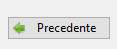

# Immagini & Icone

wxPython gestisce le immagini a vari livelli a seconda di quello che ci vuoi fare:

1. Se vuoi visualizzare una o più immagini, magari con piccole funzionalità tipo la scala di grigi o il copia e incolla... il capitolo Immagini è per te!!!

2. Se vuoi visualizzare una icona da abbinare ad un pulsante, un menù o una toolbar...  vai al capitolo Icone!!! 

3. Se vuoi realizzare un software per l'elaborazione grafica delle immagini (tipo PhotoShop)... sei nel posto sbagliato!!!


!!! warning "Attenzione!"

    Per l'elaborazione delle immagini, wxPython si appoggia sulla libreria `pillow` (Python Image Library). 
    
    Verifica che sia correttamente installata, ad esempio tramite l'interfaccia di gestione dei pacchetti di Thonny.
  

<!-- ############################################################################################################################# -->
## Immagini

> **Documentazione ufficiale classi per le immagini:**
> 
> **<a href="https://docs.wxpython.org/wx.Bitmap.html" target="_blank">wx.Bitmap</a>**: Classe per la gestione delle immagini (OOP).<br>
> **<a href="https://docs.wxpython.org/wx.Image.html" target="_blank">wx.Image</a>**: Classe per la manipolazione delle immagini (OOP).<br>
> **<a href="https://docs.wxpython.org/wx.StaticBitmap.html" target="_blank">wx.StaticBitmap</a>**: Classe grafica per la visualizzazione delle immagini.<br>


wxPython gestisce l'interazione con le immagini tramite l'ausilio di 3 classi principali. 

La prima classe si chiama `wx.Bitmap` e una sua istanza rappresenta il cosiddetto **oggetto immagine**. Questa classe si occupa
della relazione fra il file che contiene l'immagine, da qualche parte nel filesystem e un oggetto immagine della classe wx.

Se vogliamo manipolare questa immagine dobbiamo generare, a parte da una Bitmap, il corrispondente oggetto `wx.Image`.
Un oggetto di questa classe permette di manipolare un oggetto immagine (**non** il file... l'oggetto! La rappresentazione logica della stessa).
Possiamo modificare cose come la dimensione, il colore, renderla in scala di grigi, abilitarla o disabilitarla, modificare il livello di trasparenza, etc...
Fatto questo possiamo ricreare una Bitmap a partire da una Image modificata!

L'ultimo oggetto, l'unico con capacità grafiche, si chiama `wx.StaticBitmap`: è l'oggetto grafico da inserire in uno dei nostri layout e da abbinare alla Bitmap
da visualizzare. Facile!!!

Partiamo da qualche esempio ben commentato per prendere confidenza con il codice!


<br>
<br>

``` py title="Esempio 1: visualizzare una immagine"
# ...
panel = wx.Panel(self)

oggettoImmagine = wx.Bitmap("foto.jpg")
widgetImageViewer = wx.StaticBitmap(panel, bitmap=oggettoImmagine) 
# ...
```

<br>
<br>


``` py title="Esempio 2: visualizzare una immagine in scala di grigi"
# ...
panel = wx.Panel(self)
widgetImageViewer = wx.StaticBitmap(panel)

oggettoImmagine = wx.Bitmap("foto.jpg")
immagine = oggettoImmagine.ConvertToImage()
immagineBN = immagine.ConvertToGreyscale()
oggettoImmagineBN = wx.Bitmap(immagineBN)

widgetImageViewer.SetBitmap(oggettoImmagineBN)
# ...
```

La base ce l'avete... adesso occorre buttarsi un pò con qualche esercizio!!!


### Esercizi

----------------------------------------------------------------------------------------------------------------------

**Esercizio 501**

Crea una semplice interfaccia con un pannello e un StaticBitmap per
visualizzare una immagine presente nella stessa cartella ove salverete
il codice dell'esercizio.


----------------------------------------------------------------------------------------------------------------------


**Esercizio 502**

Crea una applicazione con 2 pulsanti allineati sopra e una StaticBitmap
sotto. Con il primo pulsante si apre una finestra di selezione file per
selezionare una immagine che andrà mostrata nella StaticBitmap. Il
secondo pulsante è un ToggleButton che abilita/disabilita l'immagine
selezionata.

----------------------------------------------------------------------------------------------------------------------


<!-- ############################################################################################################################# -->
## Icone


> **Documentazione ufficiale <a href="https://docs.wxpython.org/wx.ArtProvider.html" target="_blank">wx.ArtProvider</a>**
> 
> Classe per la gestione dei file multimediali predefiniti del SO (immagini, icone, video, suoni, etc..)


Se la necessità relativa alle immagini è quella di visualizzare le icone
nei pulsanti (e nei menù e nelle barre degli strumenti, come impareremo
fra breve) oltre a caricare le immagini direttamente tramite le Bitmap,
come abbiamo appena visto, c'è un'altra interessante soluzione: la
classe `wx.ArtProvider`. 

Lungi da me tediarvi sull'idea dietro la realizzazione di una tale classe e come essa possa essere derivata per
creare il proprio personale set di icone... sappiate semplicemente
quello che serve: per ogni icona abbinata ad una azione comune abbiamo
un ID e tramite quello possiamo creare automaticamente una Bitmap.

``` python
# la variabile "bitmap" è un oggetto della classe wx.Bitmap
bitmap = wx.ArtProvider.GetBitmap( id = wx.UN_ID_FRA_QUELLI_ELENCATI_SOTTO , client=wx.UN_VALORE_PER_ILPOSIZIONAMENTO, size = DefaultSize )
```

Vediamo l'elenco delle icone automaticamente supportate (in rigoroso ordine sparso):


| Elenco                     | Art Provider ID            | Disponibili              |
|----------------------------|----------------------------|--------------------------|
| wx.ART_LIST_VIEW | wx.ART_NEW | wx.ART_TICK_MARK |
| wx.ART_REPORT_VIEW | wx.ART_NEW_DIR | wx.ART_CROSS_MARK |
| | | |
| wx.ART_FIND | wx.ART_MINUS | wx.ART_FOLDER |
| wx.ART_FIND_AND_REPLACE | wx.ART_PLUS | wx.ART_FOLDER_OPEN |
| | | |
| wx.ART_CDROM | wx.ART_EXECUTABLE_FILE | wx.ART_FILE_OPEN |
| wx.ART_FLOPPY | wx.ART_MISSING_IMAGE | wx.ART_FILE_SAVE |
| wx.ART_HARDDISK | wx.ART_NORMAL_FILE | wx.ART_FILE_SAVE_AS |
| | | |
| wx.ART_HELP | wx.ART_ERROR | wx.ART_UNDO |
| wx.ART_HELP_BOOK | wx.ART_QUESTION | wx.ART_REDO |
| wx.ART_HELP_FOLDER | wx.ART_WARNING | wx.ART_CUT |
| wx.ART_HELP_PAGE | wx.ART_INFORMATION | wx.ART_COPY |
| wx.ART_HELP_SETTINGS | wx.ART_TIP | wx.ART_PASTE |
| wx.ART_HELP_SIDE_PANEL | | | wx.ART_DELETE |
| | | |
| wx.ART_GOTO_FIRST | wx.ART_PRINT | |
| wx.ART_GOTO_LAST | |
| wx.ART_GO_TO_PARENT | wx.ART_ADD_BOOKMARK | |
| wx.ART_GO_UP | wx.ART_DEL_BOOKMARK | |
| wx.ART_GO_DOWN | | |
| wx.ART_GO_BACK | wx.ART_CLOSE | |
| wx.ART_GO_FORWARD | wx.ART_QUIT | |
| wx.ART_GO_HOME | | |
| wx.ART_GO_DIR_UP | | | 
 
E' inoltre possibile aggiungere una descrizione della posizione che l'icona dovrà andare ad occupare. Questa scelta determinerà anche la dimensione iniziale.

Vediamo i valori possibili:


| Tipi ArtProvider ID   | Descrizione                                |
|-----------------------|--------------------------------------------|
| wx.ART_TOOLBAR        | Icone per le toolbar (media dimensione)    |
| wx.ART_MENU           | Icone per i menu (piccole)                 |
| wx.ART_BUTTON         | icone per i pulsanti (grandine)            |
| wx.ART_FRAME_ICON     | Icone per ... Boh!                         |
| wx.ART_CMN_DIALOG     | Icone per le finestre di dialogo (medie)   |
| wx.ART_HELP_BROWSER   | Icone per i messaggi di aiuto (grandine)   |
| wx.ART_MESSAGE_BOX    | Icone per le message box (medie)           |
| wx.ART_OTHER          | Altre icone (Default)                      |


Per finire, vediamo un pezzettino di codice in cui inseriamo un icona su un pulsante.

``` python
# ...
pulsanteIndietro = wx.Button(panel)
pulsanteIndietro.SetLabel("Precedente")
pulsanteIndietro.SetBitmap( wx.ArtProvider.GetBitmap( wx.ART_GO_BACK , wx.ART_MENU ) )
# ...
```

Per ottenere questo:




Spero sia tutto chiaro!!!<br>
Chiedetemi pure... sarò lieto di farvi fare qualche esercizio di comprensione :smile:

<br>
<br>
<br>

