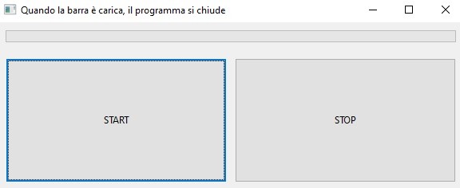

# Timer(s)


> **Documentazione ufficiale <a href="https://docs.wxpython.org/wx.Timer.html" target="_blank">wx.Timer</a>**
> 
> Classe per gestire i timer (con cui implementare semplici temporizzazioni)


I Timer sono oggetti molto comuni in ogni libreria OOP. Per la scansione
del tempo si appoggiano tipicamente al clock di sistema, che
teoricamente scandisce il milionesimo di secondo, ma che per motivi
tecnici che non sto a spiegarvi (a lezione me lo chiederete, lo so: il
bello dell'inutile) è affidabile appena al millesimo di secondo. Per
quello che serve a noi, basta e avanza...

Un Timer è un oggetto della classe `wx.Timer` che gestisce appunto una
scansione del tempo in millisecondi. Poiché ha già il suo bel daffare
con questa questione del tempo vive sospeso rispetto al *Main Event
Loop* e quindi non gestisce direttamente i suoi eventi, ma si appoggia
alla sua widget parent. Detto così sembra complicato... vediamo un
esempio commentato e capirete subito come funziona.

``` python
# dichiariamo un oggetto della classe wx.Timer
# con la nostra widget come parent
# Manteniamo un riferimento ad esso con una variabile membro (una del tipo self.var)
# Se nella vostra app avete 2 timer, inserite un ID
self.timer = wx.Timer(self)

# facciamo il BIND tramite la parent widget: BIND(evento, funzione, oggetto)
self.Bind(wx.EVT_TIMER, self.funzioneDaEseguire, self.timer)
```

Ecco qua! Come avete visto non è particolarmente complicato. Adesso il
timer è pronto e collegato alla funzione da eseguire al timeout. Ma come
si fa a far partire il timer? E a fermarlo? E...

Come vediamo fra un attimo, per attivare un timer, basta invocare la
funzione **Start(millisecondi)**. Se ad esempio invochiamo Start(100),
ogni 100 millisecondi il timer genererà un evento wx.EVT_TIMER che nel
nostro esempio, scatenerà la *funzioneDaEseguire*.

Se avete necessità di fermare questa ripetizione infinita, usate la
funzione **Stop()**. Ultima, ma non meno importante, se avete bisogno di
eseguire una sola volta la funzione dilazionata nel tempo, ad esempio
fra 10 secondi, avviate il timer con la funzione **StartOnce(10000)**.

``` python
# AVVIA il TIMER
# Il parametro è in millisecondi. 
# Significa che questo timer genererà un evento EVT_TIMER ogni secondo finchè non verrà fermato
timer.Start(1000)

# FERMA IL TIMER
timer.Stop()

# AVVIA IL TIMER per un'unica esecuzione
# come Start() ma termina il timer al primo timeout
timer.StartOnce(millisecondi)
```

Spero sia tutto chiaro :)


<!-- #################################################################################################################################### -->
## wx.Gauge


> **Documentazione ufficiale <a href="https://docs.wxpython.org/wx.Gauge.html" target="_blank">wx.Gauge</a>**
> 
> Classe grafica per implementare una barra di avanzamento (orizzontale o verticale)


La classe `wx.Gauge` rappresenta una widget che implementa una barra di avanzamento.



La barra di avanzamento va impostata indicando il range predefinito. In
questo esempio ho messo range=10 e questo significa che la barra si
caricherà come fosse divisa in 10 pezzi. Nell'esempio presentato
abbiamo un timer per far avanzare la barra di uno step automaticamente
ogni secondo e 2 pulsanti per fare OK e STOP.

Nell'esempio proposto quando si clicca OK la barra comincia a caricarsi
e può essere fermata cliccando STOP. Quando la barra è carica il
programma si chiude.

``` python
import wx

class Esempio(wx.Frame):

    def __init__(self):
        super().__init__(None, title="Quando la barra è carica, il programma si chiude")

        self.timer = wx.Timer(self,1)
        self.Bind(wx.EVT_TIMER, self.OnTimer, self.timer)        
        self.conta = 0

        panel = wx.Panel(self)
        vbox = wx.BoxSizer(wx.VERTICAL)

        self.barra = wx.Gauge(panel, range=10)
        vbox.Add(self.barra, proportion=0, flag=wx.ALL|wx.EXPAND, border=10)

        hbox = wx.BoxSizer(wx.HORIZONTAL)

        pulsanteStart = wx.Button(panel, label="START")
        pulsanteStart.Bind(wx.EVT_BUTTON, self.OnOk)
        hbox.Add(pulsanteStart, proportion=1, flag=wx.ALL|wx.EXPAND, border=5)

        pulsanteStop = wx.Button(panel, label="STOP")
        pulsanteStop.Bind(wx.EVT_BUTTON, self.OnStop)
        hbox.Add(pulsanteStop, proportion=1, flag=wx.ALL|wx.EXPAND, border=5)

        vbox.Add(hbox, proportion=1, flag=wx.ALL|wx.EXPAND, border=5)
        panel.SetSizer(vbox)
        self.SetMinSize( (600,200) )

    def OnTimer(self, event):
        self.conta += 1
        if self.conta > 10:
            self.Close(True)
            return
        self.barra.SetValue(self.conta)
        return

    def OnOk(self, event):
        self.timer.Start(1000)
        return

    def OnStop(self, event):
        self.timer.Stop()
        return

# ----------------------------------------
if __name__ == "__main__":
    app = wx.App()
    window = Esempio()
    window.Show()
    app.MainLoop()
```


<!-- #################################################################################################################################### -->
## Esercizi

**Esercizio 601 (orologio)**

Implementare una semplice finestra con un'unica etichetta che
visualizza un orologio funzionante (che scorre) con ore, minuti,
secondi.


----------------------------------------------------------------------------------


**Esercizio 602 (cronometro)**

Implementare un cronometro con una etichetta con valore iniziale
"00:00:00" rappresentanti rispettivamente minuti, secondi e centesimi
di secondo e tre pulsanti per le funzioni START, STOP, RESET.

-   START fa (ri)partire il cronometro
-   STOP lo ferma.
-   RESET lo (ri)imposta a ZERO

----------------------------------------------------------------------------------

**Esercizio 603 (semaforo)**

Applicazione con 4 immagini per 3 caselle: luce rossa, luce gialla, luce
verde, luce grigia (luce spenta). Il semaforo inizia con la luce verde
attiva e le altre due grigie. Ogni 5 secondi si passa allo stadio
successivo (luce gialla, poi luce rossa, poi si ritorna a luce verde,
all'infinito).

<br>
<br>
<br>

