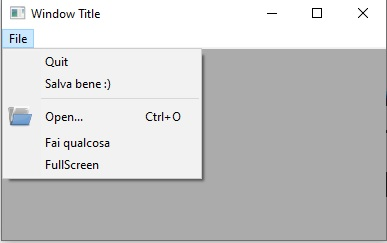
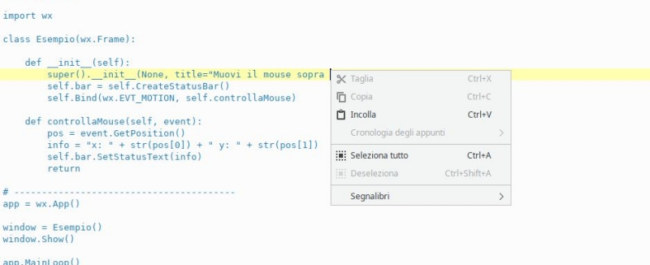

# GUI complete

In questo capitolo cercheremo di introdurre tutti quegli elementi grafici che implementano una GUI moderna: 

- le azioni
- la barra dei menù
- la barra degli strumenti
- la barra di stato
- il menù contestuale
- le impostazioni delle applicazioni


## Skeleton Full GUI

Lo **Skeleton** è un file che contiene la struttura di base dalla quale partire per costruire qualcosa.

Lo skeleton qui sotto descrive chiaramente una struttura da cui partire per alloggiare in maniera chiara e ben strutturata tutti gli elementi
di una app Full GUI, ovvero comprensiva di azioni, menù, barre degli strumenti, etc...


``` python
import wx

APP_NAME = "Il nome della vostra App"

class Finestra(wx.Frame):
    
    def __init__(self):
        super().__init__(None, title=APP_NAME)
        
        # Spazio per le variabili membro della classe
        
        # -------------------------------------------
        
        # Chiamata alle funzioni che generano la UI
        self.creaMenubar()
        self.creaToolbar()
        self.creaStatusbar()
        # -------------------------------------------
        
        # Chiamata alla funzione che genera la MainView
        self.creaMainView()
        # -------------------------------------------
        
        # le ultime cose, ad esempio, le impostazioni iniziali, etc...
        
        # -------------------------------------------
        return

    # in questa funzione andremo a creare e popolare la menubar
    def creaMenubar(self):
        return
    
    # in questa funzione andremo a creare e popolare la toolbar
    def creaToolbar(self):
        return
    
    # in questa funzione aggiungeremo la statusbar
    def creaStatusbar(self):
        return
    
    # questa funzione implementa la vista principale del programma
    def creaMainView(self):
        return


# ----------------------------------------
if __name__ == "__main__":
    app = wx.App()
    app.SetAppName(APP_NAME)
    window = Finestra()
    window.Show()
    app.MainLoop()
```

La struttura si spiega abbastanza da sola... avanti, partendo da qui!


## Azioni predefinite


***In quanti modi diversi si può fare copia e incolla?***


Con la combinazione CTRL + C... con l'icona copia sulla barra degli strumenti, con il menù del tasto destro, con la barra in alto...
Mi vengono in mente almeno 4 metodi. Probabilmente ne esistono anche altri.

Adesso pensate un momento come foste ***veri*** programmatori:


***Ma... per ognuna di queste modalità occorre reimplementare un oggetto grafico e una funzione evento???***


Fortunatamente la risposta a quest'ultima domanda è **no**! 

In questo contesto rientra un concetto tipico della programmazione grafica: il concetto di **azione**. E cosa è un'azione?


> Una **azione** è un'astrazione di una funzionalità che il nostro programma vuole offrire all'utente.<br> 
> Viene identificata univocamente tramite:
> 
> - un nome (ad esempio: COPIA) 
> - una descrizione (ad esempio, COPIA il CONTENUTO NEGLI APPUNTI)
> - un'icona (l'icona COPIA)
> - una scorciatoia (CTRL + C)

La libreria wxPython per assicurare uniformità nelle azioni più comuni ha pensato bene di identificarle tramite degli ID fissi: 
ad esempio l'ID per l'azione SALVA si chiama `wx.ID_SAVE`. 

Ecco l'elenco completo degli ID delle azioni comuni in wxPython:


| Elenco                 | ACTION ID              | Disponibili            |                       |
|------------------------|------------------------|------------------------|-----------------------|
|  wx.ID_ABOUT           |  wx.ID_ADD             |  wx.ID_APPLY           |  wx.ID_BACKWARD       |
|  wx.ID_BOLD            |  wx.ID_BOTTOM          |  wx.ID_CANCEL          |  wx.ID_CDROM          |
|  wx.ID_CLEAR           |  wx.ID_CLOSE           |  wx.ID_CONVERT         |  wx.ID_COPY           |
|  wx.ID_CUT             |  wx.ID_DELETE          |  wx.ID_DOWN            |  wx.ID_EDIT           |
|  wx.ID_EXECUTE         |  wx.ID_EXIT            |  wx.ID_FILE            |  wx.ID_FIND           |
|  wx.ID_FIRST           |  wx.ID_FLOPPY          |  wx.ID_FORWARD         |  wx.ID_HARDDISK       |
|  wx.ID_HELP            |  wx.ID_HOME            |  wx.ID_INDENT          |  wx.ID_INDEX          |
|  wx.ID_INFO            |  wx.ID_ITALIC          |  wx.ID_JUMP_TO         |  wx.ID_JUSTIFY_CENTER |
|  wx.ID_JUSTIFY_FILL    |  wx.ID_JUSTIFY_LEFT    |  wx.ID_JUSTIFY_RIGHT   |  wx.ID_LAST           |
|  wx.ID_NETWORK         |  wx.ID_NEW             |  wx.ID_NO              |  wx.ID_OK             | 
|  wx.ID_OPEN            |  wx.ID_PASTE           |  wx.ID_PREFERENCES     |  wx.ID_PREVIEW        |
|  wx.ID_PRINT           |  wx.ID_PROPERTIES      |  wx.ID_REDO            |  wx.ID_REFRESH        |
|  wx.ID_REMOVE          |  wx.ID_REPLACE         |  wx.ID_REVERT_TO_SAVED |  wx.ID_SAVE           |
|  wx.ID_SAVEAS          |  wx.ID_SELECTALL       |  wx.ID_SELECT_COLOR    |  wx.ID_SELECT_FONT    |
|  wx.ID_SORT_ASCENDING  |  wx.ID_SORT_DESCENDING |  wx.ID_SPELL_CHECK     |  wx.ID_STOP           |
|  wx.ID_STRIKETHROUGH   |  wx.ID_TOP             |  wx.ID_UNDELETE        |  wx.ID_UNDERLINE      |
|  wx.ID_UNDO            |  wx.ID_UNINDENT        |  wx.ID_UP              |  wx.ID_YES            |
|  wx.ID_ZOOM_100        |  wx.ID_ZOOM_FIT        |  wx.ID_ZOOM_IN         |  wx.ID_ZOOM_OUT       |


A breve vedremo anche come utilizzarle in maniera più che semplice!!!


## Menubar


> **Documentazione ufficiale classi MenuBar, Menu, MenuItem**
> 
> **<a href="https://docs.wxpython.org/wx.MenuBar.html" target="_blank">wx.MenuBar</a>**: Classe per implementare la barra dei Menù.<br>
> **<a href="https://docs.wxpython.org/wx.Menu.html" target="_blank">wx.Menu</a>**: Classe per implementare un Menù.<br>
> **<a href="https://docs.wxpython.org/wx.MenuItem.html" target="_blank">wx.MenuItem</a>**: Classe per implementare un elemento di Menù<br>


I menù sono oggetti grafici che tutti conosciamo e a cui tutti siamo
abituati, non c'è bisogno di fare grandi introduzioni! 

Per aggiungere una menubar:

1. lavoriamo nella funzione `creaMenubar` dello skeleton.
2. prima creiamo un oggetto Menubar
3. poi creiamo ogni menù che andremo ad aggiungervi (es: File, Modifica, Visualizza, etc...)
4. aggiungiamo le azioni necessarie ai nostri menù
5. aggiungiamo i menù creati alla menubar
6. applichiamo la menubar alla nostra applicazione

Vediamo degli esempi di codice:

``` python

# creiamo un oggetto Menubar
mb = wx.MenuBar()

# crea un menù...
fileMenu = wx.Menu()

# POI aggiungi alcune azioni...
fileMenu.Append(wx.ID_EXIT)

# inserimento DIRETTO di azione predefinita con TESTO e DESCRIZIONE personalizzati
fileMenu.Append(wx.ID_SAVE, "Salva bene :)", "Salva il documento corrente")

# riga di separazione: serve solo come abbellimento
fileMenu.AppendSeparator()

# creazione di un menuItem da azione predefinita, inserimento icona, aggiunta al menù
openItem = wx.MenuItem(fileMenu, wx.ID_OPEN)
openItem.SetBitmap(wx.ArtProvider.GetBitmap(wx.ART_FILE_OPEN))
fileMenu.Append(openItem)

# creazione di una azione personalizzata con ID=35
customItem = wx.MenuItem(fileMenu, 35, "Fai qualcosa")
fileMenu.Append(customItem)

# CHECK ITEM
self.fullScreenItem = wx.MenuItem(fileMenu, id=100, text="FullScreen", kind=wx.ITEM_CHECK)
fileMenu.Append(self.fullScreenItem)
        
# PENULTIMA COSA: aggiungi il menù alla menubar
# (La & prima della F di File attiva la scorciatoia ALT + F)
mb.Append(fileMenu, '&File')

# INFINE!!!
self.SetMenuBar(mb)
```


Se avete sistemato tutto al posto giusto, dovreste ottenere qualcosa di simile a questo:

<br>



<br>

Per collegare le azioni create ad una funzione (**Binding**) va intercettato
l'evento `wx.EVT_MENU` abbinato all'ID della voce di menù in questione:

``` python
# per fare Bind dell'azione con ID = wx.ID_EXIT ad una funzione chiamata funzioneEsci
self.Bind(wx.EVT_MENU, self.funzioneEsci, id=wx.ID_EXIT)

# per fare Bind dell'azione con ID = 35 ad una funzione chiamata faiQualcosa
self.Bind(wx.EVT_MENU, self.faiQualcosa, id=35)
```


## Toolbar

Se le barre dei menù dovrebbero permettere l'accesso a **tutte** le
funzioni disponibili in una applicazione, le barre degli strumenti
dovrebbero permettere l'accesso alle azioni veloci, ovvero a quelle di
maggior utilizzo per gli utenti.

Per aggiungere una Toolbar alla nostra Frame Widget dobbiamo utilizzare
la funzione `CreateToolBar` a cui poi potremo aggiungere
le azioni che ci interessano.


``` python
toolbar = self.CreateToolBar()

# toolbar.AddTool(...e qui si aggiungono le azioni una ad una...)
toolbar.AddTool(wx.ID_OPEN, "Apri",  wx.ArtProvider.GetBitmap(wx.ART_FOLDER_OPEN))
toolbar.AddTool(wx.ID_SAVE, "Salva", wx.ArtProvider.GetBitmap(wx.ART_FILE_SAVE))

# un separatore: come abbellimento e per vedere come si fa :)
toolbar.AddSeparator()

toolbar.AddTool(wx.ID_EXIT, "Esci",  wx.ArtProvider.GetBitmap(wx.ART_QUIT) )


# riempita la toobar, va eseguito il metodo Realize()
toolbar.Realize()
```


A questo punto, se volete collegare i pulsanti della Toolbar ad una funzione, 
basta eseguire il solito Bind() con l'evento `wx.EVT_TOOL`.


``` python
self.Bind(wx.EVT_TOOL, self.funzioneEsci, id = wx.ID_EXIT )
self.Bind(wx.EVT_TOOL, self.funzioneApri, id = wx.ID_OPEN )
```


!!! warning "Attenzione!"

    L'evento `wx.EVT_TOOL` è automaticamente abbinato ad un evento `wx.EVT_MENU` e
    viceversa. Questo significa che se, ad esempio, avete già implementato
    tutte le vostre azioni nella MenuBar e fatto il Binding con i loro ID
    con le opportune funzioni, tutte le azioni che aggiungerete alla toolbar
    con ID già utilizzati funzioneranno automaticamente senza bisogno di un
    ulteriore binding!!!


Vediamo una semplicissima dimostrazione di ciò con una finestra avente
una sola azione, presente sia nella menubar che nella toolbar.

``` 
# Esempio banale con una sola azione su menu e toolbar, UN UNICO BINDING
import wx

class Esempio(wx.Frame):

    def __init__(self):
        super().__init__(None, title="Stessa azione: menu & toolbar")

        menubar = wx.MenuBar()
        fileMenu = wx.Menu()
        fileItem = fileMenu.Append(wx.ID_EXIT)
        menubar.Append(fileMenu, '&File')
        self.SetMenuBar(menubar)

        self.Bind(wx.EVT_MENU, self.esci, id=wx.ID_EXIT)

        toolbar = self.CreateToolBar()
        toolbar.AddTool( wx.ID_EXIT, "ESCI", wx.ArtProvider.GetBitmap(wx.ART_QUIT) )
        toolbar.Realize()

    def esci(self, event):
        self.Close(True)
        return

# ----------------------------------------
if __name__ == "__main__":
    app = wx.App()
    window = Esempio()
    window.Show()
    app.MainLoop()
```

## wx.StatusBar

La classe wx.StatusBar rappresenta una widget che implementa la barra di
stato delle applicazioni.


E' possibile creare una barra di stato in due modi: o dichiarando un
oggetto di tipo wx.StatusBar e poi inserendolo nella finestra tramite il
metodo *SetStatusBar()* oppure chiamando direttamente dalla finestra il
metodo *CreateStatusBar()*. Se dovete solo visualizzare informazioni il
secondo metodo è una bomba! Se dovete modificare la StatusBar
aggiungendovi widget e icone serve il primo metodo, eventualmente
creando una classe derivata da wx.StatusBar.

Nell'esempio proposto si crea automaticamente una StatusBar e si
visualizza la posizione del puntatore non appena questo entra nella
finestra.

``` python
import wx

class Esempio(wx.Frame):

    def __init__(self):
        super().__init__(None, title="Muovi il mouse sopra la finestra")        
        self.bar = self.CreateStatusBar()
        self.Bind(wx.EVT_MOTION, self.controllaMouse)

    def controllaMouse(self, event):
        pos = event.GetPosition()
        info = "x: " + str(pos[0]) + " y: " + str(pos[1])
        self.bar.SetStatusText(info)
        return

# ----------------------------------------
app = wx.App()
window = Esempio()
window.Show()
app.MainLoop()
```


## Context Menu

I *Context Menus* ovvero i menù contestuali sono quei menù che appaiono
quando si fa click con il tasto destro in determinate posizione della
nostra applicazione. Risulta chiaro a mio avviso che i Context Menu
dipendono dalla widget sopra la quale si fa click con il tasto destro.
Un immagine vale più di 1000 parole:



Per capire come si può implementare un Context Menu tramite la libreria
wxPython proviamo ad implementarne uno su una widget con dentro un check
item che abilita o disabilita la toolbar, rendendo possibile in
quest'ultimo caso utilizzare i suoi strumenti.

``` python
import wx

class Esempio(wx.Frame):

    def __init__(self):
        super().__init__(None, title="Context Menu")

        self.toolbar = self.CreateToolBar()        
        exitTool = self.toolbar.AddTool( wx.ID_EXIT, "ESCI", wx.ArtProvider.GetBitmap(wx.ART_QUIT) )
        self.toolbar.Realize()

        self.Bind(wx.EVT_TOOL, self.esci, exitTool)

        # serve ad attivare il Context Menu
        self.Bind(wx.EVT_RIGHT_DOWN, self.OnRightDown)

        # Crea il menù, pronto per essere attivato!
        self.contextMenu = wx.Menu()
        self.fsItem = wx.MenuItem(self.contextMenu, id=100, text="Toolbar abilitata", kind=wx.ITEM_CHECK)
        self.contextMenu.Append(self.fsItem)
        self.contextMenu.Check(100, True)
        self.Bind(wx.EVT_MENU, self.ManageToolBar, self.fsItem)

    def esci(self, event):
        self.Close(True)
        return

    def OnRightDown(self, event):
        self.PopupMenu(self.contextMenu, event.GetPosition())

    def ManageToolBar(self,event):
        if self.fsItem.IsChecked():
            self.toolbar.Enable(True)
        else:
            self.toolbar.Enable(False)

# ----------------------------------------
app = wx.App()
window = Esempio()
window.Show()
app.MainLoop()
```

Il risultato di questo codice è il seguente:


Spero che osservare e riprodurre l'esempio sia sufficiente per capire
il funzionamento :)

## Impostazioni

Può essere interessante e/o addirittura necessario per una applicazione
salvare da qualche parte alcune impostazioni da ricaricare al prossimo
riavvio. Ad esempio potrebbe essere interessante tracciare la posizione
e la dimensione della finestra principale nello schermo, per riproporla
identica... oppure nel caso di una applicazione che permette ad esempio
di cambiare la dimensione del font, di memorizzare questa impostazione e
riproporla anche nelle successive esecuzioni, senza dover ogni volta
costringere l'utente a cambiarla di nuovo.

Certo siete già in grado di fare questo tipo di lavoro salvando ad
esempio su file di testo queste informazioni... ma dove lo mettiamo
questo file per essere ragionevolmente sicuri di ritrovarlo alla
prossima esecuzione? A tutte queste domande risponde con semplicità
disarmante la classe **wx.FileConfig** che deriva dalla classe astratta
**wx.ConfigBase** (uhm... forse non sapete cosa significa astratta...
pazienza!!!).

La classe *wx.FileConfig* richiede come informazioni solo il nome
dell'applicazione, poi per ogni sistema operativo sceglie il posto
riservato alle impostazioni delle applicazioni e scrive lì dentro un
file di testo con una sequenza di coppie VARIABILE = VALORE.

Quindi riassumendo:

STEP 1

:   Dare un nome alla propria App. Questo si fa nella classe App, prima
    di creare una finestra, con la funzione SetAppName. Ad esempio:

    ``` python
    app = wx.App()
    app.SetAppName("Ciccio")
    window = Esempio()
    window.Show()
    app.MainLoop()
    ```

STEP 2

:   Dove ti serve di salvare alcune impostazioni, crea un oggetto della
    classe wx.FileConfig e salva i tuoi dati con la funzione
    `Write("variabile", valore)`. Nell'esempio sotto
    proviamo a salvare la variabile "colore" che contiene il valore
    "red" e la variabile "dimensioneFont" che contiene il valore 18.
    Attenzione ad assicurarsi di salvare sempre e solo stringhe:

    ``` python
    config = wx.FileConfig("Ciccio")
    config.Write( "colore" , "red" )

    # l'int va convertito in stringa
    config.Write( "dimensioneFont" , str(18) )

    # basta... tutto qui!
    ```

STEP 3

:   Quando ti serve di sapere i valori abbinati alle variabili
    "colore" e "dimensioneFont", che evidentemente per il tuo
    programma sono importanti, ti basterà andare a controllarne il
    valore con le funzioni Read (che restituisce sempre stringhe, quindi
    converti i valori se ne hai bisogno).

    ``` python
    config = wx.FileConfig("Ciccio")

    # "black" è il valore di default, viene usato se non è stato salvato nulla
    colore = config.Read( "colore" , "black" ) 

    # trasformo in int. 12 default.
    dimensioneFont = int( config.Read( "dimensioneFont" , "12" ) ) 
    ```

Come vedete salvare le configurazioni della propria App diventa
semplicissimo, a patto di saper scegliere bene i valori da salvare come
impostazioni e di fare in modo che i dati da salvare siano semplicemente
convertibili in stringhe.

<br>
<br>
<br>

