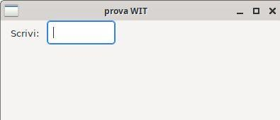
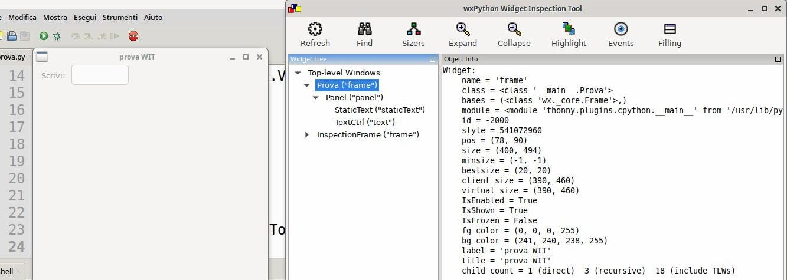
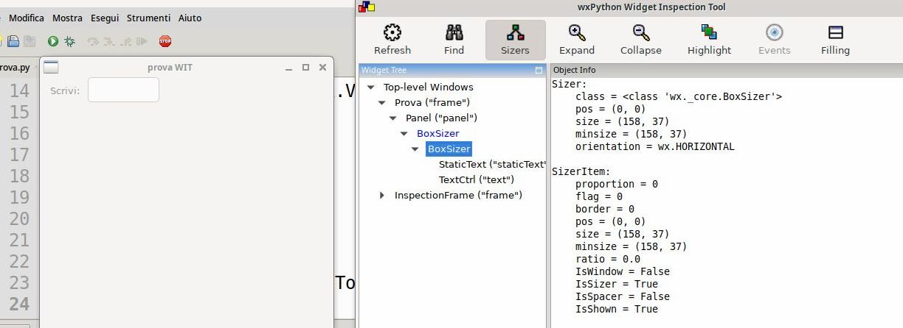
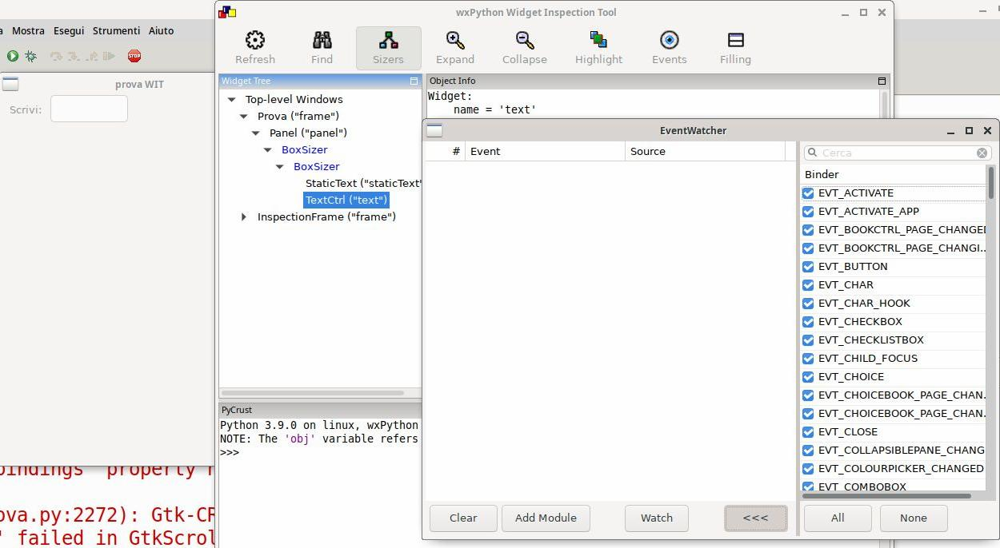

La libreria wxPython fornisce uno strumento molto interessante per
l\'analisi delle widget in fase di creazione: lo **Widget Inspection
Tool**. Questo strumento può essere utilizzato per analizzare il layout
definito in una widget e le funzionalità grafiche implementate in essa
(eventi, main loop, etc\...).

Per utilizzarlo è necessario aggiungere semplicemente 2 righe di codice
al main di una applicazione e rieseguire il suo codice:

``` python
import wx.lib.inspection
wx.lib.inspection.InspectionTool().Show()
```

Come vedete non è nulla di complicato. Cerchiamo però di capire quale
può essere l\'utilità di utilizzare uno strumento del genere, come al
solito partendo da un esempio.

Questo stupido esempio qui sotto non funziona bene. Perché? Il Widget
Inspection Tool potrebbe aiutarci a capirlo\...

``` python
import wx

class Prova(wx.Frame):
    def __init__(self, title):
        super().__init__(None,title=title)
        panel = wx.Panel(self)

        testo = wx.StaticText(panel,label="Scrivi:")
        self.riga = wx.TextCtrl(panel)
        hbox = wx.BoxSizer(wx.HORIZONTAL)
        hbox.Add(testo, flag=wx.ALL, border=10)
        hbox.Add(self.riga, proportion=1)

        box = wx.BoxSizer(wx.VERTICAL)
        box.Add(hbox)

        panel.SetSizer(box)

app = wx.App()
w = Prova("prova WIT")
w.Show()
app.MainLoop()
```

Se analizzate un pochino l\'esempio sopra, vi accorgerete che ho
inserito un testo statico e una linea di testo in un sizer orizzontale.
Ho messo un pò di bordo nel primo per allinearlo al meglio, ho messo
proportion=1 al secondo per farlo ingrandire con la finestra\... insomma
tutto ok. Poi ho inserito il layout in un sizer verticale che ho
applicato al pannello. In questo modo potrò semplicemente aggiungere
*righe* di oggetti alla mia applicazione.

Il risultato che ottengo è visualizzato qui sotto:



Come si vede non ho ottenuto un layout bello esteso ma piccolo e non
ridimensionabile. L\'esempio è semplice e i più intuituivi avranno già
capito il problema. Per tutti gli altri si può utilizzare uno strumento
in più: il **Widget Inspection Tool**.

Come detto sopra, per utilizzarlo basta modificare il codice sopra
aggiungendo le due righe indicate **prima** di far partire il mainloop.
Io ho fatto così:

``` python
# ... modifico il codice vicino alle chiamate principali ...
app = wx.App()
w = Prova("prova WIT")
w.Show()
import wx.lib.inspection
wx.lib.inspection.InspectionTool().Show()
app.MainLoop()
```

ottenendo questo:



Come vedete lo strumento chiamato **Widget Inspection Tool** fa quello
che promette: permette di analizzare le finestre a cui viene *abbinato*,
elencando tutti gli oggetti con i relativi attributi presenti.

Come vedete però, non ci sono i sizer(s): se li volete visualizzare,
vanno abilitati cliccando sull\'opportuno pulsante *Sizers* sullo
strumento:



Adesso che li vedete sullo strumento e volete controllare come si
comportano nella widget, vi basta cliccare sul pulsante *Highlight* per
farlo.


Questo ci fa capire immediatamente che il problema del nostro layout è
il sizer orizzontale che non va ad occupare tutto lo spazio disponibile
nel sizer verticale. Si risolve modificando il codice come segue:

``` python
# ...
box.Add(hbox, proportion=1)
# ...
```

Un ultima cosa molto importante del Widget Inspection Tool è che può
aiutarci a tracciare il comportamento anche degli eventi che accadono
alle finestre che implementiamo. Per vedere questa sua funzionalità
bisogna prima selezionare la widget che ci interessa, poi premere il
pulsante *Events* che mostrerà una nuova finestra con un elenco degli
eventi disponibili per quell\'oggetto.

A questo punto ci basta provare ad utilizzare la nostra finestra:



Adesso il segreto non tanto segreto è provare ad utilizzare questo
strumento ogni volta che qualcosa non quadra per provare a *ispezionare*
i nostri capolavori :)
